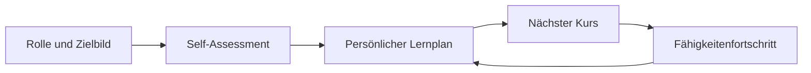

# Lernreise: Umsetzungsabgleich AI Literacy LHIND

Stand: 8. September 2026. Diese Bestandsaufnahme betrachtet die vorhandene, lokale Arbeitsversion als Ausgangspunkt. Sie bewertet nicht die in Arbeit befindlichen Änderungen in `site/lrn/plan-builder.js` und `outputs/lhind-br-ai-enablement-konzept.html`.

## Zielbild der Lernreise

Eine Mitarbeiterin oder ein Mitarbeiter soll einen zusammenhängenden Weg erleben:

1. Rolle wählen, zum Beispiel **Technology Consulting**.
2. Das zugehörige **Zielbild** verstehen: welche **Fähigkeiten** in welchen Bereichen bis zu **Acquire**, **Deepen** oder **Create** erwartet werden.
3. Den eigenen Ist-Stand per Self-Assessment einordnen oder ein Ergebnis importieren.
4. Die offenen Kompetenzlücken sehen und einen persönlichen Lernplan erhalten.
5. Den jeweils nächsten Kurs bearbeiten und nach Abschluss unmittelbar den nächsten sinnvollen Schritt sehen.
6. Den Fortschritt gegenüber dem rollenspezifischen Zielbild in den Fähigkeiten verfolgen.

Die Referenz verwendet dafür diese Begriffe. Sie sollten als sichtbares Vokabular die Leitbegriffe im Produkt sein:

| Begriff in der Referenz | Verwendung in der Lernreise |
| --- | --- |
| **Technology Consulting** | Rolle (Technical Engineering; Software Engineering & Architecture) |
| **Zielbild** | erwartete Lern- und Kompetenzentwicklung der Rolle |
| **Foundation**, **Engineering**, **Product and Process**, **Advisory and Business Consulting**, **Leadership and Strategy** | fünf Bereiche des Zielbilds |
| **Fähigkeiten** | konkrete, einem Bereich zugeordnete Kompetenzen |
| **Acquire**, **Deepen**, **Create** | Lern- und Kompetenzstufen |
| **LHIND Academy / Lernpfad** | Academy bezeichnet das Bildungsangebot; Lernpfad bezeichnet die persönliche Folge von Lernschritten. |

## Vorhandene Bausteine

Das Produkt besitzt die nötigen Bausteine bereits, aber sie wirken derzeit mehr wie einzelne Werkzeuge als wie Stationen einer einzigen Reise.

| Station | Bereits vorhanden | Beobachtung |
| --- | --- | --- |
| Startseite | Hero, importiertes Assessment, „Your learning path“, „Recommended next“, Werkzeug-Karten | Die Seite zeigt den nächsten Schritt und kann nach importiertem Assessment Empfehlungen priorisieren. Das Rollen-Zielbild und die Lernstufe werden dort jedoch nicht verständlich als Ausgangspunkt erklärt. |
| Self-Assessment | `assessment.html`: Rolle, 19 Fähigkeiten, Ist-Stand, Ergebnis und Lücken | Das manuelle Assessment spricht sichtbar von **Basic / Advanced / Expert**. Damit weicht es von **Acquire / Deepen / Create** aus der Referenz und aus dem importierten Assessment ab. |
| Assessment-Import | Importiert fünf Dimensionen mit Current- und Target-Level; erkennt Technology Consulting und übergibt den Ausgangsstand an Empfehlungen | Der Import benutzt bereits die Referenzstufen Acquire, Deepen und Create und die fünf Dimensionen. |
| Persönlicher Lernplan | `personal-plan.html` und `lrn/plan-builder.js`: Ziel, Dauer, Rhythmus; berücksichtigt Rolle, Assessmentlücken, Quiz-Evidenz und Fortschritt | Der Plan priorisiert passende Kurse erklärbar. Er ist über eine separate Werkzeugkarte erreichbar und macht das gewählte Rollen-Zielbild nicht als Reise-Kopf sichtbar. |
| Kursdetail und Kursende | `lrn/course.html` und `lrn/course.js`: Kursfortschritt, nächste Lektion, nächster Kurs, Academy-Stufen | Der nächste Kurs wird gezeigt; der Zusammenhang mit der konkreten offenen Fähigkeit und dem Zielbild bleibt meist implizit. |
| Fähigkeitenfortschritt | `skills.html` und `skills-progress.js`: Rollenprofil, 19 Fähigkeiten, Fortschritt zum Rollenziel, importierter Ausgangsstand getrennt von Lernnachweisen | Dies ist die stärkste Zielbildansicht, aber sie ist als eigenes Werkzeug statt als natürlicher Abschluss bzw. Kontrollpunkt der Lernreise eingebunden. |

Die Empfehlungslogik im Lernplan ist belastbar: Sie filtert zunächst nach Rolle, berücksichtigt importierte Dimensionslücken und Capability-Assessmentlücken, Lernfortschritt, Quiz-Evidenz, Zielbegriffe und eine deterministische Kursreihenfolge. Für passende Kurse kann sie den Grund „Addresses an assessment gap from … to …“ liefern. Die vorhandenen Tests decken diese Auswahl einschließlich Technology Consulting, falscher Rollen, bereits erreichter Ziele und Kursreihenfolge ab.

## Konkrete Brüche

1. **Zwei sichtbare Stufensysteme.** Der Import, die Kursdaten und die Referenz verwenden Acquire, Deepen und Create. Das manuelle Assessment verwendet Basic, Advanced und Expert. Mitarbeitende müssen deshalb übersetzen, obwohl der Flow Orientierung schaffen soll.
2. **Das Zielbild ist kein durchgehender Kontext.** Nach der Rollenwahl ist das Zielbild nicht als kompakte, konstante Zusammenfassung auf Startseite, Lernplan, Kursdetail und Fähigkeitenfortschritt präsent. Der Nutzer sieht einzelne Empfehlungen, aber nicht zuverlässig, welchem Ziel sie dienen.
3. **Der Einstieg verzweigt zu früh.** Die Startseite bietet Assessment, Empfehlungen, persönlicher Plan und Fähigkeitenfortschritt als gleichrangige Werkzeuge. Ein klarer Standardweg „Rolle → Standort → Zielbild → nächster Kurs“ wird nicht geführt.
4. **Der Kursabschluss schließt die Schleife nicht.** Das Kursdetail kann einen nächsten Kurs bestimmen, zeigt aber nicht durchgehend „welche Fähigkeit / welcher Bereich / von welcher Stufe zu welcher Stufe“ dadurch vorangebracht wird. Der Sprung in den Fähigkeitenfortschritt ist nicht als Zielbild-Kontrollpunkt gestaltet.
5. **Unterschiedliche Gruppierungen.** Die Katalogdaten enthalten Assessment-Bereiche wie „Core Understanding & AI Literacy“ und daneben Capability-Gruppen wie „Foundation“. Das sind unterschiedliche Gruppierungen. Die sichtbare Zielbildansicht soll die fünf Referenzdimensionen verwenden; Assessment-Bereiche dürfen nicht einfach umbenannt oder ohne belegte Zuordnung gleichgesetzt werden.

## Kleinste zusammenhängende Umsetzung

Ein neues, wiederverwendbares **Lernreise-Kontextmodell** verbindet die bestehenden Seiten. Es ersetzt weder die Empfehlungsengine noch die Kursdaten.

### 1. Gemeinsamen Lernreise-Status ableiten

Eine kleine, testbare Browser-Logik leitet aus vorhandenen Daten einen View-Status ab:

Der Status verbindet Rolle, Zielbild, Assessment beziehungsweise Import und Fortschritt. Daraus leitet er belegte offene Fähigkeiten, die nächste Etappe und einen passenden Kurs samt Begründung ab. Unbekannte Werte bleiben offen.

Eingaben bleiben die vorhandenen Quellen: `lrn/data.js` (Rollen, Targets, Fähigkeiten, Kurse), `assessment-import.js`, das lokale Assessment, `progress.js`, `skills-progress-evidence.js` und der bestehende Plan. Es wird keine zweite Kompetenzmatrix und keine neue Speicherung eingeführt.

Der Status liefert mindestens:

- Rolle und Beschreibung, etwa **Technology Consulting**.
- Zielbild-Zusammenfassung mit den fünf Bereichen und ihrer höchsten Zielstufe.
- die wichtigste offene Fähigkeit oder Dimension mit Ist- und Zielstufe.
- genau eine nächste Kurs-Empfehlung samt Begründung.
- einen stabilen Ziel-Link zum persönlichen Plan, Kurs oder Fähigkeitenfortschritt.

### 2. Eine sichtbare Lernreise auf der Startseite etablieren

Die Startseite erhält oberhalb der bisherigen Empfehlungen eine kompakte, zustandsabhängige Leiste mit fünf Stationen:

Die Leiste zeigt den aktuellen Stand und bietet nur den nächsten sinnvollen Handlungslink. Ohne Assessment bietet sie das Self-Assessment sowie einen vorläufigen Einstieg an. Mit Assessment, aber ohne gespeicherten Plan, führt sie zu „Persönlichen Lernplan erstellen“. Mit einem laufenden Plan führt sie zum nächsten Kurs. Nach Kursabschluss führt sie zurück zu Fortschritt und aktualisiertem Plan.

Das vorhandene „Recommended next“ bleibt als Kursauswahl bestehen; es wird durch den neuen Kontext als „Warum dieser nächste Schritt?“ erklärt.

### 3. Die Terminologie am Einstieg vereinheitlichen

Das sichtbare manuelle Assessment stellt die Stufen auf **Acquire**, **Deepen** und **Create** um und beschreibt sie konsistent mit der Referenz. Für bereits lokal gespeicherte Werte ist eine reine Lesekompatibilität nötig: Basic/Advanced/Expert werden beim Einlesen auf Acquire/Deepen/Create normalisiert. Neue Daten sollen nur die Referenzstufen speichern.

Die Zielbildansicht zeigt die fünf Referenzdimensionen in Referenzreihenfolge. Die vorhandenen Assessment-Bereiche bleiben als eigene Datengruppe erhalten und werden nur über fachlich belegte Zuordnungen verbunden.

### 4. Kontext an Plan, Kursende und Fähigkeitenfortschritt weiterreichen

- **Persönlicher Lernplan:** Kopf mit Rolle, Zielbild und nächster offener Stufe; jede vorgeschlagene Kurszeile nennt Bereich, Fähigkeit und `Ist → Ziel`, wenn diese Information existiert.
- **Kursdetail/Kursende:** Der „Nächster Kurs“-Block ergänzt Bereich, Fähigkeit, Zielstufe und Begründung. Nach Abschluss führt der primäre Abschluss-CTA zu dem aktualisierten nächsten Schritt.
- **Fähigkeitenfortschritt:** Ergänzt eine Rückkehr-CTA zum aktuellen Plan bzw. nächsten Kurs und erklärt den Abstand zum Zielbild mit denselben Begriffen.

### Kein Teil dieser Umsetzung

Die Referenz enthält auch Inhalte zur vollständigen Literacy- und Rollenarchitektur sowie externe Kursangebote. Diese Bestandsaufnahme empfiehlt keine Erweiterung der Rollenmatrix, keine neuen Kurse und keine Änderung der Empfehlungsreihenfolge, solange dafür kein explizit bestätigter Datenabgleich vorliegt. Der Fokus liegt auf dem roten Faden durch die vorhandenen, passenden Daten.

## Abnahmekriterien und Tests

Die vorhandenen Tests in `site/lrn/learning-plan.test.mjs`, `site/lrn/test.mjs`, `site/lrn/mastery.test.mjs`, `site/skills-progress.test.mjs` und `site/assessment-import.test.mjs` liefen mit 96 bestandenen Tests. Für die Umsetzung kommen gezielte Tests hinzu:

1. Für **Technology Consulting** zeigt der abgeleitete Status die Referenzbereiche sowie ausschließlich Acquire, Deepen und Create als Stufen.
2. Ein leerer Profilstand führt von der Startseite zum Assessment; ein importierter Stand mit Lücke führt zum Plan; ein gespeicherter laufender Plan führt zum nächsten Kurs.
3. Eine offene Fähigkeit ergibt eine Empfehlung mit passender Rolle, Bereich, Fähigkeit und `Ist → Ziel`; ein erreichter Bereich liefert keine Pflichtempfehlung.
4. Ein Abschluss des vorgeschlagenen Kurses aktualisiert den nächsten Handlungslink und den Kursfortschritt. Kompetenzstufen ändern sich nur mit geeigneter Evidenz; Assessment-Ausgangswerte zählen nicht als Kursabschluss.
5. Alte lokale Werte Basic/Advanced/Expert bleiben lesbar und werden korrekt als Acquire/Deepen/Create interpretiert.
6. Die bestehenden Invarianten bleiben bestehen: falsche Rollen werden ausgeschlossen, importierte Zielwerte werden nicht als Abschluss gezählt, und der Kursplan bleibt deterministisch.

## Aktueller Arbeitsstand und Risiken

Der Arbeitsbaum wird parallel bearbeitet; die Dateiliste ist eine Momentaufnahme. Bei der Inventur waren unter anderem folgende Änderungen sichtbar: `site/lrn/plan-builder.js` ergänzt bereits im Statussatz, dass das Assessment in die Aktualisierung des Plans einfließt. Das passt in diese Lernreise und sollte beim Umbau nicht überschrieben werden. `outputs/lhind-br-ai-enablement-konzept.html` enthält inhaltliche Textänderungen und liegt außerhalb des Produktflows.

Die UI-Craft-Vorgabe in `AGENTS.md` verweist auf `/Users/U751725/.codex/skills/ui-craft`. Der Pfad und weitere Treffer für `ui-craft/SKILL.md` waren in der lokalen Skill-Installation nicht vorhanden. Für das Konzept wurden die verfügbaren Impeccable-Anweisungen und die bestehenden Produkt- und Designvorgaben verwendet.
