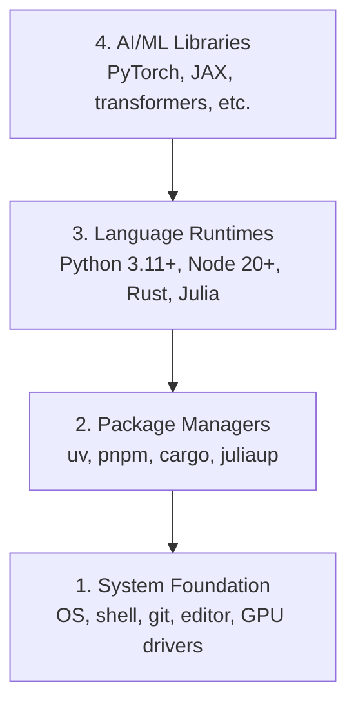

# Dev Environment

> Your tools shape your thinking. Set them up once, set them up right.

**Type:** Build
**Languages:** Python, Node.js, Rust
**Prerequisites:** None
**Time:** ~45 minutes

## Learning Objectives

- Set up Python 3.11+, Node.js 20+, and Rust toolchains from scratch
- Configure virtual environments and package managers for reproducible builds
- Verify GPU access with CUDA/MPS and run a test tensor operation
- Understand the four-layer stack: system, packages, runtimes, AI libraries

## The Problem

You're about to learn AI engineering across 200+ lessons using Python, TypeScript, Rust, and Julia. If your environment is broken, every single lesson becomes a fight against tooling instead of learning.

Most people skip environment setup. Then they spend hours debugging import errors, version conflicts, and missing CUDA drivers. We're going to do this once, properly.

## The Concept

An AI engineering environment has four layers:

We install bottom-up. Each layer depends on the one below it.

## Ship It

This lesson produces a verification script that anyone can run to check their setup.

See `outputs/prompt-env-check.md` for a prompt that helps AI assistants diagnose environment issues.

