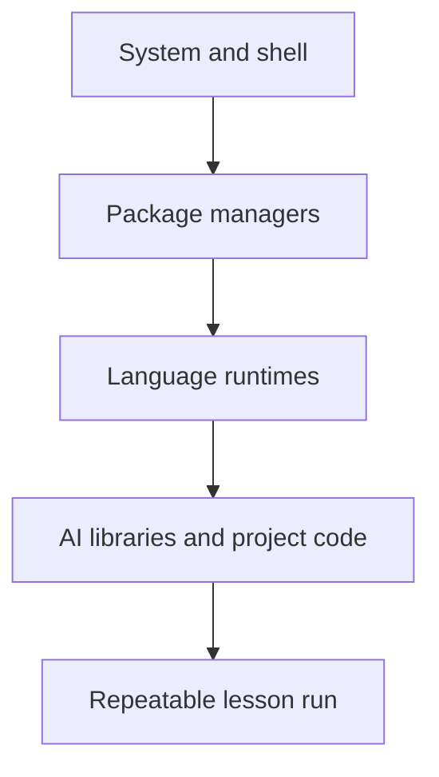

# Dev Environment

> Make the toolchain observable before the first model is imported.

**Type:** Build
**Languages:** Rust
**Prerequisites:** None
**Time:** ~45 minutes

## Learning Objectives

- Compile and run the Rust environment checker from `code/main.rs`.
- Interpret required-tool failures separately from optional-tool skips.
- Verify that the checker accepts a parseable Python 3.10+ version and reports the other runtime versions.
- Compare the Rust checker with the companion Python and TypeScript probes without confusing presence checks with package tests.
- Record a reproducible diagnosis in the reusable environment-check prompt.

## Why this lesson exists

Later lessons assume that a shell, Git, Python, Node.js, and Rust are reachable. A missing executable should be identified before an experiment fails halfway through. This lesson therefore builds a small Rust program that probes commands rather than installing anything for you.

The checker has four conceptual layers: the operating system, package managers, language runtimes, and libraries. The layers are useful for locating a failure, but `main.rs` only verifies command-line tools. It does not prove that CUDA, NumPy, or a model library is installed.



## Build It

From the repository root, compile the canonical entrypoint:

```bash
rustc --edition 2021 phases/00-setup-and-tooling/01-dev-environment/code/main.rs -o /tmp/lesson-dev-env
/tmp/lesson-dev-env
```

`CHECKS` contains five required probes (`git`, `python3`, `node`, `rustc`, and `cargo`) and three optional probes (`uv`, `pnpm`, and `julia`). `run_check` executes each program with `--version`, reads the first non-empty output line, and turns a missing executable into a `[FAIL]` or `[skip]` line. `parse_minor_python` rejects a Python version below 3.10. A successful run ends with `Environment is ready. Start with Phase 1.` and exit status 0; a failed required probe returns exit status 1.

The summary is the primary observable artifact. On a machine without the optional tools it can legitimately say `5/5 required, 0/3 optional`; the optional count is not a failure.

## Use It

Run the companion probes when you want a language-specific view:

```bash
python3 phases/00-setup-and-tooling/01-dev-environment/code/verify.py
```

`verify.py` is a stdlib-only comparison probe: it checks Python, Git, Node.js, and Cargo presence, reports optional `uv`/`pnpm`/Julia tools, and treats its PyTorch/CUDA section as optional. `verify.ts` uses `execFileSync` to probe Node.js, Git, Python, Cargo, and Deno; its required set is Node.js 20+, Git, and Python 3.10+. These files are comparison tools, not the Rust lesson entrypoint, so their results can differ without indicating a contradiction.

## Ship It

The reusable artifact is [`outputs/prompt-env-check.md`](../outputs/prompt-env-check.md). Hand it to an assistant together with the exact failing line, the command that produced it, and whether the probe was required or optional. The prompt can guide a fix, but the verification command remains the acceptance check.

## Exercises

1. Run the Rust command above and copy the required/optional summary. Explain why a missing `uv` line does not change the required result, while a missing `python3` line does.
2. Compare one tool in the Rust output with the corresponding Python or TypeScript probe. Identify whether both are checking a version, an import, or a runtime capability.
3. Use a temporary directory with a modified `PATH` that hides one optional executable. Predict the single changed row, run the binary, and restore `PATH`; do not alter the repository.
4. Add the exact command, summary, and next action to `prompt-env-check.md`. Mark GPU availability as unverified unless the Python probe actually imports PyTorch and reports it.

## Reference Solution

A sound run records the Rust binary's exit status, all five required rows, and the three optional rows. It explains Python parsing as a version gate, treats a missing optional program as a skip, and does not infer package or GPU availability from a command version. The companion probes provide extra evidence only when their own interpreter/import checks run. The shipped prompt names the failing layer and asks for the relevant command output, so another person can reproduce the diagnosis.

Run the Rust tests from `code/` after the exercise:

```bash
rustc --edition 2021 --test tests/test_main.rs -o /tmp/lesson-dev-env-tests
/tmp/lesson-dev-env-tests
```
