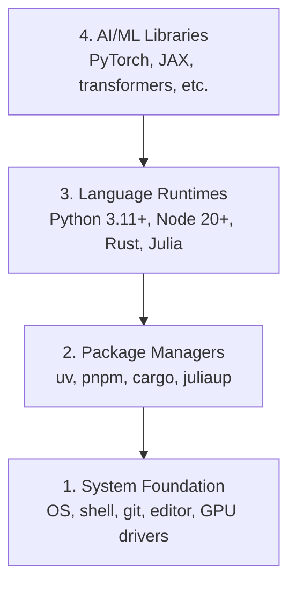

# Dev Environment

> Your tools shape your thinking. Set them up once, set them up right.

**Type:** Build
**Languages:** Rust
**Prerequisites:** None
**Time:** ~45 minutes

## Learning Objectives

- Set up Python 3.11+, Node.js 20+, and Rust toolchains from scratch
- Configure virtual environments and package managers for reproducible builds
- Verify GPU access with CUDA/MPS and run a test tensor operation
- Understand the four-layer stack: system, packages, runtimes, AI libraries

## The Problem

You're about to learn AI engineering across 200+ lessons using Python, TypeScript, Rust, and Julia. If your environment is broken, every single lesson becomes a fight against tooling instead of learning.

Most people skip environment setup. Then they spend hours debugging import errors, version conflicts, and missing CUDA drivers. We're going to do this once, properly.

## The Concept

An AI engineering environment has four layers:



We install bottom-up. Each layer depends on the one below it.

### Verify Your Python Setup

Once `uv` has installed Python and NumPy, confirm both are on the path and working:

```python editable
import sys
print(f"Python {sys.version}")

import numpy as np
print(f"NumPy {np.__version__}")
a = np.array([1, 2, 3])
print(f"Vector: {a}, dot product with itself: {np.dot(a, a)}")
```

## Ship It

This lesson produces a verification script that anyone can run to check their setup.

See `outputs/prompt-env-check.md` for a prompt that helps AI assistants diagnose environment issues.

## Build It

Reconstruct **Dev Environment** by following `Check` on a graph with edges (0,1) and (1,2). Run `rustc --edition 2021 main.rs -o /tmp/lesson && /tmp/lesson` and verify that degrees, adjacency, or connectivity expose the isolated/no-edge case explicitly.

## Use It

Call `Check` from a small caller with a graph with edges (0,1) and (1,2). Compare its result with the demo output, and record the input contract and the one field a downstream user should rely on.

## Exercises

Start with the smallest reproducible run. Keep the input, output, and interpretation together so another reader can repeat the check.

1. **Read the control output.** Run [main.rs](../code/main.rs) with `rustc --edition 2021 main.rs -o /tmp/lesson && /tmp/lesson` from `code/`. Record the smallest input that demonstrates “Set up Python 3.11+, Node.js 20+, and Rust toolchains from scratch”. Point to `run_check`, `parse_minor_python`, `print_header` and name the output field or printed value that proves the claim.
2. **Make one controlled change.** Change one input, threshold, or environment choice that affects “Configure virtual environments and package managers for reproducible builds”. Predict the direction of the change before running it, then compare the two results and explain why unrelated fields should remain stable.
3. **Probe a boundary.** Choose an empty, missing, malformed, or maximum-sized input relevant to “Verify GPU access with CUDA/MPS and run a test tensor operation”. Write the expected behavior first. Distinguish an intentional validation message from an exception or a silently wrong result.
4. **Hand off the artifact.** Open outputs/prompt-env-check.md and adapt one example to a real workflow that exercises “Understand the four-layer stack: system, packages, runtimes, AI libraries”. Record the owner, evidence required, and next action; mark anything the demo leaves unverified.

## Reference Solution

For **Dev Environment**, record the `rustc --edition 2021 main.rs -o /tmp/lesson && /tmp/lesson` output, the captured input, and the interpretation that connects each check to the environment claim:

- the result demonstrates “Set up Python 3.11+, Node.js 20+, and Rust toolchains from scratch” and names the field or intermediate value used as evidence;
- the one-variable comparison makes “Configure virtual environments and package managers for reproducible builds” visible and explains the mechanism in run_check, parse_minor_python, print_header;
- the boundary prediction matches (or explicitly corrects) the observed behavior for “Verify GPU access with CUDA/MPS and run a test tensor operation”; and
- outputs/prompt-env-check.md contains one concrete update applying “Understand the four-layer stack: system, packages, runtimes, AI libraries”, with an owner and a follow-up check.

After the experiment, run the lesson's tests. If prediction and observation disagree, record the mismatch and revise the explanation rather than tuning the input until it looks right.

## Guided Demo

Use the [10–15 minute guided demo](demo.md) to predict an invariant, run the canonical entrypoint, change one variable, and probe a failure case.
