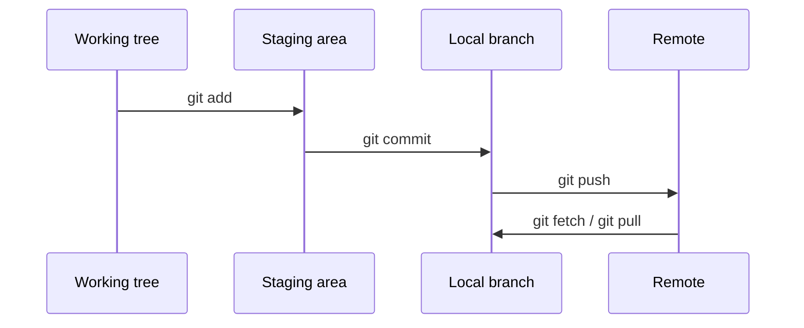

# Git & Collaboration

> Use small, inspectable commits to make experiments reversible.

**Type:** Learn
**Languages:** None
**Prerequisites:** Phase 0, Lesson 01
**Time:** ~30 minutes

## Learning Objectives

- Configure a repository-local Git identity and verify it with `git config`.
- Create a branch for an experiment and merge it back into a local `main` branch.
- Write ignore rules for model checkpoints and other generated files without hiding source code.
- Inspect commits with `git log --oneline --decorate --graph` and explain what changed.
- Push a branch only after checking its status and reviewing the staged diff.

## Why this lesson exists

The course notebook is the lesson artifact here: there is no `code/main.*` entrypoint. The notebook walks through identity configuration, a daily add/commit/push cycle, and a branch named `experiment/new-optimizer`. It also includes a course-repository workflow that creates a personal progress branch. The exercises should be performed in a disposable repository or a branch you own, not by rewriting the course history.

## The collaboration model



A commit is a snapshot; a branch is a movable name for a line of commits; a remote is another copy reachable through a configured URL. `git status` and `git diff --staged` are the evidence that tells you what will be committed.

## Build It

Open `docs/notebook/lesson.ipynb` and execute its shell snippets one command at a time in a temporary directory:

```bash
tmp_dir=$(mktemp -d)
cd "$tmp_dir"
git init
git branch -M main
git config user.name "Lesson User"
git config user.email "lesson@example.invalid"
printf '%s\n' '# experiment' > README.md
git add README.md
git commit -m "Create experiment"
git checkout -b experiment/new-optimizer
printf '%s\n' 'optimizer=baseline' > config.txt
git add config.txt
git commit -m "Record optimizer choice"
git checkout main
git merge --ff-only experiment/new-optimizer
git log --oneline --decorate --graph --all
```

The local identity avoids changing global user settings. The final log should show both commits reachable from `main`. If the merge is not fast-forwardable in a different experiment, stop and inspect the conflict instead of deleting work.

## Use It

Before committing a model run, create a `.gitignore` entry such as:

```text
*.pt
*.pth
*.safetensors
checkpoints/
```

Check the rule with `git status --ignored`; keep code, configuration, and small evaluation fixtures visible. The notebook's daily sequence is `git status`, `git add`, `git commit`, and `git push origin <branch>`. `git checkout -b my-progress` creates an isolated progress branch; it does not publish it until a push is requested.

## Ship It

[`outputs/artifact-card.md`](../outputs/artifact-card.md) is the reusable decision card. Fill it with the repository path, the branch name, the commit shown by `git log`, the ignore rules tested, and the review command used before a push. It is a checklist, not a substitute for a remote backup.

## Exercises

1. Repeat the temporary-repository run and change one file on the experiment branch. Use `git diff --staged` to show exactly what the commit will contain.
2. Add a `.pt` file and a source file, then confirm that only the checkpoint is ignored. Remove the temporary directory by its explicit path when finished.
3. In a fresh temporary repository, create the experiment branch after a base commit. Make one commit on `main` and a different-file commit on `experiment/new-optimizer` before the first merge. Inspect the diverged graph, then merge with `git merge --no-ff experiment/new-optimizer` and record why the histories can combine without a content conflict.
4. Read the last three commits with `git log --oneline --decorate --graph` and write one sentence describing the parent of each commit.

## Reference Solution

The expected evidence is a repository-local identity, two named branches, visible commits, and an ignore rule that hides checkpoints but not source. For the divergence exercise, `main` and `experiment/new-optimizer` each have a commit after their common base; changing different files lets `git merge --no-ff` create a merge commit without a content conflict. A correct handoff includes `git status`, the staged diff, the commit IDs, and the branch that would be pushed. No global configuration, force push, rebase, or deletion of unrelated history is required for this lesson.
