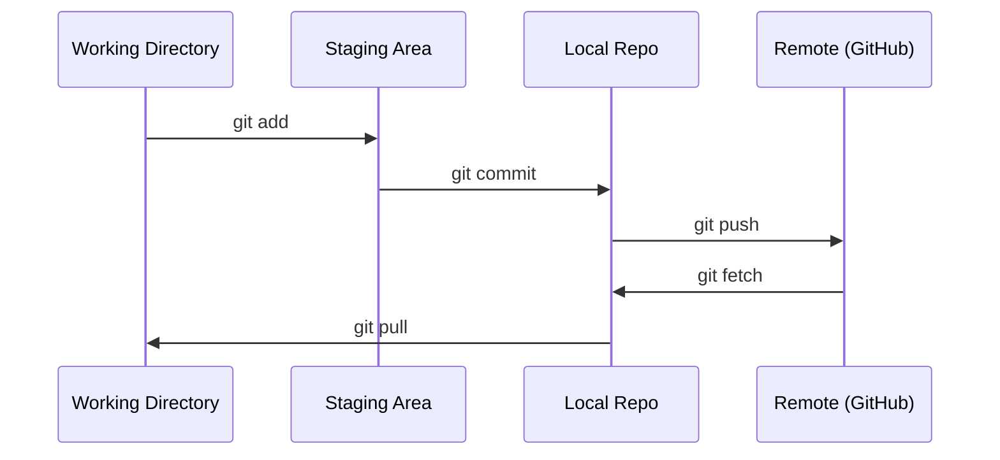

# Git & Collaboration

> Version control is not optional. Every experiment, every model, every lesson you build here gets tracked.

**Type:** Learn
**Languages:** None
**Prerequisites:** Phase 0, Lesson 01
**Time:** ~30 minutes

## Learning Objectives

- Configure git identity and use the daily workflow of add, commit, and push
- Create and merge branches for isolated experiments without breaking main
- Write a `.gitignore` that excludes model checkpoints and large binary files
- Navigate the commit history with `git log` to understand project evolution

## The Problem

You're about to write hundreds of code files across 20 phases. Without version control you will lose work, break things you can't undo, and have no way to collaborate with others.

Git is the tool. GitHub is where the code lives. This lesson covers what you need for this course and nothing more.

## The Concept

Three things to remember:
1. Save often (`git commit`)
2. Push to remote (`git push`)
3. Branch for experiments (`git checkout -b experiment`)

## Use It

For this course, you need exactly these commands:

| Command | When |
|---------|------|
| `git clone` | Get the course repo |
| `git add` + `git commit` | Save your work |
| `git push` | Back it up to GitHub |
| `git checkout -b` | Try something without breaking main |
| `git log --oneline` | See what you've done |

That's it. You don't need rebase, cherry-pick, or submodules for this course.

## Key Terms

| Term | What people say | What it actually means |
|------|----------------|----------------------|
| Commit | "Saving" | A snapshot of your entire project at a point in time |
| Branch | "A copy" | A pointer to a commit that moves forward as you work |
| Merge | "Combining code" | Taking changes from one branch and applying them to another |
| Remote | "The cloud" | A copy of your repo hosted somewhere else (GitHub, GitLab) |

## Exercises

1. **Explain the mechanism.** Give a concrete example and a counterexample that demonstrate this objective: Configure git identity and use the daily workflow of add, commit, and push.
2. **Make a decision.** Compare two plausible approaches, state the assumptions, and justify a choice while applying this objective: Create and merge branches for isolated experiments without breaking main.
3. **Stress-test the reasoning.** Introduce one failure condition, revise the proposed approach, and define evidence of success for this objective: Write a `.gitignore` that excludes model checkpoints and large binary files.

## Reference Solution

A complete response first demonstrates “Configure git identity and use the daily workflow of add, commit, and push” with a specific example and a genuine counterexample. It then compares the alternatives using explicit assumptions for “Create and merge branches for isolated experiments without breaking main.” The final stress test must name a realistic failure condition, revise the approach, and define observable acceptance evidence for “Write a `.gitignore` that excludes model checkpoints and large binary files.” Unsupported preference statements are not sufficient.
