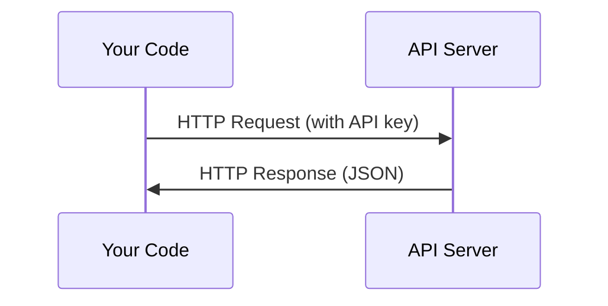

# APIs & Keys

> Every AI API works the same way: send a request, get a response. The details change, the pattern doesn't.

**Type:** Build
**Languages:** Python
**Prerequisites:** Phase 0, Lesson 01
**Time:** ~30 minutes

## Learning Objectives

- Store API keys securely using environment variables and `.env` files
- Make an LLM API call using both the Anthropic Python SDK and raw HTTP
- Compare SDK-based and raw HTTP request/response formats for debugging
- Identify and handle common API errors including authentication and rate limits

## The Problem

Starting from Phase 11, you'll call LLM APIs (Anthropic, OpenAI, Google). In Phase 13-16 you'll build agents that use these APIs in loops. You need to know how API keys work, how to store them safely, and how to make your first API call.

## The Concept

Every API call has:
1. An endpoint (URL)
2. An API key (authentication)
3. A request body (what you want)
4. A response body (what you get back)

## Ship It

This lesson produces:
- `outputs/prompt-api-troubleshooter.md` - diagnose common API errors

## Key Terms

| Term | What people say | What it actually means |
|------|----------------|----------------------|
| API key | "Password for the API" | A unique string that identifies your account and authorizes requests |
| Rate limit | "They're throttling me" | Maximum requests per minute/hour to prevent abuse and ensure fair usage |
| Token | "A word" (in API context) | A billing unit: input and output tokens are counted and charged separately |
| Streaming | "Real-time responses" | Getting the response word by word instead of waiting for the full response |

## Exercises

1. **Establish a baseline.** Run the lesson demo, then capture the inputs, outputs, and one invariant that demonstrates this objective: Store API keys securely using environment variables and `.env` files.
2. **Change one variable.** Modify a single input or parameter and use the resulting evidence to investigate this objective: Make an LLM API call using both the Anthropic Python SDK and raw HTTP.
3. **Probe an edge case.** Predict the result before running it, compare prediction with observation, and explain the discrepancy while applying this objective: Compare SDK-based and raw HTTP request/response formats for debugging.

## Reference Solution

Use the canonical [main.py](../code/main.py) as the executable baseline. A complete solution records a successful run, identifies the invariant tied to “Store API keys securely using environment variables and `.env` files,” and changes only one variable for the comparison. The edge-case result must distinguish the prediction from the observation, explain the cause using “Compare SDK-based and raw HTTP request/response formats for debugging,” and cite a repeatable check rather than relying on visual inspection alone.
