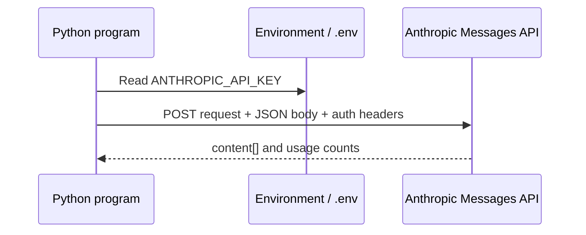

# APIs & Keys

> Make authentication, request shape, and response shape separately observable.

**Type:** Build
**Languages:** Python
**Prerequisites:** Phase 0, Lessons 01–03
**Time:** ~30 minutes

## Learning Objectives

- Keep an API key in `ANTHROPIC_API_KEY` or a local `.env` file instead of source code.
- Trace the Anthropic Messages request built by `first_api_call.py` through both SDK and standard-library HTTP paths.
- Compare the shared `model`, `max_tokens`, and `messages` fields with the response `content` and `usage` fields.
- Run the no-credential path without making a network request and distinguish it from a live request failure.
- Use the API troubleshooting prompt to turn an authentication or rate-limit message into a reproducible next check.

## Why this lesson exists

An API call has a small, inspectable contract: endpoint, authentication header, JSON request body, and JSON response. The Python implementation has two functions. `call_with_sdk` constructs an `anthropic.Anthropic()` client and requests the one-sentence neural-network prompt. `call_raw_http` sends the same conceptual request to `https://api.anthropic.com/v1/messages` with `x-api-key`, `anthropic-version: 2023-06-01`, and a JSON body.



The Python entrypoint does not catch every SDK-constructor or network exception. With no SDK installed it prints an install hint; with no key the raw HTTP branch prints a key reminder. Those are safe local diagnostics, not successful API calls.

## Build It

From the lesson directory, run without credentials first:

```bash
env -u ANTHROPIC_API_KEY python3 code/main.py
```

In a dependency-free environment the output contains both section labels and the no-SDK/no-key messages. If the SDK is installed without a key, its constructor may fail before the raw-HTTP section; preserve that credential error rather than treating a traceback as an API result. Do not place a real key in the command line or commit a `.env` file. If you intentionally have the SDK and a key, the live Python call uses the model string recorded in `first_api_call.py`, `max_tokens=256`, and one user message; the response prints `content[0].text` and `usage.input_tokens`/`usage.output_tokens`.

## Use It

The TypeScript companion has a deterministic `MOCK=1` path. If a TypeScript runner is already available, run:

```bash
MOCK=1 npx tsx code/first_api_call.ts
```

It prints a mock response and `tokens: 12 in, 28 out`, then exits without a network call. Its `.env` loader gives process environment variables precedence over file values. This makes request/response plumbing testable without treating a mock as provider evidence.

## Ship It

[`outputs/prompt-api-troubleshooter.md`](../outputs/prompt-api-troubleshooter.md) is the reusable artifact. When adapting it, include the exact status/error text, whether the SDK or HTTP path was used, whether a key was present, and the next command that can confirm the diagnosis. Never paste the key itself.

## Exercises

1. Run the Python entrypoint without a key and label each printed message as import/setup, credential, or network evidence.
2. Compare the Python request body with the TypeScript `MessagesRequest`: identify the model field, `max_tokens`, and the role/content message without sending either request.
3. Create a temporary `.env` containing `ANTHROPIC_API_KEY=mock`, run the TypeScript mock path, then remove the file. Confirm that `process.env` would override the file if both were set.
4. Add an authentication failure and a rate-limit failure to the troubleshooting artifact. For each, specify the captured status/body and a verification step; do not claim that the local mock exercised the provider.

## Reference Solution

The no-credential Python run is successful only as a bounded local diagnostic: it should not make a live request. The TypeScript mock proves that the expected response envelope can be parsed, not that credentials or the network work. A live run is accepted only when the request uses the documented headers/body and the returned `content` and `usage` fields are present. The artifact must retain error evidence without exposing secrets.

Run the Python tests from `code/`:

```bash
python3 -m unittest discover tests -v
```
