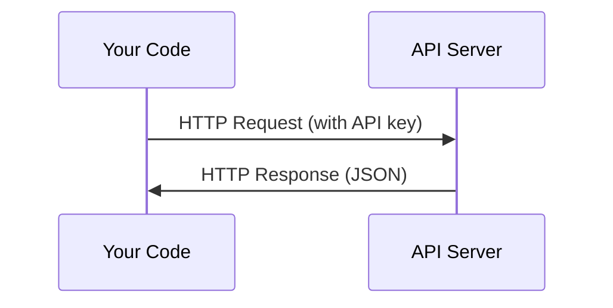

# APIs & Keys

> Every AI API works the same way: send a request, get a response. The details change, the pattern doesn't.

**Type:** Build
**Languages:** Python
**Prerequisites:** Phase 0, Lesson 01
**Time:** ~30 minutes

## Learning Objectives

- Store API keys securely using environment variables and `.env` files
- Make an LLM API call using both the Anthropic Python SDK and raw HTTP
- Compare SDK-based and raw HTTP request/response formats for debugging
- Identify and handle common API errors including authentication and rate limits

## The Problem

Starting from Phase 11, you'll call LLM APIs (Anthropic, OpenAI, Google). In Phase 13-16 you'll build agents that use these APIs in loops. You need to know how API keys work, how to store them safely, and how to make your first API call.

## The Concept

Every API call has:
1. An endpoint (URL)
2. An API key (authentication)
3. A request body (what you want)
4. A response body (what you get back)

## Ship It

This lesson produces:
- `outputs/prompt-api-troubleshooter.md` - diagnose common API errors

## Key Terms

| Term | What people say | What it actually means |
|------|----------------|----------------------|
| API key | "Password for the API" | A unique string that identifies your account and authorizes requests |
| Rate limit | "They're throttling me" | Maximum requests per minute/hour to prevent abuse and ensure fair usage |
| Token | "A word" (in API context) | A billing unit: input and output tokens are counted and charged separately |
| Streaming | "Real-time responses" | Getting the response word by word instead of waiting for the full response |

## Build It

Reconstruct **APIs & Keys** by following `call_with_sdk` on the smallest valid record {"id": 1}. Run `python3 main.py` and verify that validation names the missing field or rejects the request; it must not silently accept an incomplete record.

## Use It

Call `call_with_sdk` from a small caller with the smallest valid record {"id": 1}. Compare its result with the demo output, and record the input contract and the one field a downstream user should rely on.

## Exercises

This lab follows `call_with_sdk` and `call_raw_http` on a controlled fixture; write down the value before changing the input.

1. **Trace the canonical fixture.** From `code/`, run `python3 main.py` using the smallest valid record {"id": 1}. Follow `call_with_sdk`, `call_raw_http`, `loadDotenv`. Expect validation names the missing field or rejects the request; it must not silently accept an incomplete record; capture the first printed shape, metric, status, or summary field and state which part supports **Store API keys securely using environment variables and `.env` files**.
2. **Change the controlled parameter.** Repeat the command after changing only the optional field: use the same record with one optional field changed. Predict the direction of the change, then compare the two output values. Explain why **Make an LLM API call using both the Anthropic Python SDK and raw HTTP** says the other inputs should stay fixed.
3. **Exercise the guard.** Feed the implementation a record missing the required "id" field. Before running it, write down whether the relevant function should return an empty value, a zero-sized result, or a validation error. Check the observed status against **Compare SDK-based and raw HTTP request/response formats for debugging** and record the exception text if the code rejects the case.
4. **Prepare the artifact for reuse.** Open `outputs/prompt-api-troubleshooter.md` and add a worked example using the smallest valid record {"id": 1}. Include the input contract, one expected output field, and a named acceptance check for **Identify and handle common API errors including authentication and rate limits**; note what the demo cannot establish.

## Reference Solution

A checkable result for **APIs & Keys** should contain:

- the `python3 main.py` output for the smallest valid record {"id": 1}, with `call_with_sdk`, `call_raw_http`, `loadDotenv` traced to the value or shape that supports **Store API keys securely using environment variables and `.env` files**;
- a before/after comparison for the optional field, where the same record with one optional field changed changes the observation in the direction predicted by **Make an LLM API call using both the Anthropic Python SDK and raw HTTP**;
- a recorded result for a record missing the required "id" field that matches the implementation’s validation or empty-result contract and explains the evidence for **Compare SDK-based and raw HTTP request/response formats for debugging**; and
- an updated `outputs/prompt-api-troubleshooter.md` example with a concrete input, expected output field, and acceptance check tied to **Identify and handle common API errors including authentication and rate limits**.

Run the lesson tests after the demo. If the boundary behaves differently from the prediction, keep the actual exception or output and explain the implementation path that produced it.
