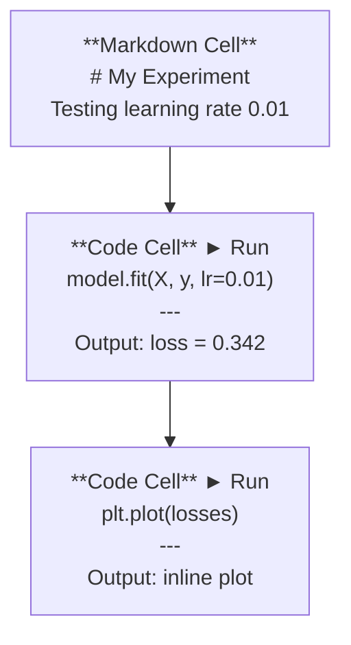
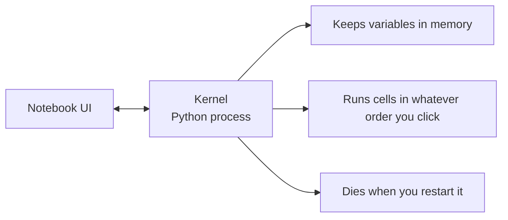

# Jupyter Notebooks

> Notebooks are the lab bench of AI engineering. You prototype here, then move what works into production.

**Type:** Build
**Languages:** Python
**Prerequisites:** Phase 0, Lesson 01
**Time:** ~30 minutes

## Learning Objectives

- Install and launch JupyterLab, Jupyter Notebook, or VS Code with the Jupyter extension
- Use magic commands (`%timeit`, `%%time`, `%matplotlib inline`) to benchmark and visualize inline
- Distinguish when to use notebooks vs scripts and apply the "explore in notebooks, ship in scripts" workflow
- Identify and avoid common notebook traps: out-of-order execution, hidden state, and memory leaks

## The Problem

Every AI paper, tutorial, and Kaggle competition uses Jupyter notebooks. They let you run code in pieces, see outputs inline, mix code with explanations, and iterate fast. If you try to learn AI without notebooks, you're doing math homework without scratch paper.

But notebooks have real traps. People use them for everything, including things they're terrible at. Knowing when to use a notebook and when to use a script will save you from debugging nightmares later.

## The Concept

A notebook is a list of cells. Each cell is either code or text.

The kernel is a Python process running in the background. When you run a cell, it sends the code to the kernel, which executes it and sends back the result. All cells share the same kernel, so variables persist between cells.

That "whatever order you click" part is both the superpower and the foot-gun.

## Use It

### Notebooks vs Scripts: When to use which

| Use notebooks for | Use scripts for |
|-------------------|-----------------|
| Exploring a dataset | Training pipelines |
| Prototyping a model | Reusable utilities |
| Visualizing results | Anything with `if __name__` |
| Explaining your work | Code that runs on a schedule |
| Quick experiments | Production code |
| Course exercises | Packages and libraries |

The rule: **explore in notebooks, ship in scripts**.

A common workflow in AI:
1. Explore data in a notebook
2. Prototype your model in the notebook
3. Once it works, move the code to `.py` files
4. Import those `.py` files back into the notebook for further experiments

### Common traps

**Out-of-order execution.** You run cell 5, then cell 2, then cell 7. The notebook works on your machine but breaks when someone runs it top to bottom. Fix: Kernel > Restart & Run All before sharing.

**Hidden state.** You delete a cell but the variable it created is still in memory. The notebook looks clean but depends on a ghost cell. Fix: Restart the kernel regularly.

**Memory leaks.** Loading a 4GB dataset, training a model, loading another dataset. Nothing gets freed. Fix: `del variable_name` and `gc.collect()`, or restart the kernel.

## Ship It

This lesson produces:
- `outputs/prompt-notebook-helper.md` for debugging notebook issues

## Key Terms

| Term | What people say | What it actually means |
|------|----------------|----------------------|
| Kernel | "The thing running my code" | A separate Python process that executes cells and keeps variables in memory |
| Cell | "A code block" | An independently runnable unit in a notebook, either code or markdown |
| Magic command | "Jupyter tricks" | Special commands prefixed with `%` or `%%` that control the notebook environment |
| `.ipynb` | "Notebook file" | A JSON file containing cells, outputs, and metadata. Stands for IPython Notebook |

## Further Reading

- [JupyterLab Docs](https://jupyterlab.readthedocs.io/) for the full feature set
- [Google Colab FAQ](https://research.google.com/colaboratory/faq.html) for Colab-specific limits and features
- [28 Jupyter Notebook Tips](https://www.dataquest.io/blog/jupyter-notebook-tips-tricks-shortcuts/) for power-user shortcuts
