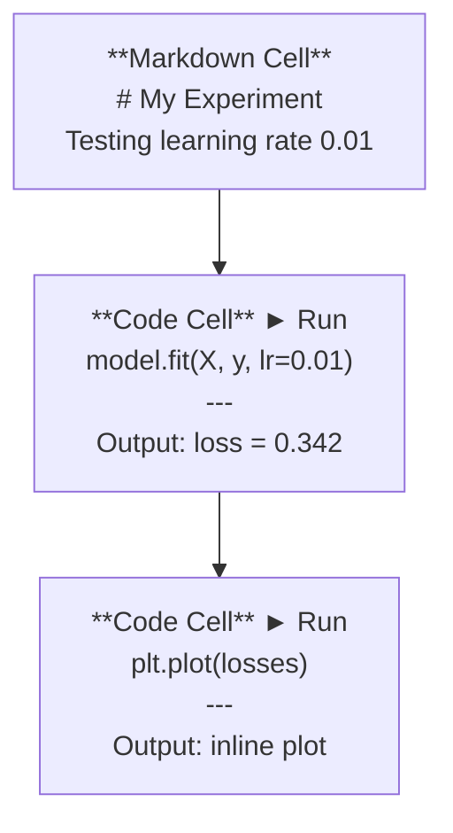
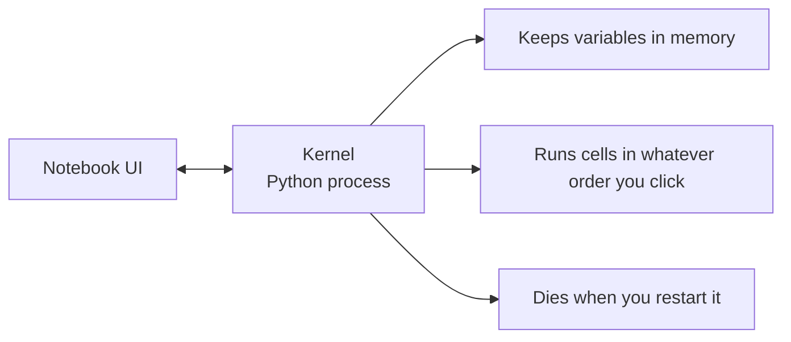

# Jupyter Notebooks

> Notebooks are the lab bench of AI engineering. You prototype here, then move what works into production.

**Type:** Build
**Languages:** Python
**Prerequisites:** Phase 0, Lesson 01
**Time:** ~30 minutes

## Learning Objectives

- Install and launch JupyterLab, Jupyter Notebook, or VS Code with the Jupyter extension
- Use magic commands (`%timeit`, `%%time`, `%matplotlib inline`) to benchmark and visualize inline
- Distinguish when to use notebooks vs scripts and apply the "explore in notebooks, ship in scripts" workflow
- Identify and avoid common notebook traps: out-of-order execution, hidden state, and memory leaks

## The Problem

Every AI paper, tutorial, and Kaggle competition uses Jupyter notebooks. They let you run code in pieces, see outputs inline, mix code with explanations, and iterate fast. If you try to learn AI without notebooks, you're doing math homework without scratch paper.

But notebooks have real traps. People use them for everything, including things they're terrible at. Knowing when to use a notebook and when to use a script will save you from debugging nightmares later.

## The Concept

A notebook is a list of cells. Each cell is either code or text.

The kernel is a Python process running in the background. When you run a cell, it sends the code to the kernel, which executes it and sends back the result. All cells share the same kernel, so variables persist between cells.

That "whatever order you click" part is both the superpower and the foot-gun.

## Build It

Reconstruct **Jupyter Notebooks** by following `CellResult` on the demo’s smallest built-in fixture. Run `python3 main.py` and verify that the result reports the empty case explicitly or raises the documented validation error.

## Use It

Call `CellResult` from a small caller with the demo’s smallest built-in fixture. Compare its result with the demo output, and record the input contract and the one field a downstream user should rely on.

## Ship It

Hand off `outputs/prompt-notebook-helper.md` with the command `python3 main.py`, the accepted input shape (the demo’s smallest built-in fixture), the expected observable result, and a failure note for malformed inputs.

## Further Reading

- [JupyterLab Docs](https://jupyterlab.readthedocs.io/) for the full feature set
- [Google Colab FAQ](https://research.google.com/colaboratory/faq.html) for Colab-specific limits and features
- [28 Jupyter Notebook Tips](https://www.dataquest.io/blog/jupyter-notebook-tips-tricks-shortcuts/) for power-user shortcuts

## Exercises

Keep two runs side by side for **Jupyter Notebooks**. The important evidence is the named field, shape, or status—not a polished paragraph about the run.

1. **Read the first result.** From `code/`, run `python3 main.py` using the demo’s smallest built-in fixture. Follow `CellResult`, `NotebookKernel`, `restart`. Expect the result reports the empty case explicitly or raises the documented validation error; capture the first printed shape, metric, status, or summary field and state which part supports **Install and launch JupyterLab, Jupyter Notebook, or VS Code with the Jupyter extension**.
2. **Run a two-value comparison.** Repeat the command after changing only the primary fixture value: use the same fixture with its primary value changed from 1 to 2. Predict the direction of the change, then compare the two output values. Explain why **Use magic commands (`%timeit`, `%%time`, `%matplotlib inline`) to benchmark and visualize inline** says the other inputs should stay fixed.
3. **Try an adversarial fixture.** Feed the implementation an empty fixture {}. Before running it, write down whether the relevant function should return an empty value, a zero-sized result, or a validation error. Check the observed status against **Distinguish when to use notebooks vs scripts and apply the "explore in notebooks, ship in scripts" workflow** and record the exception text if the code rejects the case.
4. **Write the operator note.** Open `outputs/prompt-notebook-helper.md` and add a worked example using the demo’s smallest built-in fixture. Include the input contract, one expected output field, and a named acceptance check for **Identify and avoid common notebook traps: out-of-order execution, hidden state, and memory leaks**; note what the demo cannot establish.

## Reference Solution

A checkable result for **Jupyter Notebooks** should contain:

- the `python3 main.py` output for the demo’s smallest built-in fixture, with `CellResult`, `NotebookKernel`, `restart` traced to the value or shape that supports **Install and launch JupyterLab, Jupyter Notebook, or VS Code with the Jupyter extension**;
- a before/after comparison for the primary fixture value, where the same fixture with its primary value changed from 1 to 2 changes the observation in the direction predicted by **Use magic commands (`%timeit`, `%%time`, `%matplotlib inline`) to benchmark and visualize inline**;
- a recorded result for an empty fixture {} that matches the implementation’s validation or empty-result contract and explains the evidence for **Distinguish when to use notebooks vs scripts and apply the "explore in notebooks, ship in scripts" workflow**; and
- an updated `outputs/prompt-notebook-helper.md` example with a concrete input, expected output field, and acceptance check tied to **Identify and avoid common notebook traps: out-of-order execution, hidden state, and memory leaks**.

Run the lesson tests after the demo. If the boundary behaves differently from the prediction, keep the actual exception or output and explain the implementation path that produced it.
