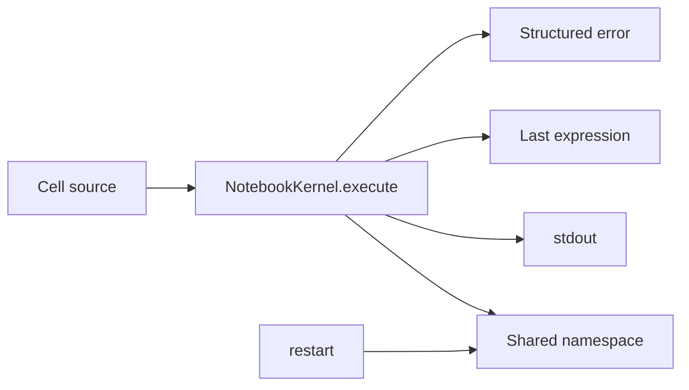

# Jupyter Notebooks

> A notebook is a stateful experiment: make the state, output, and restart boundary visible.

**Type:** Build
**Languages:** Python
**Prerequisites:** Phase 0, Lesson 01
**Time:** ~30 minutes

## Learning Objectives

- Execute a cell and distinguish captured `stdout`, the last expression, and a structured error.
- Explain why variables persist between cells and why `NotebookKernel.restart()` removes them.
- Run a list of cells in document order with `NotebookKernel.run_all`.
- Transfer the model to a real Jupyter interface using markdown, code cells, and magic commands.
- Diagnose hidden state and out-of-order execution with a restart-and-run-all check.

## Why this lesson exists

Installing a notebook server is useful, but the important behavior is the kernel contract. The local demo implements that contract in a small standard-library class rather than depending on Jupyter. `NotebookKernel` keeps a namespace, executes Python with `ast` and `exec`, captures printed output, displays the last expression, and turns an exception into `CellResult(error_type, error_message)` without killing the kernel.



## Build It

Run the standard-library simulation from its code directory:

```bash
cd phases/00-setup-and-tooling/05-jupyter-notebooks/code
python3 main.py
```

The demo runs three cells: it assigns `samples = [2, 4, 8]`, prints the list, and evaluates `sum(samples) / len(samples)`. The third result is `4.666666666666667`. After `restart()`, evaluating `samples` produces a `NameError`. Those two observations are the core of the lesson: state is shared until the kernel is restarted.

## Use It

The tests exercise the same public surface:

```python
from main import NotebookKernel

kernel = NotebookKernel()
kernel.execute("answer = 6 * 7")
print(kernel.execute("answer").display)  # 42
print(kernel.execute('print("hello notebook")').stdout)
```

`run_all(["x = 3", "x *= 4", "x"])` restarts first and returns a final display of `12`. A failed cell returns `ZeroDivisionError` or another error type in the result; it does not terminate the kernel object.

The companion notebook documents real Jupyter actions such as `Shift+Enter`, `%timeit`, `%%time`, `%matplotlib inline`, rich DataFrame display, and `Kernel > Restart & Run All`. Those magics belong to a real IPython kernel; the local `NotebookKernel` intentionally models Python cell semantics only.

## Ship It

[`outputs/prompt-notebook-helper.md`](../outputs/prompt-notebook-helper.md) is the reusable troubleshooting artifact. It asks for the exact error, restart-and-run-all result, data shape, environment, and kernel executable before recommending a fix. Keep the diagnostic output separate from any private data loaded by a notebook.

## Exercises

1. Run `main.py` and record the display from the arithmetic cell and the error type after restart.
2. Use `NotebookKernel.execute` with `value = 10`, then `value + 5`; explain why the second cell can see the first assignment.
3. Execute `1 / 0`, inspect `error_type` and `error_message`, then execute `2 + 2` on the same kernel to show that one failed cell does not destroy state.
4. In a real notebook, create one markdown cell and two code cells, run them out of order, then use Restart & Run All. Record which hidden dependency disappeared.

## Reference Solution

The local acceptance evidence is `display == "42"` for the two-cell answer example, `stdout == "hello notebook\n"` for a print cell, `error_type == "NameError"` after restart, and a final `run_all` display of `12`. The real-notebook exercise is complete when the document runs top to bottom after a restart; `%timeit` and plots are interface features, not outputs fabricated by `NotebookKernel`.

Run the lesson tests from `code/`:

```bash
python3 -m unittest discover tests -v
```
