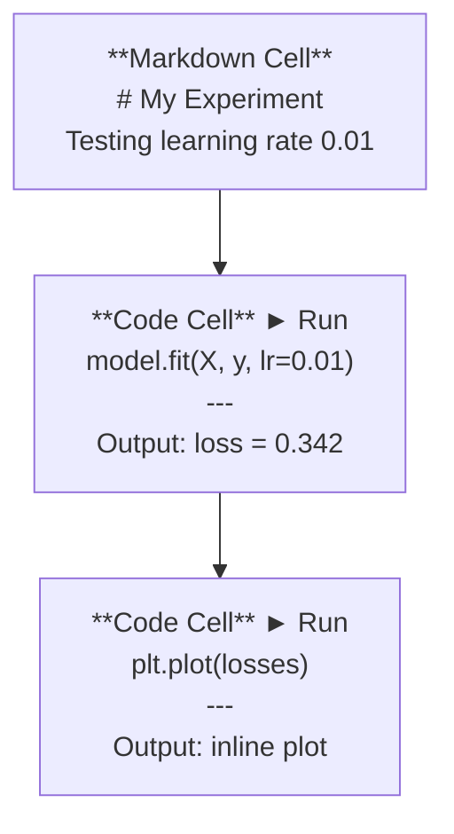
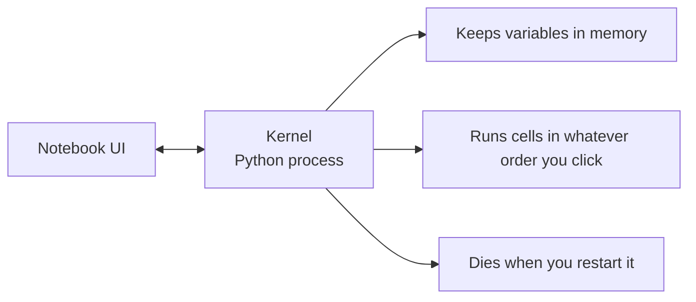

# Jupyter Notebooks

> Notebooks are the lab bench of AI engineering. You prototype here, then move what works into production.

**Type:** Build
**Languages:** Python
**Prerequisites:** Phase 0, Lesson 01
**Time:** ~30 minutes

## Learning Objectives

- Install and launch JupyterLab, Jupyter Notebook, or VS Code with the Jupyter extension
- Use magic commands (`%timeit`, `%%time`, `%matplotlib inline`) to benchmark and visualize inline
- Distinguish when to use notebooks vs scripts and apply the "explore in notebooks, ship in scripts" workflow
- Identify and avoid common notebook traps: out-of-order execution, hidden state, and memory leaks

## The Problem

Every AI paper, tutorial, and Kaggle competition uses Jupyter notebooks. They let you run code in pieces, see outputs inline, mix code with explanations, and iterate fast. If you try to learn AI without notebooks, you're doing math homework without scratch paper.

But notebooks have real traps. People use them for everything, including things they're terrible at. Knowing when to use a notebook and when to use a script will save you from debugging nightmares later.

## The Concept

A notebook is a list of cells. Each cell is either code or text.

The kernel is a Python process running in the background. When you run a cell, it sends the code to the kernel, which executes it and sends back the result. All cells share the same kernel, so variables persist between cells.

That "whatever order you click" part is both the superpower and the foot-gun.

## Further Reading

- [JupyterLab Docs](https://jupyterlab.readthedocs.io/) for the full feature set
- [Google Colab FAQ](https://research.google.com/colaboratory/faq.html) for Colab-specific limits and features
- [28 Jupyter Notebook Tips](https://www.dataquest.io/blog/jupyter-notebook-tips-tricks-shortcuts/) for power-user shortcuts

## Exercises

1. **Establish a baseline.** Run the lesson demo, then capture the inputs, outputs, and one invariant that demonstrates this objective: Install and launch JupyterLab, Jupyter Notebook, or VS Code with the Jupyter extension.
2. **Change one variable.** Modify a single input or parameter and use the resulting evidence to investigate this objective: Use magic commands (`%timeit`, `%%time`, `%matplotlib inline`) to benchmark and visualize inline.
3. **Probe an edge case.** Predict the result before running it, compare prediction with observation, and explain the discrepancy while applying this objective: Distinguish when to use notebooks vs scripts and apply the "explore in notebooks, ship in scripts" workflow.

## Reference Solution

Use the canonical [main.py](../code/main.py) as the executable baseline. A complete solution records a successful run, identifies the invariant tied to “Install and launch JupyterLab, Jupyter Notebook, or VS Code with the Jupyter extension,” and changes only one variable for the comparison. The edge-case result must distinguish the prediction from the observation, explain the cause using “Distinguish when to use notebooks vs scripts and apply the "explore in notebooks, ship in scripts" workflow,” and cite a repeatable check rather than relying on visual inspection alone.
