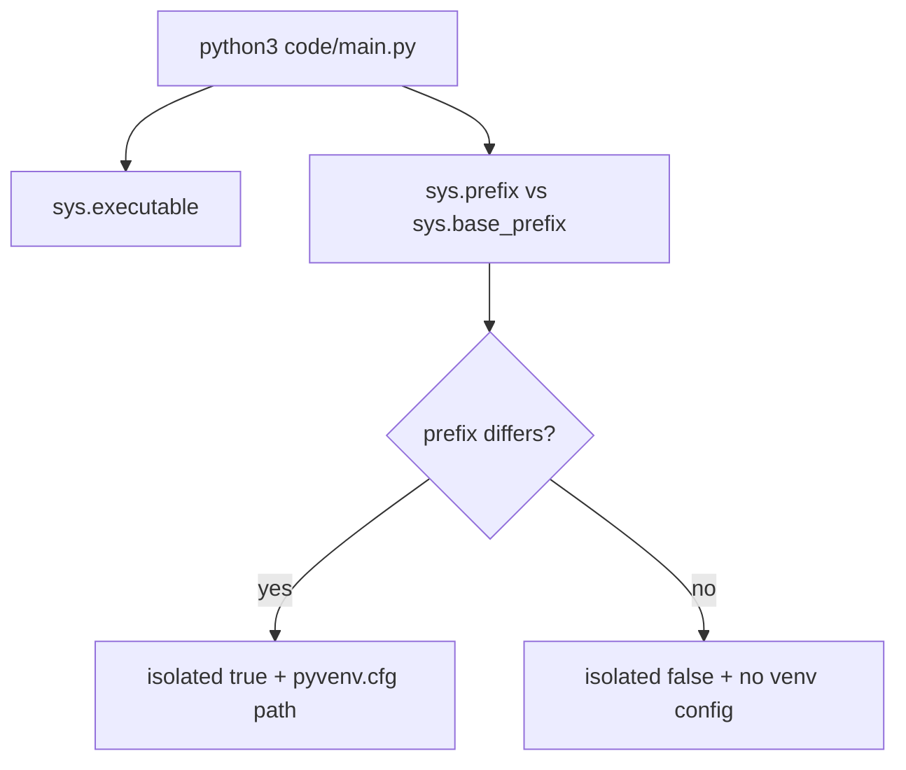

# Python Environments

> Reproducibility starts with knowing which interpreter is executing the command.

**Type:** Build
**Languages:** Python
**Prerequisites:** Phase 0, Lesson 01
**Time:** ~30 minutes

## Learning Objectives

- Read `sys.prefix`, `sys.base_prefix`, and `sys.executable` with `environment_report`.
- Determine whether the active interpreter is inside a virtual environment from `isolated` and `pyvenv_config`.
- Compare the `uv venv` and `python3 -m venv` branches in `env_setup.sh`.
- Explain why package installation policy and environment selection belong in project documentation.
- Design a per-phase environment boundary without claiming that this demo creates a lockfile.

## What the code actually proves

`code/main.py` is intentionally read-only. `environment_report()` resolves the active executable, `sys.prefix`, and `sys.base_prefix`; it reports `isolated = (prefix != base_prefix)` and includes the path to `pyvenv.cfg` only when that file exists. Running it does not create an environment, install packages, or inspect CUDA.



## Build It

Run the report without changing the repository:

```bash
cd phases/00-setup-and-tooling/06-python-environments
python3 code/main.py
```

The JSON contains `python`, `executable`, `prefix`, `base_prefix`, `isolated`, and `pyvenv_config`. Read the absolute paths before making a claim. To observe the isolated branch safely, create a disposable environment outside the repository and invoke the same script with its interpreter:

```bash
python3 -m venv /tmp/phase00-python-env
/tmp/phase00-python-env/bin/python code/main.py
```

The two reports should differ in `executable`, `prefix`, `isolated`, and usually `pyvenv_config`; the source file is unchanged.

## Use It

`code/env_setup.sh` is a separate provisioning script. It requires Python 3.11+, prefers `uv` when present, otherwise uses `python3 -m venv`, activates `.venv` at the repository root, installs `numpy matplotlib jupyter scikit-learn pandas`, and verifies imports. It optionally reports PyTorch and CUDA. Run it only in a disposable clone or when you explicitly intend to create that root `.venv`; this lesson does not run it during normal tests.

The script does not write `pyproject.toml` or a lockfile. A reproducible project can add those files separately, but the observable contract in this lesson is interpreter isolation and package verification.

## Ship It

[`outputs/artifact-card.md`](../outputs/artifact-card.md) should carry one baseline JSON report, the interpreter path used, and the command that reproduced it. Add a per-phase decision such as “shared lightweight environment for setup lessons; separate environment for incompatible framework requirements,” and link the actual project metadata when it exists.

## Exercises

1. Capture reports from the system interpreter and `/tmp/phase00-python-env/bin/python`. Explain `isolated` using the two prefix values, not by guessing from the prompt.
2. Read `env_setup.sh` and list its two environment-creation branches and its five core package names. Identify the step that verifies a package rather than installing it.
3. Run `python3 code/main.py` from a directory outside the repository and confirm that changing the current directory does not change the interpreter metadata.
4. Add the two reports and an acceptance rule to the artifact: a command is accepted only when the expected interpreter path and `isolated` value are visible. Do not claim a lockfile or CUDA setup was tested.

## Reference Solution

The baseline report may show `isolated: false`; that is a valid observation. The disposable venv should show distinct prefix/base-prefix paths, `isolated: true`, and a `pyvenv.cfg` path. A correct environment plan names the creation tool, the packages it owns, and the phase that uses it, while distinguishing those choices from the read-only report. The lesson tests exercise the report without mutating an environment.

Run the tests from `code/`:

```bash
python3 -m unittest discover tests -v
```
