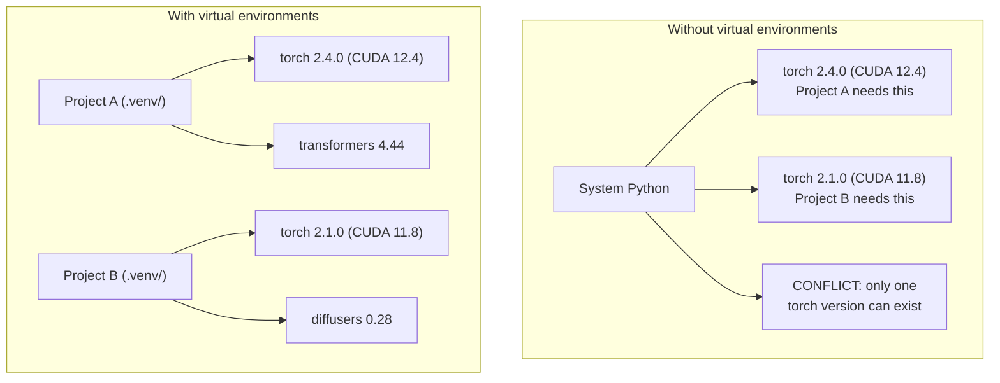

# Python Environments

> Dependency hell is real. Virtual environments are the cure.

**Type:** Build
**Languages:** Python
**Prerequisites:** Phase 0, Lesson 01
**Time:** ~30 minutes

## Learning Objectives

- Create isolated virtual environments using `uv`, `venv`, or `conda`
- Write a `pyproject.toml` with optional dependency groups and generate lockfiles for reproducibility
- Diagnose and fix common pitfalls: global installs, pip/conda mixing, CUDA version mismatches
- Implement a per-phase environment strategy for projects with conflicting dependencies

## The Problem

You install PyTorch 2.4 for a fine-tuning project. Next week, a different project needs PyTorch 2.1 because its CUDA build is pinned. You upgrade globally, and the first project breaks. You downgrade, and the second one breaks.

This is dependency hell. It happens constantly in AI/ML work because:

- PyTorch, JAX, and TensorFlow each ship their own CUDA bindings
- Model libraries pin specific framework versions
- A global `pip install` overwrites whatever was there before
- CUDA 11.8 builds don't work with CUDA 12.x drivers (and vice versa)

The fix: every project gets its own isolated environment with its own packages.

## The Concept




## Use It

Run the setup script to create your course environment:

```bash
bash phases/00-setup-and-tooling/06-python-environments/code/env_setup.sh
```

This creates a `.venv` at the repo root with core dependencies installed and verified.


## Key Terms

| Term | What people say | What it actually means |
|------|----------------|----------------------|
| Virtual environment | "A venv" | An isolated directory containing a Python interpreter and packages, separate from the system Python |
| Lockfile | "Pinned dependencies" | A file listing every package and its exact version, guaranteeing identical installs across machines |
| pyproject.toml | "The new setup.py" | The standard Python project configuration file, replacing setup.py/setup.cfg/requirements.txt |
| Transitive dependency | "A dependency of a dependency" | Package B depends on C; if you install A which depends on B, C is a transitive dependency of A |
| CUDA mismatch | "My GPU isn't working" | PyTorch was compiled for a different CUDA version than what your GPU driver supports |

## Exercises

1. **Establish a baseline.** Run the lesson demo, then capture the inputs, outputs, and one invariant that demonstrates this objective: Create isolated virtual environments using `uv`, `venv`, or `conda`.
2. **Change one variable.** Modify a single input or parameter and use the resulting evidence to investigate this objective: Write a `pyproject.toml` with optional dependency groups and generate lockfiles for reproducibility.
3. **Probe an edge case.** Predict the result before running it, compare prediction with observation, and explain the discrepancy while applying this objective: Diagnose and fix common pitfalls: global installs, pip/conda mixing, CUDA version mismatches.

## Reference Solution

Use the canonical [main.py](../code/main.py) as the executable baseline. A complete solution records a successful run, identifies the invariant tied to “Create isolated virtual environments using `uv`, `venv`, or `conda`,” and changes only one variable for the comparison. The edge-case result must distinguish the prediction from the observation, explain the cause using “Diagnose and fix common pitfalls: global installs, pip/conda mixing, CUDA version mismatches,” and cite a repeatable check rather than relying on visual inspection alone.
