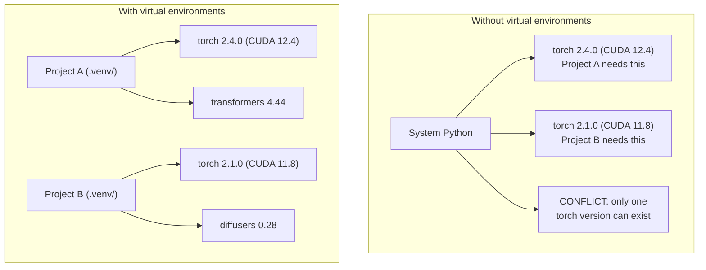

# Python Environments

> Dependency hell is real. Virtual environments are the cure.

**Type:** Build
**Languages:** Python
**Prerequisites:** Phase 0, Lesson 01
**Time:** ~30 minutes

## Learning Objectives

- Create isolated virtual environments using `uv`, `venv`, or `conda`
- Write a `pyproject.toml` with optional dependency groups and generate lockfiles for reproducibility
- Diagnose and fix common pitfalls: global installs, pip/conda mixing, CUDA version mismatches
- Implement a per-phase environment strategy for projects with conflicting dependencies

## The Problem

You install PyTorch 2.4 for a fine-tuning project. Next week, a different project needs PyTorch 2.1 because its CUDA build is pinned. You upgrade globally, and the first project breaks. You downgrade, and the second one breaks.

This is dependency hell. It happens constantly in AI/ML work because:

- PyTorch, JAX, and TensorFlow each ship their own CUDA bindings
- Model libraries pin specific framework versions
- A global `pip install` overwrites whatever was there before
- CUDA 11.8 builds don't work with CUDA 12.x drivers (and vice versa)

The fix: every project gets its own isolated environment with its own packages.

## The Concept




## Use It

Run the setup script to create your course environment:

```bash
bash phases/00-setup-and-tooling/06-python-environments/code/env_setup.sh
```

This creates a `.venv` at the repo root with core dependencies installed and verified.


## Key Terms

| Term | What people say | What it actually means |
|------|----------------|----------------------|
| Virtual environment | "A venv" | An isolated directory containing a Python interpreter and packages, separate from the system Python |
| Lockfile | "Pinned dependencies" | A file listing every package and its exact version, guaranteeing identical installs across machines |
| pyproject.toml | "The new setup.py" | The standard Python project configuration file, replacing setup.py/setup.cfg/requirements.txt |
| Transitive dependency | "A dependency of a dependency" | Package B depends on C; if you install A which depends on B, C is a transitive dependency of A |
| CUDA mismatch | "My GPU isn't working" | PyTorch was compiled for a different CUDA version than what your GPU driver supports |

## Build It

Reconstruct **Python Environments** by following `environment_report` on the demo’s smallest built-in fixture. Run `python3 main.py` and verify that the result reports the empty case explicitly or raises the documented validation error.

## Ship It

Hand off `outputs/artifact-card.md` with the command `python3 main.py`, the accepted input shape (the demo’s smallest built-in fixture), the expected observable result, and a failure note for malformed inputs.

## Exercises

Work from the smallest fixture that the Python Environments demo already understands, then make one deliberate change and record what moved.

1. **Run the smallest fixture.** From `code/`, run `python3 main.py` using the demo’s smallest built-in fixture. Follow `environment_report`. Expect the result reports the empty case explicitly or raises the documented validation error; capture the first printed shape, metric, status, or summary field and state which part supports **Create isolated virtual environments using `uv`, `venv`, or `conda`**.
2. **Perturb one field.** Repeat the command after changing only the primary fixture value: use the same fixture with its primary value changed from 1 to 2. Predict the direction of the change, then compare the two output values. Explain why **Write a `pyproject.toml` with optional dependency groups and generate lockfiles for reproducibility** says the other inputs should stay fixed.
3. **Check the failure boundary.** Feed the implementation an empty fixture {}. Before running it, write down whether the relevant function should return an empty value, a zero-sized result, or a validation error. Check the observed status against **Diagnose and fix common pitfalls: global installs, pip/conda mixing, CUDA version mismatches** and record the exception text if the code rejects the case.
4. **Make the result repeatable.** Open `outputs/artifact-card.md` and add a worked example using the demo’s smallest built-in fixture. Include the input contract, one expected output field, and a named acceptance check for **Implement a per-phase environment strategy for projects with conflicting dependencies**; note what the demo cannot establish.

## Reference Solution

A checkable result for **Python Environments** should contain:

- the `python3 main.py` output for the demo’s smallest built-in fixture, with `environment_report` traced to the value or shape that supports **Create isolated virtual environments using `uv`, `venv`, or `conda`**;
- a before/after comparison for the primary fixture value, where the same fixture with its primary value changed from 1 to 2 changes the observation in the direction predicted by **Write a `pyproject.toml` with optional dependency groups and generate lockfiles for reproducibility**;
- a recorded result for an empty fixture {} that matches the implementation’s validation or empty-result contract and explains the evidence for **Diagnose and fix common pitfalls: global installs, pip/conda mixing, CUDA version mismatches**; and
- an updated `outputs/artifact-card.md` example with a concrete input, expected output field, and acceptance check tied to **Implement a per-phase environment strategy for projects with conflicting dependencies**.

Run the lesson tests after the demo. If the boundary behaves differently from the prediction, keep the actual exception or output and explain the implementation path that produced it.
