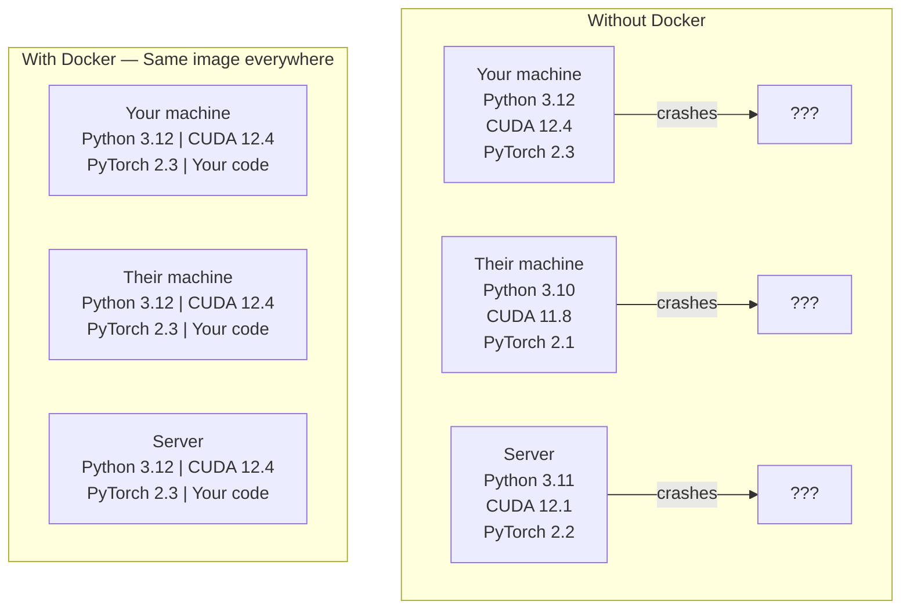

# Docker for AI

> Containers make "works on my machine" a thing of the past.

**Type:** Build
**Languages:** Docker
**Prerequisites:** Phase 0, Lessons 01 and 03
**Time:** ~60 minutes

## Learning Objectives

- Build a GPU-enabled Docker image with CUDA, PyTorch, and AI libraries from a Dockerfile
- Mount host directories as volumes to persist models, datasets, and code across container rebuilds
- Configure the NVIDIA Container Toolkit to expose GPUs inside containers
- Orchestrate multi-service AI applications (inference server + vector database) using Docker Compose

## The Problem

You trained a model on your laptop with PyTorch 2.3, CUDA 12.4, and Python 3.12. Your colleague has PyTorch 2.1, CUDA 11.8, and Python 3.10. Your model crashes on their machine. Your Dockerfile works on both.

AI projects are dependency nightmares. A typical stack includes Python, PyTorch, CUDA drivers, cuDNN, system-level C libraries, and specialized packages like flash-attn that need exact compiler versions. Docker packages all of this into a single image that runs identically everywhere.

## The Concept

Docker wraps your code, runtime, libraries, and system tools into an isolated unit called a container. Think of it as a lightweight virtual machine, except it shares the host OS kernel instead of running its own, so it starts in seconds instead of minutes.



### Why AI projects need Docker more than most

1. **GPU drivers are fragile.** CUDA 12.4 code does not run on CUDA 11.8. Docker isolates the CUDA toolkit inside the container while sharing the host GPU driver through the NVIDIA Container Toolkit.

2. **Model weights are large.** A 7B parameter model is 14 GB in fp16. You do not want to re-download it every time you rebuild. Docker volumes let you mount a models directory from the host.

3. **Multi-service architectures are common.** A real AI application is not just a Python script. It is an inference server, a vector database for RAG, maybe a web frontend. Docker Compose orchestrates all of these with one command.

### Key vocabulary

| Term | What it means |
|------|---------------|
| Image | A read-only template. Your recipe. Built from a Dockerfile. |
| Container | A running instance of an image. Your kitchen. |
| Dockerfile | Instructions to build an image. Layer by layer. |
| Volume | Persistent storage that survives container restarts. |
| docker-compose | A tool for defining multi-container applications in YAML. |

### Common container patterns in AI

```
Dev Container
  Full toolkit. Editor support. Jupyter. Debugging tools.
  Used during development and experimentation.

Training Container
  Minimal. Just the training script and dependencies.
  Runs on GPU clusters. No editor, no Jupyter.

Inference Container
  Optimized for serving. Small image. Fast cold start.
  Runs behind a load balancer in production.
```


## Use It

You now have a reproducible AI development environment. For the rest of this course:

- Use `docker compose up` to start your dev environment and vector database together
- Mount your code, models, and data as volumes so nothing is lost between rebuilds
- When a lesson requires a new Python package, add it to the Dockerfile and rebuild
- Share your Dockerfile with teammates. They get the exact same environment.

### No GPU?

Remove the `--gpus all` flag and the NVIDIA deploy block. The container still works for CPU-based lessons. PyTorch detects the absence of CUDA and falls back to CPU automatically.


## Key Terms

| Term | What people say | What it actually means |
|------|----------------|----------------------|
| Container | "Lightweight VM" | An isolated process using the host kernel, with its own filesystem and network |
| Image layer | "Cached step" | Each Dockerfile instruction creates a layer. Unchanged layers are cached, so rebuilds are fast. |
| NVIDIA Container Toolkit | "GPU in Docker" | A runtime hook that exposes host GPUs to containers via `--gpus` flag |
| Volume mount | "Shared folder" | A directory on the host mapped into the container. Changes persist after the container stops. |
| Base image | "Starting point" | The `FROM` image your Dockerfile builds on top of. Determines what is pre-installed. |
