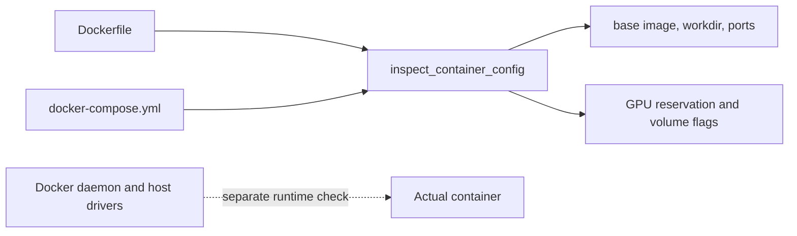

# Docker for AI

> Treat an image and its mounts as a configuration to inspect, not a promise that a host can run it.

**Type:** Build
**Languages:** Python
**Prerequisites:** Phase 0, Lessons 01 and 03
**Time:** ~45 minutes

## Learning Objectives

- Read the pinned CUDA base image, `WORKDIR`, `EXPOSE`, and package layers from the lesson Dockerfile.
- Verify that Compose requests NVIDIA GPU capabilities and declares the expected host and named volumes.
- Distinguish the offline configuration audit from a real Docker build or GPU runtime check.
- Explain which mounts preserve repository, model, dataset, and Qdrant data across container recreation.
- Record reproducibility evidence without claiming that a host has the NVIDIA Container Toolkit installed.

## What this lesson audits

The Python entrypoint does not call Docker. `inspect_container_config()` reads the supplied `Dockerfile` and `docker-compose.yml` with `Path` and regular expressions, then returns a small JSON summary. This keeps the lesson runnable on a machine without Docker while making the configuration contract concrete.



## Build It

From the lesson directory, run:

```bash
cd phases/00-setup-and-tooling/07-docker-for-ai
python3 code/main.py
```

The expected summary for the checked-in files is:

```json
{
  "base_image": "nvidia/cuda:12.4.1-devel-ubuntu22.04",
  "base_is_pinned": true,
  "workdir": "/workspace",
  "exposed_ports": [8888],
  "gpu_reservation": true,
  "persistent_volume": true
}
```

The audit sees `qdrant_data:` in Compose, not whether Qdrant is healthy. It also sees `capabilities: [gpu]`, not whether the host driver and NVIDIA Container Toolkit can satisfy that request.

## Use It

Read the two configuration files alongside the JSON. The image installs Python 3.12, PyTorch 2.3.1 from the CUDA 12.4 wheel index, and the listed AI packages; it exposes port 8888 and declares `/workspace` and `/models` volumes. Compose additionally mounts the repository at `/workspace`, `~/models` at `/models`, `~/datasets` at `/data`, and a named `qdrant_data` volume at Qdrant's storage path. These are file-layout claims from local files, not a guarantee that a build will succeed on every host.

If Docker is already installed, `docker compose -f code/docker-compose.yml config` is a useful syntax check. A real `docker build` downloads a large CUDA image and packages, so record that as a separate runtime experiment rather than hiding it inside the Python audit.

## Ship It

[`outputs/artifact-card.md`](../outputs/artifact-card.md) should include the JSON summary, the two configuration paths, and a table of mounts and their purpose. Add a separate runtime acceptance line for `docker compose config`, image build, GPU visibility, and service health; a green Python audit covers none of those external conditions.

## Exercises

1. Run `python3 code/main.py` and verify each JSON field against the corresponding Dockerfile or Compose line.
2. Change only the `EXPOSE` line in a temporary copy and confirm that `exposed_ports` changes while the GPU and volume flags do not.
3. Explain the difference between the bind mount `~/models:/models` and the named volume `qdrant_data:/qdrant/storage`. Do not start services just to inspect the text.
4. If Docker is available, run `docker compose config` and record whether the host can render the GPU reservation. If it is unavailable, mark that check pending in the artifact rather than inferring failure from the Python output.

## Reference Solution

The Python result must contain the six values shown above. A correct explanation links `base_is_pinned` to the non-`latest` tag, `/workspace` to `WORKDIR`, `8888` to `EXPOSE`, and the two booleans to exact Compose strings. The handoff separates static configuration evidence from daemon, registry, driver, and service-health evidence.

Run the lesson tests from `code/`:

```bash
python3 -m unittest discover tests -v
```
