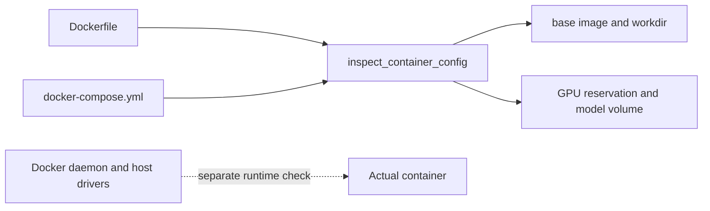

# Docker for AI

> Treat an image and its mounts as a configuration to inspect, not a promise that a host can run it.

**Type:** Build
**Languages:** Python
**Prerequisites:** Phase 0, Lessons 01 and 03
**Time:** ~45 minutes

## Learning Objectives

- Read the pinned CUDA base image, `WORKDIR`, and allowlisted Python package layer from the lesson Dockerfile.
- Verify that Compose requests NVIDIA GPU capabilities and declares the expected workspace, dataset, and model-cache mounts.
- Distinguish the offline configuration audit from a real Docker build or GPU runtime check.
- Explain how the named `model_cache` volume preserves model data across container recreation.
- Record reproducibility evidence without claiming that a host has the NVIDIA Container Toolkit installed.

## What this lesson audits

The Python entrypoint does not call Docker. `inspect_container_config()` reads the supplied `Dockerfile` and `docker-compose.yml` with `Path` and regular expressions, then returns a small JSON summary. This keeps the lesson runnable on a machine without Docker while making the configuration contract concrete. The files use only allowlisted Python packages (`numpy`, `safetensors`, and optional `torch`) if an image is actually built.



## Build It

From the lesson directory, run:

```bash
cd phases/00-setup-and-tooling/07-docker-for-ai
python3 code/main.py
```

The expected summary for the checked-in files is:

```json
{
  "base_image": "nvidia/cuda:12.4.1-devel-ubuntu22.04",
  "base_is_pinned": true,
  "workdir": "/workspace",
  "exposed_ports": [],
  "gpu_reservation": true,
  "persistent_volume": true
}
```

`persistent_volume` reflects the `model_cache:` named volume mounted at `/models`; it does not prove that Docker has created it. There is no exposed port, notebook server, or vector database in this minimal fixture. The Dockerfile's CUDA base and `torch` layer still require a real build to validate.

## Use It

Read the two configuration files alongside the JSON. The image installs Python 3 plus the allowlisted NumPy, safetensors, and PyTorch packages; it sets `/workspace` and `/models` as container volumes. Compose additionally mounts the repository at `/workspace`, a named `model_cache` at `/models`, and `~/datasets` at `/data`. The command is a self-terminating Python readiness print, not an inference service.

If Docker is already installed, `docker compose -f code/docker-compose.yml config` is a useful syntax check. A real `docker build` downloads a large CUDA image and packages, so record that as a separate runtime experiment rather than hiding it inside the Python audit.

## Ship It

[`outputs/artifact-card.md`](../outputs/artifact-card.md) should include the JSON summary, the two configuration paths, and a table of mounts and their purpose. Add separate runtime acceptance lines for Compose syntax, image build, GPU visibility, and any service you add later; a green Python audit covers none of those external conditions.

## Exercises

1. Run `python3 code/main.py` and verify each JSON field against the corresponding Dockerfile or Compose line.
2. Change only the `WORKDIR` line in a temporary copy and confirm that the parser reports the changed path while the GPU and volume flags remain stable.
3. Explain the difference between the repository bind mount, the `~/datasets` bind mount, and the named `model_cache:/models` volume. Do not start services just to inspect the text.
4. If Docker is available, run `docker compose config` and record whether the host can render the GPU reservation. If it is unavailable, mark that check pending in the artifact rather than inferring failure from the Python output.

## Reference Solution

The Python result must contain the six values shown above. A correct explanation links `base_is_pinned` to the non-`latest` CUDA tag, `/workspace` to `WORKDIR`, the empty port list to the absence of `EXPOSE`, and the two booleans to exact Compose strings. The handoff separates static configuration evidence from daemon, registry, driver, and runtime evidence.

Run the lesson tests from `code/`:

```bash
python3 -m unittest discover tests -v
```
