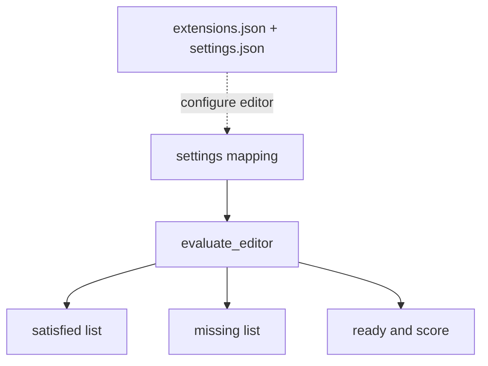

# Editor Setup

> A useful editor makes the project contract visible without changing the project for you.

**Type:** Build
**Languages:** Python
**Prerequisites:** Phase 0, Lesson 01
**Time:** ~20 minutes

## Learning Objectives

- Evaluate a boolean editor checklist with `evaluate_editor` without mutating user settings.
- Interpret the `ready`, `satisfied`, `missing`, and `score` fields returned by the demo.
- Map the checked-in VS Code settings to format-on-save, type checking, notebook output limits, and terminal behavior.
- Identify the recommended extensions for Python, Pylance, Jupyter, Ruff/Black, GitLens, and Remote SSH.
- Separate a local checklist result from the claim that a remote GPU session or an alternative editor is working.

## What the demo checks

`code/main.py` constructs a sample mapping in which all five required keys are `True`: `format_on_save`, `type_checking`, `integrated_terminal`, `notebook_support`, and `remote_ssh`. `evaluate_editor` compares each value with `is True`, returns missing keys in checklist order, and computes `len(satisfied) / 5`. It does not inspect VS Code, install extensions, or connect over SSH.



## Build It

Run the deterministic sample:

```bash
cd phases/00-setup-and-tooling/08-editor-setup/code
python3 main.py
```

It reports `ready: true`, an empty `missing` list, five satisfied names, and `score: 1.0`. Exercise the contract directly without changing settings files:

```python
from main import evaluate_editor

print(evaluate_editor({"format_on_save": True, "type_checking": False}))
```

The result is not ready, lists `type_checking` plus the three absent keys, and reports `1/5`. A value such as `1` is not the boolean `True` under the implementation's identity check.

## Use It

The checked-in `vscode/extensions.json` recommends Python, Pylance, Jupyter, debugpy, Black, Ruff, GitLens, Remote SSH, and related file-format/notebook extensions. `vscode/settings.json` sets Python type checking to `basic`, format-on-save with Black, Ruff on save, notebook output scrolling, a 500-line text limit, terminal profiles, and exclusions for caches. These files are a starting configuration; they do not install extensions or prove that a remote host is reachable.

## Ship It

[`outputs/artifact-card.md`](../outputs/artifact-card.md) is the reusable checklist. Record the mapping passed to `evaluate_editor`, the JSON result, and which settings/extensions were actually installed. Keep Remote SSH validation separate: the checklist can say `remote_ssh: true` while an SSH connection still fails.

## Exercises

1. Run the sample and verify that all five required names appear in `satisfied` and none appear in `missing`.
2. Evaluate a mapping with `type_checking` set to `False` and one with the key absent. Compare the two missing lists; both should contain `type_checking`.
3. Inspect `settings.json` and connect three checklist keys to exact settings (`python.analysis.typeCheckingMode`, `editor.formatOnSave`, and `notebook.output.scrolling`).
4. Use the artifact to record an editor setup on a local project, then separately record a Remote SSH smoke test. Do not use the score as evidence of network access.

## Reference Solution

The canonical JSON has five satisfied entries, `ready: true`, and score 1.0. A partial mapping demonstrates strict boolean checking and stable missing-key order. The settings and extension files explain how to implement the checklist, while a real editor launch and an SSH command are required for runtime acceptance. Tests cover the pure function and do not modify a user's editor.

Run the lesson tests from `code/`:

```bash
python3 -m unittest discover tests -v
```
