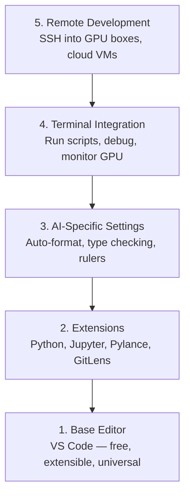

# Editor Setup

> Your editor is your co-pilot. Configure it once so it stays out of your way and starts pulling its weight.

**Type:** Build
**Languages:** Python
**Prerequisites:** Phase 0, Lesson 01
**Time:** ~20 minutes

## Learning Objectives

- Install VS Code with essential extensions for Python, Jupyter, linting, and remote SSH
- Configure format-on-save, type checking, and notebook output scrolling for AI workflows
- Set up Remote SSH to edit and debug code on remote GPU machines as if they were local
- Evaluate editor alternatives (Cursor, Windsurf, Neovim) and their tradeoffs for AI work

## The Problem

You'll spend thousands of hours inside your editor writing Python, running notebooks, debugging training loops, and SSH-ing into GPU boxes. A misconfigured editor turns every session into friction: no autocomplete, no type hints, no inline errors, manual formatting, and a clunky terminal workflow.

The right setup takes 20 minutes. Skipping it costs you 20 minutes every day.

## The Concept

An AI engineering editor setup needs five things:

## Use It

With this setup, your daily workflow looks like:

1. Open the project folder in VS Code (or connect via Remote SSH to a GPU box).
2. Write Python in the editor with autocomplete, type hints, and inline errors.
3. Run Jupyter notebooks inline with the Jupyter extension.
4. Use the integrated terminal for training scripts, `uv pip install`, and GPU monitoring.
5. Review changes with GitLens before committing.

## Key Terms

| Term | What people say | What it actually means |
|------|----------------|----------------------|
| LSP | "Autocomplete engine" | Language Server Protocol: a standard for editors to get type info, completions, and diagnostics from a language-specific server |
| Pylance | "The Python plugin" | Microsoft's Python language server using Pyright for type checking and IntelliSense |
| Remote SSH | "Working on the server" | VS Code extension that runs a lightweight server on a remote machine and streams the UI to your local editor |
| Format on save | "Auto-prettier" | The editor runs a formatter (Black, Ruff) every time you save, so code style is always consistent |

## Exercises

1. **Establish a baseline.** Run the lesson demo, then capture the inputs, outputs, and one invariant that demonstrates this objective: Install VS Code with essential extensions for Python, Jupyter, linting, and remote SSH.
2. **Change one variable.** Modify a single input or parameter and use the resulting evidence to investigate this objective: Configure format-on-save, type checking, and notebook output scrolling for AI workflows.
3. **Probe an edge case.** Predict the result before running it, compare prediction with observation, and explain the discrepancy while applying this objective: Set up Remote SSH to edit and debug code on remote GPU machines as if they were local.

## Reference Solution

Use the canonical [main.py](../code/main.py) as the executable baseline. A complete solution records a successful run, identifies the invariant tied to “Install VS Code with essential extensions for Python, Jupyter, linting, and remote SSH,” and changes only one variable for the comparison. The edge-case result must distinguish the prediction from the observation, explain the cause using “Set up Remote SSH to edit and debug code on remote GPU machines as if they were local,” and cite a repeatable check rather than relying on visual inspection alone.
