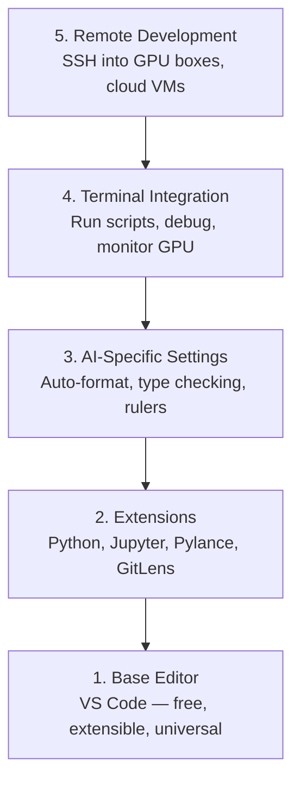

# Editor Setup

> Your editor is your co-pilot. Configure it once so it stays out of your way and starts pulling its weight.

**Type:** Build
**Languages:** Python
**Prerequisites:** Phase 0, Lesson 01
**Time:** ~20 minutes

## Learning Objectives

- Install VS Code with essential extensions for Python, Jupyter, linting, and remote SSH
- Configure format-on-save, type checking, and notebook output scrolling for AI workflows
- Set up Remote SSH to edit and debug code on remote GPU machines as if they were local
- Evaluate editor alternatives (Cursor, Windsurf, Neovim) and their tradeoffs for AI work

## The Problem

You'll spend thousands of hours inside your editor writing Python, running notebooks, debugging training loops, and SSH-ing into GPU boxes. A misconfigured editor turns every session into friction: no autocomplete, no type hints, no inline errors, manual formatting, and a clunky terminal workflow.

The right setup takes 20 minutes. Skipping it costs you 20 minutes every day.

## The Concept

An AI engineering editor setup needs five things:

## Use It

With this setup, your daily workflow looks like:

1. Open the project folder in VS Code (or connect via Remote SSH to a GPU box).
2. Write Python in the editor with autocomplete, type hints, and inline errors.
3. Run Jupyter notebooks inline with the Jupyter extension.
4. Use the integrated terminal for training scripts, `uv pip install`, and GPU monitoring.
5. Review changes with GitLens before committing.

## Key Terms

| Term | What people say | What it actually means |
|------|----------------|----------------------|
| LSP | "Autocomplete engine" | Language Server Protocol: a standard for editors to get type info, completions, and diagnostics from a language-specific server |
| Pylance | "The Python plugin" | Microsoft's Python language server using Pyright for type checking and IntelliSense |
| Remote SSH | "Working on the server" | VS Code extension that runs a lightweight server on a remote machine and streams the UI to your local editor |
| Format on save | "Auto-prettier" | The editor runs a formatter (Black, Ruff) every time you save, so code style is always consistent |

## Build It

Reconstruct **Editor Setup** by following `evaluate_editor` on the demo’s smallest built-in fixture. Run `python3 main.py` and verify that the result reports the empty case explicitly or raises the documented validation error.

## Ship It

Hand off `outputs/artifact-card.md` with the command `python3 main.py`, the accepted input shape (the demo’s smallest built-in fixture), the expected observable result, and a failure note for malformed inputs.

## Exercises

This lab follows `evaluate_editor` and `evaluate_editor` on a controlled fixture; write down the value before changing the input.

1. **Trace the canonical fixture.** From `code/`, run `python3 main.py` using the demo’s smallest built-in fixture. Follow `evaluate_editor`. Expect the result reports the empty case explicitly or raises the documented validation error; capture the first printed shape, metric, status, or summary field and state which part supports **Install VS Code with essential extensions for Python, Jupyter, linting, and remote SSH**.
2. **Change the controlled parameter.** Repeat the command after changing only the primary fixture value: use the same fixture with its primary value changed from 1 to 2. Predict the direction of the change, then compare the two output values. Explain why **Configure format-on-save, type checking, and notebook output scrolling for AI workflows** says the other inputs should stay fixed.
3. **Exercise the guard.** Feed the implementation an empty fixture {}. Before running it, write down whether the relevant function should return an empty value, a zero-sized result, or a validation error. Check the observed status against **Set up Remote SSH to edit and debug code on remote GPU machines as if they were local** and record the exception text if the code rejects the case.
4. **Prepare the artifact for reuse.** Open `outputs/artifact-card.md` and add a worked example using the demo’s smallest built-in fixture. Include the input contract, one expected output field, and a named acceptance check for **Evaluate editor alternatives (Cursor, Windsurf, Neovim) and their tradeoffs for AI work**; note what the demo cannot establish.

## Reference Solution

A checkable result for **Editor Setup** should contain:

- the `python3 main.py` output for the demo’s smallest built-in fixture, with `evaluate_editor` traced to the value or shape that supports **Install VS Code with essential extensions for Python, Jupyter, linting, and remote SSH**;
- a before/after comparison for the primary fixture value, where the same fixture with its primary value changed from 1 to 2 changes the observation in the direction predicted by **Configure format-on-save, type checking, and notebook output scrolling for AI workflows**;
- a recorded result for an empty fixture {} that matches the implementation’s validation or empty-result contract and explains the evidence for **Set up Remote SSH to edit and debug code on remote GPU machines as if they were local**; and
- an updated `outputs/artifact-card.md` example with a concrete input, expected output field, and acceptance check tied to **Evaluate editor alternatives (Cursor, Windsurf, Neovim) and their tradeoffs for AI work**.

Run the lesson tests after the demo. If the boundary behaves differently from the prediction, keep the actual exception or output and explain the implementation path that produced it.
