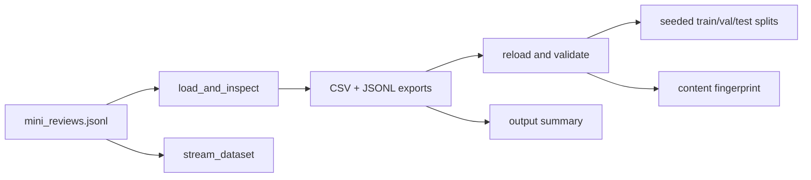

# Data Management

> Make dataset identity, format, split, and cache decisions reproducible before training starts.

**Type:** Build
**Languages:** Python
**Prerequisites:** Phase 0, Lesson 01
**Time:** ~45 minutes

## Learning Objectives

- Load and inspect the checked-in `mini_reviews.jsonl` fixture with `load_and_inspect`.
- Stream a bounded number of rows with `stream_dataset` without reading the rest of the file.
- Convert validated records to CSV and JSONL, then load both formats back.
- Create disjoint train/validation/test subsets with a fixed seed and record their membership.
- Compute a content fingerprint and an output-directory summary without treating either as a data-quality audit.

## What the utility actually does

`code/data_utils.py` is a complete offline utility around a 12-row JSONL fixture in `code/fixtures/mini_reviews.jsonl`. It uses only Python's standard library: `json`, `csv`, `random`, `hashlib`, and `pathlib`. This stays stdlib-first for didactic clarity and makes every output reproducible without a Hub account or network.



Rows have the concrete schema `id`, `text`, and binary `label`. The loader rejects missing columns, malformed JSON, non-integer IDs/labels, and labels outside 0/1. `stream_dataset` requires a positive `max_rows`; zero and negative limits raise `ValueError` before the file is read. The fingerprint is a compact change detector, not proof that labels or sampling are semantically correct.

## Build It

From the lesson directory, run the offline pipeline:

```bash
cd phases/00-setup-and-tooling/09-data-management
python3 code/main.py
```

The canonical run loads 12 rows, previews IDs 0–2, writes `mini_reviews_sample.csv` and `mini_reviews_sample.jsonl` below `/tmp/phase00-data-management`, reloads JSONL, and makes seeded splits with `seed=42`. With this 12-row fixture and the defaults (`train_ratio=0.75`, `val_ratio=0.125`), the counts are train 9, validation 1, and test 2. The fingerprint is the first 16 hexadecimal characters of a SHA-256 digest; record the printed value rather than treating it as a universal identifier.

## Use It

Inspect or stream the fixture directly:

```python
from data_utils import load_and_inspect, stream_dataset

rows = load_and_inspect()
preview = stream_dataset(max_rows=3)
print([row["id"] for row in preview])  # [0, 1, 2]
```

`convert_format(rows, output_dir, name)` writes one CSV with a header and one JSON object per JSONL line. `load_from_csv` and `load_from_jsonl` normalize the stored `id` and `label` types. `make_splits(rows, seed=42)` shuffles indices with `random.Random(seed)` and returns disjoint lists; it does not stratify labels or guarantee statistical balance. `cache_summary(path)` counts direct output files and bytes, not a global package cache.

## Ship It

[`outputs/prompt-data-helper.md`](../outputs/prompt-data-helper.md) is the reusable artifact. Fill it with the fixture/source path, schema, row budget, format, seed, split counts, fingerprint, and output directory. If you replace the fixture with real data, document its provenance separately; this lesson does not fetch or verify an external dataset.

## Exercises

1. Run `main.py`, record the three preview IDs, the two export paths, and the printed split counts. Check that the output directory contains exactly the CSV and JSONL exports.
2. Change one row in a temporary JSONL copy and run `load_and_inspect`. Observe the validation output and compare fingerprints before and after the change.
3. Reload both export formats and compare the row dictionaries, including integer `id` and `label` values. Explain why CSV needs explicit type coercion while JSONL preserves numeric syntax.
4. Run `make_splits` twice with seed 42 and once with seed 7. Record membership, prove the three ID sets are disjoint and complete, and note that this toy splitter is not stratified.

## Reference Solution

A correct run reports the 12-row schema, streams exactly three records, round-trips the CSV and JSONL records, and produces deterministic 9/1/2 splits for seed 42. The fingerprint changes when a sampled row changes, while the output summary reports the two generated files and their bytes. The artifact records local evidence and limitations rather than inventing a Hub revision, Parquet output, cache guarantee, or model-quality claim.

Run the lesson tests from `code/`:

```bash
python3 -m unittest discover tests -v
```
