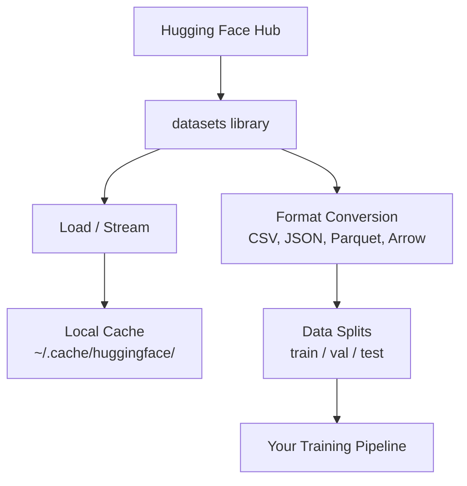

# Data Management

> Data is the fuel. How you manage it determines how fast you go.

**Type:** Build
**Languages:** Python
**Language:** Python
**Prerequisites:** Phase 0, Lesson 01
**Time:** ~45 minutes

## Learning Objectives

- Load, stream, and cache datasets using the Hugging Face `datasets` library
- Convert between CSV, JSON, Parquet, and Arrow formats and explain their tradeoffs
- Create reproducible train/validation/test splits with fixed random seeds
- Manage large model and dataset files using `.gitignore`, Git LFS, or DVC

## The Problem

Every AI project starts with data. You need to find datasets, download them, convert between formats, split them for training and evaluation, and version them so experiments are reproducible. Doing this manually every time is slow and error-prone. You need a repeatable workflow.

## The Concept

The Hugging Face `datasets` library is the standard way to load data for AI work. It handles downloading, caching, format conversion, and streaming out of the box.

## Ship It

This lesson produces:
- `code/data_utils.py` - reusable data loading and caching utility
- `outputs/prompt-data-helper.md` - prompt for finding the right dataset for a task

## Key Terms

| Term | What people say | What it actually means |
|------|----------------|----------------------|
| Dataset split | "Training data" | A named subset (train/val/test) used at different stages of the ML lifecycle |
| Streaming | "Load it lazily" | Processing data row by row from a remote source without downloading the full dataset |
| Parquet | "Compressed CSV" | A columnar file format optimized for analytical queries and storage efficiency |
| Arrow | "Fast dataframe" | An in-memory columnar format used internally by the datasets library for zero-copy reads |
| Git LFS | "Git for big files" | An extension that stores large files outside the git repo while keeping pointers in version control |
| DVC | "Git for data" | A version control system for datasets and models that integrates with cloud storage |
| Cache | "Already downloaded" | A local copy of previously fetched data, stored at ~/.cache/huggingface/ by default |

## Build It

Reconstruct **Data Management** by following `load_and_inspect` on x=0.5 with the demo defaults. Run `python3 main.py` and verify that the update or loss change agrees with the gradient sign; a zero gradient produces no accidental jump.

## Use It

Call `load_and_inspect` from a small caller with x=0.5 with the demo defaults. Compare its result with the demo output, and record the input contract and the one field a downstream user should rely on.

## Exercises

Keep two runs side by side for **Data Management**. The important evidence is the named field, shape, or status—not a polished paragraph about the run.

1. **Read the first result.** From `code/`, run `python3 main.py` using x=0.5 with the demo defaults. Follow `load_and_inspect`, `stream_dataset`, `convert_format`. Expect the update or loss change agrees with the gradient sign; a zero gradient produces no accidental jump; capture the first printed shape, metric, status, or summary field and state which part supports **Load, stream, and cache datasets using the Hugging Face `datasets` library**.
2. **Run a two-value comparison.** Repeat the command after changing only the learning rate: use the same run with learning rate 0.1 instead of 0.01. Predict the direction of the change, then compare the two output values. Explain why **Convert between CSV, JSON, Parquet, and Arrow formats and explain their tradeoffs** says the other inputs should stay fixed.
3. **Try an adversarial fixture.** Feed the implementation a zero gradient or an already-minimized point. Before running it, write down whether the relevant function should return an empty value, a zero-sized result, or a validation error. Check the observed status against **Create reproducible train/validation/test splits with fixed random seeds** and record the exception text if the code rejects the case.
4. **Write the operator note.** Open `outputs/prompt-data-helper.md` and add a worked example using x=0.5 with the demo defaults. Include the input contract, one expected output field, and a named acceptance check for **Manage large model and dataset files using `.gitignore`, Git LFS, or DVC**; note what the demo cannot establish.

## Reference Solution

A checkable result for **Data Management** should contain:

- the `python3 main.py` output for x=0.5 with the demo defaults, with `load_and_inspect`, `stream_dataset`, `convert_format` traced to the value or shape that supports **Load, stream, and cache datasets using the Hugging Face `datasets` library**;
- a before/after comparison for the learning rate, where the same run with learning rate 0.1 instead of 0.01 changes the observation in the direction predicted by **Convert between CSV, JSON, Parquet, and Arrow formats and explain their tradeoffs**;
- a recorded result for a zero gradient or an already-minimized point that matches the implementation’s validation or empty-result contract and explains the evidence for **Create reproducible train/validation/test splits with fixed random seeds**; and
- an updated `outputs/prompt-data-helper.md` example with a concrete input, expected output field, and acceptance check tied to **Manage large model and dataset files using `.gitignore`, Git LFS, or DVC**.

Run the lesson tests after the demo. If the boundary behaves differently from the prediction, keep the actual exception or output and explain the implementation path that produced it.
