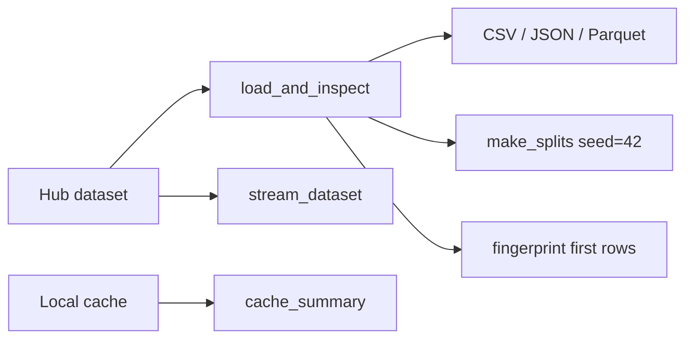

# Data Management

> Make dataset identity, format, split, and cache decisions reproducible before training starts.

**Type:** Build
**Languages:** Python
**Prerequisites:** Phase 0, Lesson 01
**Time:** ~45 minutes

## Learning Objectives

- Load and inspect the `cornell-movie-review-data/rotten_tomatoes` training split with `load_and_inspect`.
- Stream a bounded number of rows with `stream_dataset` instead of materializing the whole split.
- Convert a Dataset to CSV, JSON, and Parquet and compare the files created by `convert_format`.
- Create train/validation/test subsets with `make_splits` and a fixed seed, then verify their row counts.
- Record a dataset fingerprint and cache summary without treating either as a semantic data-quality audit.

## What the utility actually does

`code/data_utils.py` is an integration utility around the Hugging Face `datasets` and `huggingface_hub` APIs. It is not a local synthetic-data demo: the canonical path contacts the Hub, writes `/tmp/data_utils_demo`, downloads `config.json` for `sentence-transformers/all-MiniLM-L6-v2`, and inspects the local cache. The repository's dependency allowlist is intentionally stdlib-first and does not include these two external packages; the standard test harness may therefore skip this lesson. Do not install extra dependencies merely to make a local check green.



## Build It

When the two external APIs are already available and network access is intentional, run:

```bash
cd phases/00-setup-and-tooling/09-data-management
python3 code/main.py
```

The sequence is explicit in `data_utils.py`: load the Rotten Tomatoes `train` split; stream three rows; select the first 500 rows; write three files under `/tmp/data_utils_demo`; split those 500 rows with `train_ratio=0.8`, `val_ratio=0.1`, and `seed=42`; reload the Parquet file; download the model config; fingerprint the first 100 rows; and report cache size. The split should be approximately 400/50/50 for 500 rows; record the actual counts because rounding belongs to the library.

If the imports are unavailable, the program prints an installation message and exits before any dataset operation. If the Hub or network is unavailable, preserve the actual error instead of inventing rows or file sizes. This failure is an integration precondition, not evidence that the split logic is wrong.

## Use It

The helper contracts are usable independently once the external APIs are present:

- `load_and_inspect(name, config=None, split="train")` prints row count, column names, features, and the first row.
- `stream_dataset(name, config=None, max_rows=5)` returns at most `max_rows` dictionaries.
- `convert_format(ds, output_dir, name)` writes `.csv`, `.json`, and `.parquet` and returns their paths.
- `make_splits(ds, train_ratio, val_ratio, seed)` rejects ratios whose sum leaves no test data and returns three Dataset objects.
- `fingerprint(ds, num_rows=100)` hashes a JSON serialization of the first `min(num_rows, len(ds))` rows and returns the first 16 hexadecimal characters.

The code uses the default Hugging Face cache path `~/.cache/huggingface/datasets`. A fingerprint detects a changed sampled representation; it does not prove that labels are correct or that two datasets are statistically equivalent.

## Ship It

[`outputs/prompt-data-helper.md`](../outputs/prompt-data-helper.md) is the reusable artifact. When adapting it, retain the dataset ID, config, split, intended row budget, and authentication/network preconditions. Ask for a real Hub lookup before recommending an ID; the prompt's examples are suggestions, not outputs generated by this lesson.

## Exercises

1. Run the canonical command only if the external packages and network are available. Record whether the first failure is import, Hub access, or a later conversion step.
2. For the 500-row sample, verify the actual train/validation/test counts and rerun `make_splits` with seed 42. Compare the selected row identities, not just the counts.
3. Inspect the three files under `/tmp/data_utils_demo`. Compare their byte sizes and reload the Parquet file with `load_from_parquet`; quote the returned column names.
4. Compute a fingerprint twice with `num_rows=100`, then change one sampled row in a disposable Dataset and compute it again. Add the observed hashes and the limitation of this check to the artifact.

## Reference Solution

A successful integration run reports the named dataset and `train` split, streams exactly three rows, writes all three formats, and produces actual split counts and a 16-character fingerprint. The acceptance record includes the seed and paths, but does not claim a fixed byte ratio or a clean cache without observing them. In an environment lacking the external APIs, the correct solution is a documented skip with the printed precondition; no fabricated data or dependency installation is required.

Run the lesson tests from `code/` when their dependency policy permits it:

```bash
python3 -m unittest discover tests -v
```
