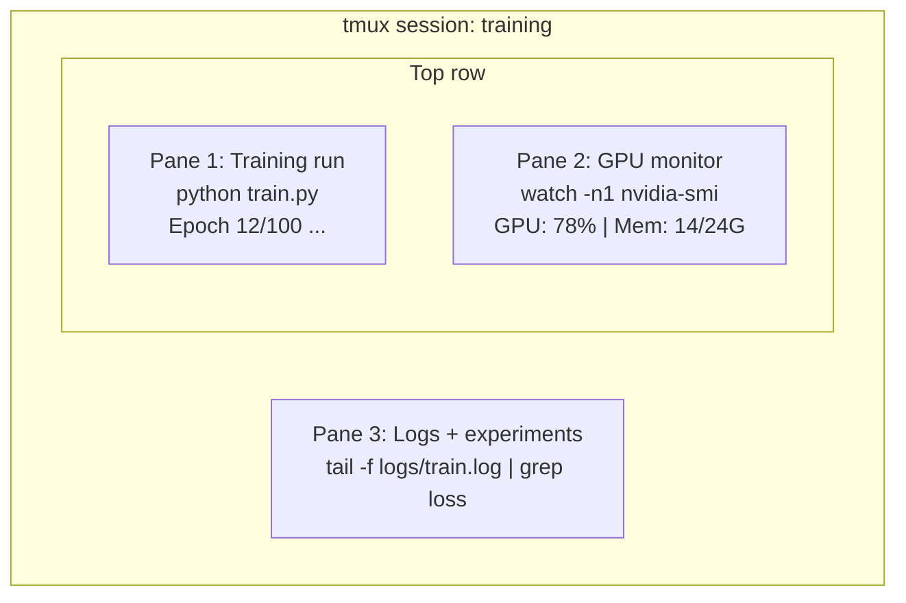

# Terminal & Shell

> The terminal is where AI engineers live. Get comfortable here.

**Type:** Learn
**Languages:** None
**Prerequisites:** Phase 0, Lesson 01
**Time:** ~35 minutes

## Learning Objectives

- Use piping, redirects, and `grep` to filter and process training logs from the command line
- Create persistent tmux sessions with multiple panes for concurrent training and GPU monitoring
- Monitor system and GPU resources with `htop`, `nvtop`, and `nvidia-smi`
- Transfer files between local and remote machines using SSH, `scp`, and `rsync`

## The Problem

You will spend more time in the terminal than in any editor. Training runs, GPU monitoring, log tailing, remote SSH sessions, environment management. Every AI workflow touches the shell. If you're slow here, you're slow everywhere.

This lesson covers the terminal skills that matter for AI work. No history of Unix. No deep-dive into Bash scripting. Just what you need.

## The Concept

Three things running at once. One terminal. You can detach, go home, SSH back in, and reattach. The training keeps running.

## Use It

Here's when each tool comes into play during this course:

| Tool | When you use it |
|------|----------------|
| tmux | Every training run (Phases 3+) |
| `tail -f` + `grep` | Monitoring training logs |
| `nohup` / `&` | Quick background tasks |
| `htop` / `nvtop` | Debugging slow training, OOM errors |
| SSH + `rsync` | Working on cloud GPUs |
| Piping + redirects | Processing experiment results |
| Aliases | Saving time on repetitive commands |

## Key Terms

| Term | What people say | What it actually means |
|------|----------------|----------------------|
| Shell | "The terminal" | The program that interprets your commands (bash, zsh, fish) |
| tmux | "Terminal multiplexer" | A program that lets you run multiple terminal sessions inside one window, and detach/reattach |
| Pipe | "The bar thing" | The `\|` operator that sends one command's output as input to another |
| PID | "Process ID" | A unique number assigned to every running process, used to monitor or kill it |
| nohup | "No hangup" | Runs a command immune to the hangup signal, so closing the terminal won't kill it |
| SSH | "Connecting to the server" | Secure Shell, an encrypted protocol for running commands on a remote machine |

## Exercises

1. **Explain the mechanism.** Give a concrete example and a counterexample that demonstrate this objective: Use piping, redirects, and `grep` to filter and process training logs from the command line.
2. **Make a decision.** Compare two plausible approaches, state the assumptions, and justify a choice while applying this objective: Create persistent tmux sessions with multiple panes for concurrent training and GPU monitoring.
3. **Stress-test the reasoning.** Introduce one failure condition, revise the proposed approach, and define evidence of success for this objective: Monitor system and GPU resources with `htop`, `nvtop`, and `nvidia-smi`.

## Reference Solution

A complete response first demonstrates “Use piping, redirects, and `grep` to filter and process training logs from the command line” with a specific example and a genuine counterexample. It then compares the alternatives using explicit assumptions for “Create persistent tmux sessions with multiple panes for concurrent training and GPU monitoring.” The final stress test must name a realistic failure condition, revise the approach, and define observable acceptance evidence for “Monitor system and GPU resources with `htop`, `nvtop`, and `nvidia-smi`.” Unsupported preference statements are not sufficient.
