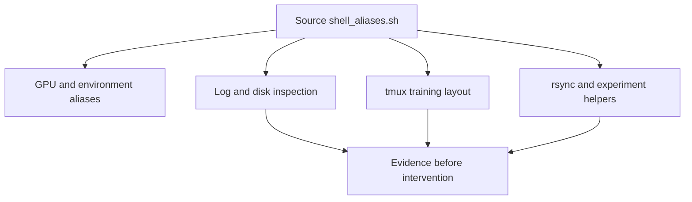

# Terminal & Shell

> Turn recurring training operations into inspectable shell commands, not opaque habits.

**Type:** Learn
**Languages:** None
**Prerequisites:** Phase 0, Lesson 01
**Time:** ~35 minutes

## Learning Objectives

- Source `code/shell_aliases.sh` and inspect the aliases and functions it adds to a shell.
- Filter a static training log with `grep`, pipes, and redirects before using a follow-mode watcher.
- Create a detached `tmux` training layout and identify its monitoring panes without killing a real job.
- Check GPU processes, disk usage, and large model files with the supplied aliases.
- Transfer a directory with `syncto` or `syncfrom` while checking the function's argument guard first.

## The artifact is a shell library

This lesson has no `code/main.*` program. Its executable artifact is [`code/shell_aliases.sh`](../code/shell_aliases.sh), which is meant to be sourced from Bash or zsh. It defines GPU queries (`gpu`, `gpuwatch`, `gpumem`, `gpuprocs`), environment helpers (`ae`, `de`, `mkvenv`, `uvvenv`), log filters, disk checks, tmux shortcuts, rsync wrappers, experiment-directory helpers, and process inspection functions.



## Build It

Inspect the library in a clean interactive Bash without changing a profile:

```bash
bash --noprofile --norc -ic 'source phases/00-setup-and-tooling/10-terminal-and-shell/code/shell_aliases.sh; type gpu; type watchloss; type trainenv; type syncto; type newexp'
```

The output should identify `gpu` and `watchloss` as aliases and the others as functions. `watchloss` follows `logs/*.log`; do not run it against a missing or unbounded log while validating the lesson. `trainenv` creates and attaches to a tmux session, so inspect its commands before using it on a remote machine.

## Use It

For a bounded log experiment, create a temporary file and use the underlying pipeline rather than leaving `tail -f` running:

```bash
tmp_log=$(mktemp)
printf '%s\n' 'step=1 loss=2.1' 'step=2 accuracy=0.7' 'step=3 loss=1.4' > "$tmp_log"
grep 'loss' "$tmp_log" > "${tmp_log}.loss"
cat "${tmp_log}.loss"
rm -f "$tmp_log" "${tmp_log}.loss"
```

The `gpu` aliases query `nvidia-smi` and therefore report nothing useful on a machine without that tool. `syncto` and `syncfrom` wrap `rsync -avz --progress`; both return a usage message and status 1 when required arguments are missing. `newexp` creates `experiments/<name>_<timestamp>/logs`, `checkpoints`, and `configs`.

## Ship It

[`outputs/artifact-card.md`](../outputs/artifact-card.md) is the handoff. Record the exact alias/function, the input log or remote path, the command output, and a safe rollback or cleanup path. Never put a broad `pkill` pattern or a private hostname in a shared profile without reviewing it.

## Exercises

1. Source the file in a clean shell and run `type` for one alias and one function. Explain how Bash distinguishes them.
2. Filter a static log for `loss`, `accuracy`, and `ERROR` with three separate `grep` commands. Compare the output with the corresponding `watchloss`, `watchacc`, and `watcherr` pipelines without leaving a live watcher running.
3. Run `syncto` with no arguments and record its usage text and exit status. Then inspect, but do not invoke, the command it would run for `syncto gpu ~/data ./data`.
4. In a temporary working directory, call `newexp demo`; list the three created subdirectories and remove that exact experiment directory. Do not run `killtraining` on a shared machine.

## Reference Solution

The expected evidence is a clean-shell `type` report, a finite filtered-log file, and a recorded `syncto` usage guard. A tmux plan names the session and panes but is only accepted as running after `tmux ls` and an explicit reattach check. GPU and remote-transfer claims remain environment-dependent; the artifact should distinguish “command is defined” from “command succeeded.”
