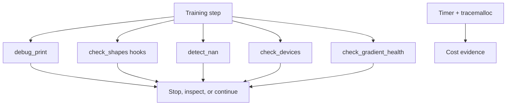

# Debugging and Profiling

> Catch a bad tensor, gradient, device, or allocation before a long training run hides it.

**Type:** Build
**Languages:** Python
**Prerequisites:** Lesson 01 (Dev Environment), basic PyTorch familiarity
**Time:** ~60 minutes

## Learning Objectives

- Use `debug_print` to expose a tensor's shape, dtype, device, range, mean, and NaN flag.
- Time a bounded section with `Timer` and inspect Python allocations with `tracemalloc`.
- Trace layer input/output shapes with `check_shapes` and forward hooks.
- Detect NaN losses and non-finite gradients with `detect_nan`, then inspect devices and gradient norms.
- Distinguish CPU/Python diagnostics from CUDA memory observations and state the PyTorch precondition for each.
- Run the bounded standard-library timing, allocation, and logging fallback when PyTorch is absent.

## The toolkit

The canonical entrypoint is `code/main.py`, which delegates to `debug_tools.py`. With PyTorch installed it runs ten demonstrations: tensor summaries, two matrix timings, `tracemalloc`, shape hooks through a three-layer MLP, normal and simulated NaN loss, device checks, gradient health, optional CUDA memory, logging, and a conditional `breakpoint()` pattern. Without PyTorch it runs a standard-library timer, `tracemalloc` over byte arrays, and structured logging, then exits 0 while clearly reporting that tensor demonstrations were skipped.



## Build It

From the lesson directory, run the bounded entrypoint:

```bash
cd phases/00-setup-and-tooling/12-debugging-and-profiling
python3 code/main.py
```

With PyTorch, `demo_print_debugging` first reports shape `(32, 784)` and then `(32, 128)`; the injected tensor reports `has_nan=True`. `demo_shape_checking` traces `784 -> 256 -> 64 -> 10` for a `(4, 784)` input. `demo_nan_detection` reports a finite normal loss and then detects the simulated NaN at step 99. CUDA memory output appears only when `torch.cuda.is_available()` is true. Without PyTorch, the standard-library path reports 10,000 constructed values, allocation statistics, and logging events. Timings and allocation counts are measurements of the current machine, not fixed acceptance numbers.

## Use It

The most direct probe, when PyTorch is available, is:

```python
import torch
from debug_tools import debug_print

debug_print("probe", torch.tensor([[1.0, 2.0, 3.0]]))
debug_print("bad", torch.tensor([[1.0, float("nan"), 3.0]]))
```

For a model, `check_shapes` installs hooks and removes them after the forward pass. `check_devices` compares every supplied tensor with the first model parameter's device. `check_gradient_health` returns the L2 norm of all available gradients and warns about zero or very large per-parameter norms. `tracemalloc` observes Python allocations; it is not a complete report of CUDA allocator memory.

## Ship It

[`outputs/prompt-debug-ai-code.md`](../outputs/prompt-debug-ai-code.md) is the reusable diagnostic prompt. A useful handoff includes the exact tensor shape/dtype/device, the loss and step, gradient findings, timing label, and whether the issue reproduced after a clean run. Never paste credentials or an entire private dataset into the prompt.

## Exercises

1. Run the entrypoint and record whether the PyTorch branch or the standard-library branch ran. If PyTorch is installed, capture the shape and `has_nan` fields from the finite and injected-NaN summaries; otherwise capture the fallback timer and allocation headings.
2. Use a `(2, 3)` tensor with one NaN and compare `debug_print` output with an all-finite tensor. Explain why `has_nan` changes while shape and dtype do not.
3. Build an `nn.Linear(4, 2)` and pass a `(2, 3)` input to reproduce a shape error. Then pass `(2, 4)` and use `check_shapes` to record the layer transition.
4. Run the artifact prompt against a simulated NaN loss and require a verification command plus a statement of what `tracemalloc` and CUDA memory do not measure.

## Reference Solution

The canonical report must expose the finite/NaN distinction and the MLP shape path when PyTorch is available. A shape failure is accepted only when the incompatible input and the layer's expected feature count are recorded. A useful profile reports a named timer and allocation snapshot, but does not compare wall-clock values across machines as if they were invariant. When PyTorch is absent, record the missing-dependency message, the standard-library timer/allocation/logging evidence, and the explicitly skipped tensor-specific evidence; the process should still exit 0.

Run the lesson tests from `code/`:

```bash
python3 -m unittest discover tests -v
```
