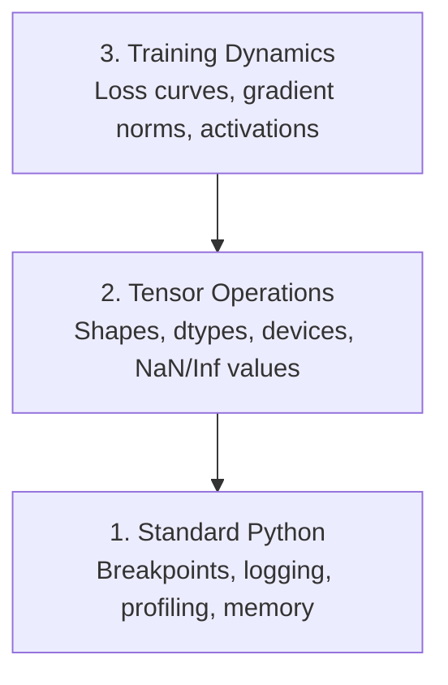

# Debugging and Profiling

> The worst AI bugs don't crash. They train silently on garbage and report a beautiful loss curve.

**Type:** Build
**Languages:** Python
**Prerequisites:** Lesson 1 (Dev Environment), basic PyTorch familiarity
**Time:** ~60 minutes

## Learning Objectives

- Use conditional `breakpoint()` and `debug_print` to inspect tensor shapes, dtypes, and NaN values mid-training
- Profile training loops with `cProfile`, `Timer`, and `tracemalloc` to find bottlenecks
- Detect common AI bugs: shape mismatches, NaN loss, data leakage, and wrong-device tensors
- Capture timing, allocation, and gradient-health evidence with `Timer`, `tracemalloc`, and `check_gradient_health`

## The Problem

AI code fails differently than regular code. A web app crashes with a stack trace. A misconfigured training loop runs for 8 hours, burns $200 in GPU time, and produces a model that predicts the mean of every input. The code never errored. The bug was a tensor on the wrong device, a forgotten `.detach()`, or labels leaking into features.

You need debugging tools that catch these silent failures before they waste your time and compute.

## The Concept

AI debugging operates at three levels:



Most people jump straight to level 3 (staring at dashboards). But 80% of AI bugs live at levels 1 and 2.


## Ship It

Run the debugging toolkit script:

```bash
python phases/00-setup-and-tooling/12-debugging-and-profiling/code/debug_tools.py
```

See `outputs/prompt-debug-ai-code.md` for a prompt that helps diagnose AI-specific bugs.

## Build It

Reconstruct **Debugging and Profiling** by following `debug_print` on a 2x3 tensor with one finite value. Run `python3 main.py` and verify that the diagnostic names the shape/dtype/non-finite value or the profiling section that explains the cost.

## Use It

Call `debug_print` from a small caller with a 2x3 tensor with one finite value. Compare its result with the demo output, and record the input contract and the one field a downstream user should rely on.

## Exercises

Work from the smallest fixture that the Debugging and Profiling demo already understands, then make one deliberate change and record what moved.

1. **Run the smallest fixture.** From `code/`, run `python3 main.py` using a 2x3 tensor with one finite value. Follow `debug_print`, `Timer`, `check_shapes`. Expect the diagnostic names the shape/dtype/non-finite value or the profiling section that explains the cost; capture the first printed shape, metric, status, or summary field and state which part supports **Use conditional `breakpoint()` and `debug_print` to inspect tensor shapes, dtypes, and NaN values mid-training**.
2. **Perturb one field.** Repeat the command after changing only the injected NaN value: use the same tensor with one NaN. Predict the direction of the change, then compare the two output values. Explain why **Profile training loops with `cProfile`, `Timer`, and `tracemalloc` to find bottlenecks** says the other inputs should stay fixed.
3. **Check the failure boundary.** Feed the implementation a tensor with an incompatible shape. Before running it, write down whether the relevant function should return an empty value, a zero-sized result, or a validation error. Check the observed status against **Detect common AI bugs: shape mismatches, NaN loss, data leakage, and wrong-device tensors** and record the exception text if the code rejects the case.
4. **Make the result repeatable.** Open `outputs/prompt-debug-ai-code.md` and add a worked example using a 2x3 tensor with one finite value. Include the input contract, one expected output field, and a named acceptance check for **Capture timing, allocation, and gradient-health evidence with `Timer`, `tracemalloc`, and `check_gradient_health`**; note what the demo cannot establish.

## Reference Solution

A checkable result for **Debugging and Profiling** should contain:

- the `python3 main.py` output for a 2x3 tensor with one finite value, with `debug_print`, `Timer`, `check_shapes` traced to the value or shape that supports **Use conditional `breakpoint()` and `debug_print` to inspect tensor shapes, dtypes, and NaN values mid-training**;
- a before/after comparison for the injected NaN value, where the same tensor with one NaN changes the observation in the direction predicted by **Profile training loops with `cProfile`, `Timer`, and `tracemalloc` to find bottlenecks**;
- a recorded result for a tensor with an incompatible shape that matches the implementation’s validation or empty-result contract and explains the evidence for **Detect common AI bugs: shape mismatches, NaN loss, data leakage, and wrong-device tensors**; and
- an updated `outputs/prompt-debug-ai-code.md` example with a concrete input, expected output field, and acceptance check tied to **Capture timing, allocation, and gradient-health evidence with `Timer`, `tracemalloc`, and `check_gradient_health`**.

Run the lesson tests after the demo. If the boundary behaves differently from the prediction, keep the actual exception or output and explain the implementation path that produced it.
