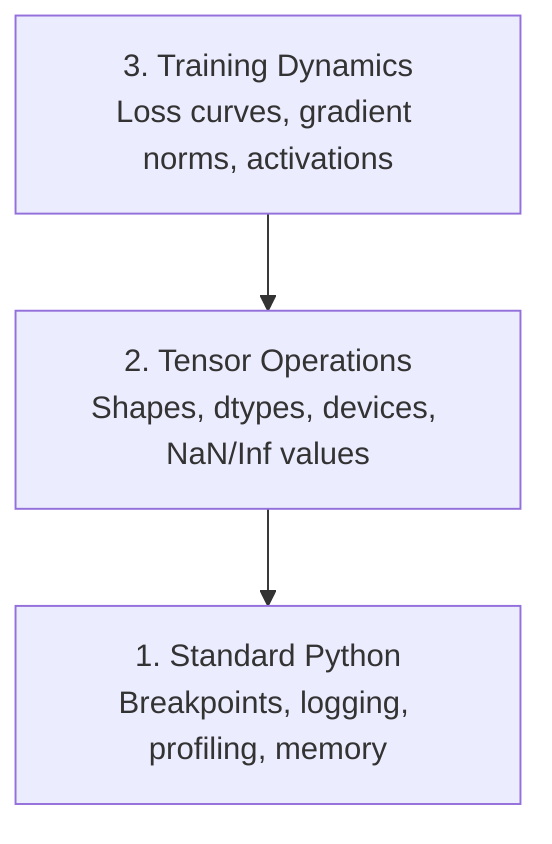

# Debugging and Profiling

> The worst AI bugs don't crash. They train silently on garbage and report a beautiful loss curve.

**Type:** Build
**Languages:** Python
**Language:** Python
**Prerequisites:** Lesson 1 (Dev Environment), basic PyTorch familiarity
**Time:** ~60 minutes

## Learning Objectives

- Use conditional `breakpoint()` and `debug_print` to inspect tensor shapes, dtypes, and NaN values mid-training
- Profile training loops with `cProfile`, `line_profiler`, and `tracemalloc` to find bottlenecks
- Detect common AI bugs: shape mismatches, NaN loss, data leakage, and wrong-device tensors
- Set up TensorBoard to visualize loss curves, weight histograms, and gradient distributions

## The Problem

AI code fails differently than regular code. A web app crashes with a stack trace. A misconfigured training loop runs for 8 hours, burns $200 in GPU time, and produces a model that predicts the mean of every input. The code never errored. The bug was a tensor on the wrong device, a forgotten `.detach()`, or labels leaking into features.

You need debugging tools that catch these silent failures before they waste your time and compute.

## The Concept

AI debugging operates at three levels:



Most people jump straight to level 3 (staring at TensorBoard). But 80% of AI bugs live at levels 1 and 2.


## Ship It

Run the debugging toolkit script:

```bash
python phases/00-setup-and-tooling/12-debugging-and-profiling/code/debug_tools.py
```

See `outputs/prompt-debug-ai-code.md` for a prompt that helps diagnose AI-specific bugs.

## Exercises

1. **Establish a baseline.** Run the lesson demo, then capture the inputs, outputs, and one invariant that demonstrates this objective: Use conditional `breakpoint()` and `debug_print` to inspect tensor shapes, dtypes, and NaN values mid-training.
2. **Change one variable.** Modify a single input or parameter and use the resulting evidence to investigate this objective: Profile training loops with `cProfile`, `line_profiler`, and `tracemalloc` to find bottlenecks.
3. **Probe an edge case.** Predict the result before running it, compare prediction with observation, and explain the discrepancy while applying this objective: Detect common AI bugs: shape mismatches, NaN loss, data leakage, and wrong-device tensors.

## Reference Solution

Use the canonical [main.py](../code/main.py) as the executable baseline. A complete solution records a successful run, identifies the invariant tied to “Use conditional `breakpoint()` and `debug_print` to inspect tensor shapes, dtypes, and NaN values mid-training,” and changes only one variable for the comparison. The edge-case result must distinguish the prediction from the observation, explain the cause using “Detect common AI bugs: shape mismatches, NaN loss, data leakage, and wrong-device tensors,” and cite a repeatable check rather than relying on visual inspection alone.
