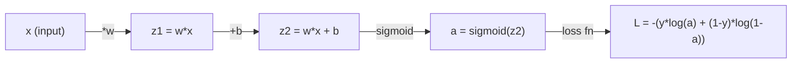
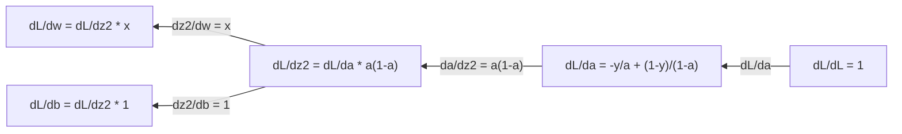
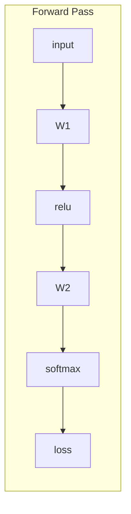
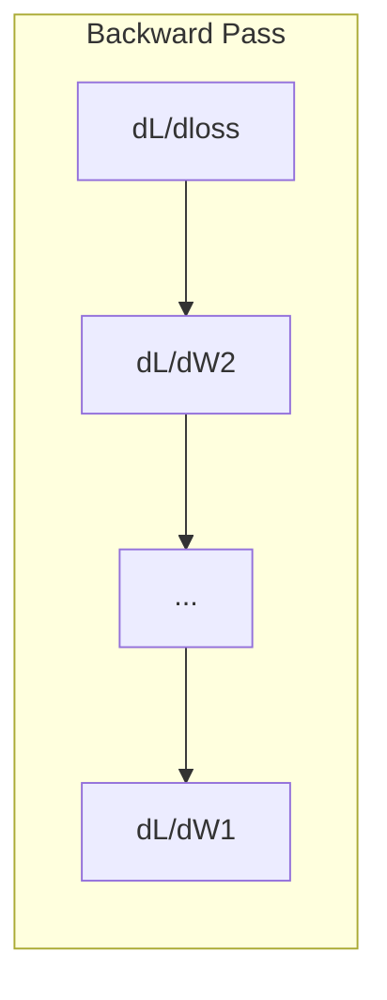

# Calculus for Machine Learning

> Derivatives tell you which way is downhill. That is all a neural network needs to learn.

**Type:** Learn
**Languages:** Julia
**Language:** Python
**Prerequisites:** Phase 1, Lessons 01-03
**Time:** ~60 minutes

## Learning Objectives

- Compute numerical and analytical derivatives for common ML functions (x^2, sigmoid, cross-entropy)
- Implement gradient descent from scratch to minimize a loss function in 1D and 2D
- Derive the gradient of a linear regression model and train it via manual weight updates
- Explain the Hessian matrix, Taylor series approximations, and their connection to optimization methods

## The Problem

You have a neural network with millions of weights. Each weight is a knob. You need to figure out which direction to turn every single knob to make the model slightly less wrong. Calculus gives you that direction.

Without calculus, training a neural network would mean trying random changes and hoping for the best. With derivatives, you know exactly how each weight affects the error. You turn every knob the right way, every time.

## The Concept

### What is a derivative?

A derivative measures the rate of change. For a function y = f(x), the derivative f'(x) tells you: if you nudge x by a tiny amount, how much does y change?

Geometrically, the derivative is the slope of the tangent line at a point.

**f(x) = x^2:**

| x | f(x) | f'(x) (slope) |
|---|------|---------------|
| 0 | 0    | 0 (flat, at the bottom) |
| 1 | 1    | 2 |
| 2 | 4    | 4 (tangent line slope at this point) |
| 3 | 9    | 6 |

At x=2, the slope is 4. If you move x a tiny bit to the right, y increases by about 4 times that amount. At x=0, the slope is 0. You are at the bottom of the bowl.

The formal definition:

```
f'(x) = lim   f(x + h) - f(x)
        h->0  -----------------
                     h
```

In code, you skip the limit and just use a very small h. That is the numerical derivative.

### Partial derivatives: one variable at a time

Real functions have many inputs. A neural network loss depends on thousands of weights. A partial derivative holds all variables constant except one, then takes the derivative with respect to that one.

```
f(x, y) = x^2 + 3xy + y^2

df/dx = 2x + 3y     (treat y as a constant)
df/dy = 3x + 2y     (treat x as a constant)
```

Each partial derivative answers: if I nudge just this one weight, how does the loss change?

### The gradient: vector of all partial derivatives

The gradient collects every partial derivative into one vector. For a function f(x, y, z), the gradient is:

```
grad f = [ df/dx, df/dy, df/dz ]
```

The gradient points in the direction of steepest ascent. To minimize a function, go in the opposite direction.

**Contour plot of f(x,y) = x^2 + y^2:**

The function forms a bowl shape with concentric circles as contour lines. The minimum is at (0, 0).

| Point | grad f | -grad f (descent direction) |
|-------|--------|----------------------------|
| (1, 1) | [2, 2] (points uphill, away from minimum) | [-2, -2] (points downhill, toward minimum) |
| (0, 0) | [0, 0] (flat, at the minimum) | [0, 0] |

This is gradient descent in a picture. Compute the gradient, negate it, take a step.

### The connection to optimization

Training a neural network is optimization. You have a loss function L(w1, w2, ..., wn) that measures how wrong the model is. You want to minimize it.

```
Gradient descent update rule:

  w_new = w_old - learning_rate * dL/dw

For every weight:
  1. Compute the partial derivative of loss with respect to that weight
  2. Subtract a small multiple of it from the weight
  3. Repeat
```

The learning rate controls step size. Too big and you overshoot. Too small and you crawl.

**Loss landscape (1D slice):**

The loss function L(w) forms a curve with peaks and valleys as the weight w varies.

| Feature | Description |
|---------|-------------|
| Global minimum | The lowest point on the entire curve -- the best solution |
| Local minimum | A valley that is lower than its neighbors but not the lowest overall |
| Slope | Gradient descent follows the slope downhill from any starting point |

Gradient descent follows the slope downhill. It can get stuck in local minima, but in high-dimensional spaces (millions of weights) this is rarely a practical problem.

### Numerical vs analytical derivatives

There are two ways to compute a derivative.

Analytical: apply calculus rules by hand. For f(x) = x^2, the derivative is f'(x) = 2x. Exact. Fast.

Numerical: approximate using the definition. Compute f(x+h) and f(x-h) for a tiny h, then use the difference.

```
Numerical (central difference):

f'(x) ~= f(x + h) - f(x - h)
          -----------------------
                  2h

h = 0.0001 works well in practice
```

Numerical derivatives are slower but work for any function. Analytical derivatives are fast but require you to derive the formula. Neural network frameworks use a third approach: automatic differentiation, which computes exact derivatives mechanically. You will see that in Phase 3.

### Derivatives by hand for simple functions

These are the derivatives you will see over and over in ML.

```
Function        Derivative       Used in
--------        ----------       -------
f(x) = x^2     f'(x) = 2x      Loss functions (MSE)
f(x) = wx + b  f'(w) = x        Linear layer (gradient w.r.t. weight)
                f'(b) = 1        Linear layer (gradient w.r.t. bias)
                f'(x) = w        Linear layer (gradient w.r.t. input)
f(x) = e^x     f'(x) = e^x     Softmax, attention
f(x) = ln(x)   f'(x) = 1/x     Cross-entropy loss
f(x) = 1/(1+e^-x)  f'(x) = f(x)(1-f(x))   Sigmoid activation
```

For f(x) = x^2:

```
f(x) = x^2    f'(x) = 2x

  x    f(x)   f'(x)   meaning
  -2    4      -4      slope tilts left (decreasing)
  -1    1      -2      slope tilts left (decreasing)
   0    0       0      flat (minimum!)
   1    1       2      slope tilts right (increasing)
   2    4       4      slope tilts right (increasing)
```

For f(w) = wx + b with x=3, b=1:

```
f(w) = 3w + 1    f'(w) = 3

The derivative with respect to w is just x.
If x is big, a small change in w causes a big change in output.
```

### The chain rule

When functions are composed, the chain rule tells you how to differentiate.

```
If y = f(g(x)), then dy/dx = f'(g(x)) * g'(x)

Example: y = (3x + 1)^2
  outer: f(u) = u^2       f'(u) = 2u
  inner: g(x) = 3x + 1    g'(x) = 3
  dy/dx = 2(3x + 1) * 3 = 6(3x + 1)
```

Neural networks are chains of functions: input -> linear -> activation -> linear -> activation -> loss. Backpropagation is the chain rule applied repeatedly from output to input. That is the entire algorithm.

### The Hessian Matrix

The gradient tells you the slope. The Hessian tells you the curvature.

The Hessian is the matrix of second-order partial derivatives. For a function f(x1, x2, ..., xn), entry (i, j) of the Hessian is:

```
H[i][j] = d^2f / (dx_i * dx_j)
```

For a 2-variable function f(x, y):

```
H = | d^2f/dx^2    d^2f/dxdy |
    | d^2f/dydx    d^2f/dy^2 |
```

**What the Hessian tells you at a critical point (where gradient = 0):**

| Hessian property | Meaning | Example surface |
|-----------------|---------|-----------------|
| Positive definite (all eigenvalues > 0) | Local minimum | Bowl pointing up |
| Negative definite (all eigenvalues < 0) | Local maximum | Bowl pointing down |
| Indefinite (mixed eigenvalues) | Saddle point | Horse saddle shape |

**Example:** f(x, y) = x^2 - y^2 (a saddle function)

```
df/dx = 2x       df/dy = -2y
d^2f/dx^2 = 2    d^2f/dy^2 = -2    d^2f/dxdy = 0

H = | 2   0 |
    | 0  -2 |

Eigenvalues: 2 and -2 (one positive, one negative)
--> Saddle point at (0, 0)
```

Compare with f(x, y) = x^2 + y^2 (a bowl):

```
H = | 2  0 |
    | 0  2 |

Eigenvalues: 2 and 2 (both positive)
--> Local minimum at (0, 0)
```

**Why the Hessian matters in ML:**

Newton's method uses the Hessian to take better optimization steps than gradient descent. Instead of just following the slope, it accounts for curvature:

```
Newton's update:    w_new = w_old - H^(-1) * gradient
Gradient descent:   w_new = w_old - lr * gradient
```

Newton's method converges faster because the Hessian "rescales" the gradient -- steep directions get smaller steps, flat directions get larger steps.

The catch: for a neural network with N parameters, the Hessian is N x N. A model with 1 million parameters would need a 1 trillion-entry matrix. That is why we use approximations.

| Method | What it uses | Cost | Convergence |
|--------|-------------|------|-------------|
| Gradient descent | First derivatives only | O(N) per step | Slow (linear) |
| Newton's method | Full Hessian | O(N^3) per step | Fast (quadratic) |
| L-BFGS | Approximate Hessian from gradient history | O(N) per step | Medium (superlinear) |
| Adam | Per-parameter adaptive rates (diagonal Hessian approx) | O(N) per step | Medium |
| Natural gradient | Fisher information matrix (statistical Hessian) | O(N^2) per step | Fast |

In practice, Adam is the default optimizer for deep learning. It approximates second-order information cheaply by tracking the running mean and variance of gradients per parameter.

### Taylor Series Approximation

Any smooth function can be approximated locally by a polynomial:

```
f(x + h) = f(x) + f'(x)*h + (1/2)*f''(x)*h^2 + (1/6)*f'''(x)*h^3 + ...
```

The more terms you include, the better the approximation -- but only near the point x.

**Why Taylor series matter for ML:**

- **First-order Taylor = gradient descent.** When you use f(x + h) ~ f(x) + f'(x)*h, you are making a linear approximation. Gradient descent minimizes this linear model to choose h = -lr * f'(x).

- **Second-order Taylor = Newton's method.** Using f(x + h) ~ f(x) + f'(x)*h + (1/2)*f''(x)*h^2, you get a quadratic model. Minimizing it gives h = -f'(x)/f''(x) -- Newton's step.

- **Loss function design.** MSE and cross-entropy are smooth, which means their Taylor expansions are well-behaved. This is not an accident. Smooth losses make optimization predictable.

```
Approximation order    What it captures    Optimization method
-------------------    -----------------   -------------------
0th order (constant)   Just the value      Random search
1st order (linear)     Slope               Gradient descent
2nd order (quadratic)  Curvature           Newton's method
Higher orders          Finer structure     Rarely used in ML
```

The key insight: all gradient-based optimization is really about approximating the loss function locally and stepping to the minimum of that approximation.

### Integrals in ML

Derivatives tell you rates of change. Integrals compute accumulations -- area under a curve.

In ML, you rarely compute integrals by hand, but the concept is everywhere:

**Probability.** For a continuous random variable with density p(x):
```
P(a < X < b) = integral from a to b of p(x) dx
```
The area under the probability density curve between a and b is the probability of landing in that range.

**Expected value.** The average outcome weighted by probability:
```
E[f(X)] = integral of f(x) * p(x) dx
```
The expected loss over a data distribution is an integral. Training minimizes an empirical approximation of this.

**KL divergence.** Measures how different two distributions are:
```
KL(p || q) = integral of p(x) * log(p(x) / q(x)) dx
```
Used in VAEs, knowledge distillation, and Bayesian inference.

**Normalization constants.** In Bayesian inference:
```
p(w | data) = p(data | w) * p(w) / integral of p(data | w) * p(w) dw
```
The denominator is an integral over all possible parameter values. It is often intractable, which is why we use approximations like MCMC and variational inference.

| Integral concept | Where it appears in ML |
|-----------------|----------------------|
| Area under curve | Probability from density functions |
| Expected value | Loss functions, risk minimization |
| KL divergence | VAEs, policy optimization, distillation |
| Normalization | Bayesian posteriors, softmax denominator |
| Marginal likelihood | Model comparison, evidence lower bound (ELBO) |

### Multivariable Chain Rule in a Computation Graph

The chain rule does not just apply to scalar functions in a line. In a neural network, variables fan out and merge. Here is how derivatives flow through a simple forward pass:



The backward pass computes gradients right to left:



Each arrow multiplies by the local derivative. The gradient for any parameter is the product of all local derivatives along the path from loss to that parameter. When paths branch and merge, you sum the contributions (multivariate chain rule).

This is all backpropagation is: the chain rule applied systematically through a computation graph, from output to inputs.

### The Jacobian matrix

When a function maps a vector to a vector (like a neural network layer), its derivative is a matrix. The Jacobian contains every partial derivative of every output with respect to every input.

For f: R^n -> R^m, the Jacobian J is an m x n matrix:

| | x1 | x2 | ... | xn |
|---|---|---|---|---|
| f1 | df1/dx1 | df1/dx2 | ... | df1/dxn |
| f2 | df2/dx1 | df2/dx2 | ... | df2/dxn |
| ... | ... | ... | ... | ... |
| fm | dfm/dx1 | dfm/dx2 | ... | dfm/dxn |

You will not compute Jacobians by hand for neural networks. PyTorch handles it. But knowing it exists helps you understand shapes in backpropagation: if a layer maps R^n to R^m, its Jacobian is m x n. The gradient flows backward through the transpose of this matrix.

### Why this matters for neural networks

Every weight in a neural network gets a gradient. The gradient tells you how to adjust that weight to reduce the loss.





Each weight update:
- `W1 = W1 - lr * dL/dW1`
- `W2 = W2 - lr * dL/dW2`

The forward pass computes the prediction and loss. The backward pass computes the gradient of the loss with respect to every weight. Then every weight takes a small step downhill. Repeat for millions of steps. That is deep learning.


## Use It

With NumPy, the same operations are faster and more concise:

```python fillin
import numpy as np

x = np.array([1, 2, 3, 4, 5], dtype=float)
y = np.array([3, 5, 7, 9, 11], dtype=float)  # true relationship: y = 2x + 1

def train(w, b, lr, epochs):
    for _ in range(epochs):
        pred = w * x + b
        error = pred - y
        dw = np.mean(2 * error * x)
        db = np.mean(2 * error)
        w -= lr * dw
        b -= lr * db
    return w, b

# Learning rate too large -- "Too large: diverge" from the key terms below.
w_bad, b_bad = train(0.0, 0.0, lr=1.0, epochs=50)
print("diverged:", w_bad, b_bad)  # blows up toward inf/nan

def loss_gradients(w, b):
    pred = w * x + b
    error = pred - y
    dw = {{blank:np.mean(2 * error * x)}}
    db = {{blank:np.mean(2 * error)}}
    return dw, db

w, b = 0.0, 0.0
lr = {{blank:0.01}}
for _ in range(2000):
    dw, db = loss_gradients(w, b)
    w -= lr * dw
    b -= lr * db

if abs(w - 2.0) < 0.01 and abs(b - 1.0) < 0.01:
    print("PASS")
else:
    print("WRONG:", w, b)
```

You just built gradient descent from scratch. PyTorch automates the gradient computation, but the update loop is identical.


## Key Terms

| Term | What people say | What it actually means |
|------|----------------|----------------------|
| Derivative | "The slope" | The rate of change of a function at a point. Tells you how much the output changes per unit change in input. |
| Partial derivative | "Derivative of one variable" | The derivative with respect to one variable while all others are held constant. |
| Gradient | "Direction of steepest ascent" | A vector of all partial derivatives. Points in the direction that increases the function fastest. |
| Gradient descent | "Go downhill" | Subtract the gradient (times a learning rate) from the parameters to reduce the loss. The core of neural network training. |
| Learning rate | "Step size" | A scalar that controls how big each gradient descent step is. Too large: diverge. Too small: converge slowly. |
| Chain rule | "Multiply the derivatives" | The rule for differentiating composed functions: df/dx = df/dg * dg/dx. The mathematical basis of backpropagation. |
| Jacobian | "Matrix of derivatives" | When a function maps vectors to vectors, the Jacobian is the matrix of all partial derivatives of outputs with respect to inputs. |
| Numerical derivative | "Finite differences" | Approximating a derivative by evaluating the function at two nearby points and computing the slope between them. |
| Backpropagation | "Reverse-mode autodiff" | Computing gradients layer by layer from output to input using the chain rule. How neural networks learn. |
| Hessian | "Matrix of second derivatives" | The matrix of all second-order partial derivatives. Describes the curvature of a function. Positive definite Hessian at a critical point means local minimum. |
| Taylor series | "Polynomial approximation" | Approximating a function near a point using its derivatives: f(x+h) ~ f(x) + f'(x)h + (1/2)f''(x)h^2 + ... The basis for understanding why gradient descent and Newton's method work. |
| Integral | "Area under the curve" | The accumulation of a quantity over a range. In ML, integrals define probabilities, expected values, and KL divergence. |

## Further Reading

- [3Blue1Brown: Essence of Calculus](https://www.3blue1brown.com/topics/calculus) - visual intuition for derivatives, integrals, and the chain rule
- [Stanford CS231n: Backpropagation](https://cs231n.github.io/optimization-2/) - how gradients flow through neural network layers

## Exercises

1. **Establish a baseline.** Run the lesson demo, then capture the inputs, outputs, and one invariant that demonstrates this objective: Compute numerical and analytical derivatives for common ML functions (x^2, sigmoid, cross-entropy).
2. **Change one variable.** Modify a single input or parameter and use the resulting evidence to investigate this objective: Implement gradient descent from scratch to minimize a loss function in 1D and 2D.
3. **Probe an edge case.** Predict the result before running it, compare prediction with observation, and explain the discrepancy while applying this objective: Derive the gradient of a linear regression model and train it via manual weight updates.

## Reference Solution

Use the canonical [main.jl](../code/main.jl) as the executable baseline. A complete solution records a successful run, identifies the invariant tied to “Compute numerical and analytical derivatives for common ML functions (x^2, sigmoid, cross-entropy),” and changes only one variable for the comparison. The edge-case result must distinguish the prediction from the observation, explain the cause using “Derive the gradient of a linear regression model and train it via manual weight updates,” and cite a repeatable check rather than relying on visual inspection alone.

## Guided Demo

Use the [10–15 minute guided demo](demo.md) to predict an invariant, run the canonical entrypoint, change one variable, and probe a failure case.
