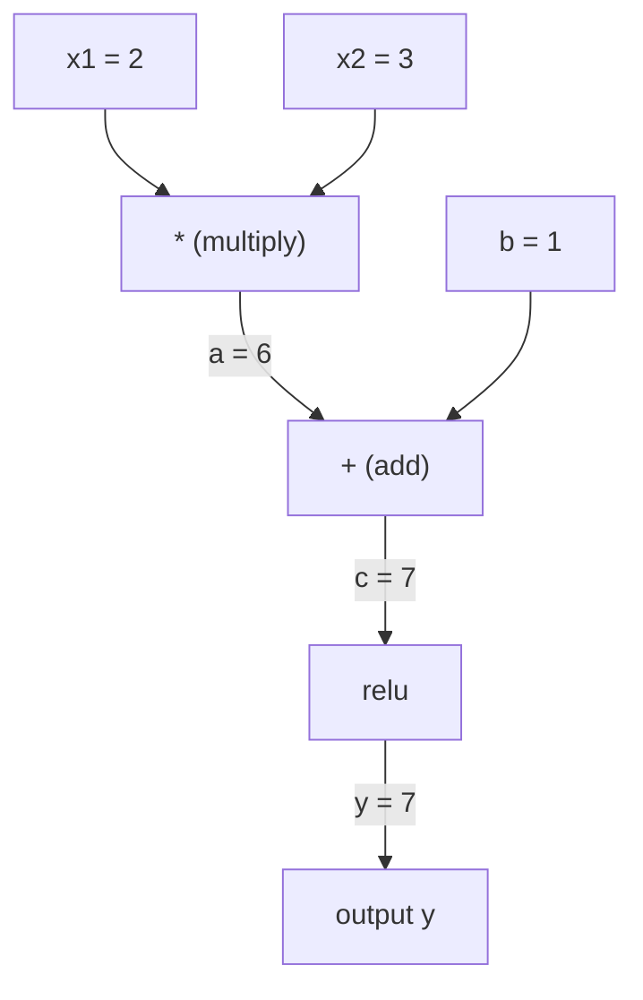
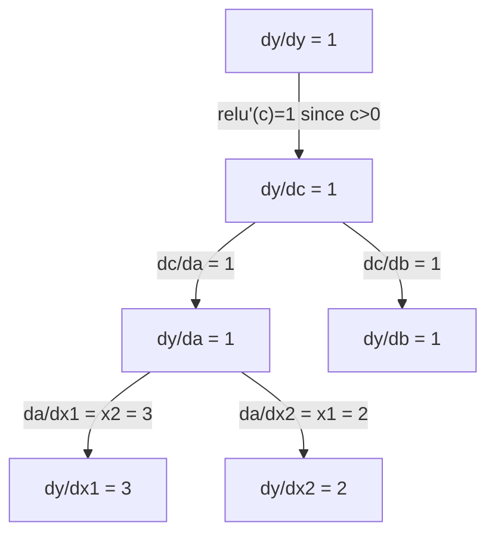

# Chain Rule & Automatic Differentiation

> The chain rule is the engine behind every neural network that learns.

**Type:** Build
**Language:** Python
**Prerequisites:** Phase 1, Lesson 04 (Derivatives & Gradients)
**Time:** ~90 minutes

## Learning Objectives

- Build a minimal autograd engine (Value class) that records operations and computes gradients via reverse-mode autodiff
- Implement forward and backward passes through a computation graph using topological sort
- Construct and train a multi-layer perceptron on XOR using only the from-scratch autograd engine
- Verify autodiff correctness using gradient checking against numerical finite differences

## The Problem

You can compute derivatives of simple functions. But a neural network is not a simple function. It is hundreds of functions composed together: matrix multiply, add bias, apply activation, matrix multiply again, softmax, cross-entropy loss. The output is a function of a function of a function.

To train the network, you need the gradient of the loss with respect to every single weight. Doing this by hand is impossible for millions of parameters. Doing it numerically (finite differences) is too slow.

The chain rule gives you the math. Automatic differentiation gives you the algorithm. Together they let you compute exact gradients through arbitrary compositions of functions in time proportional to a single forward pass.

This is how PyTorch, TensorFlow, and JAX work. You will build a miniature version from scratch.

## The Concept

### The Chain Rule

If `y = f(g(x))`, the derivative of `y` with respect to `x` is:

```
dy/dx = dy/dg * dg/dx = f'(g(x)) * g'(x)
```

Multiply the derivatives along the chain. Each link contributes its local derivative.

Example: `y = sin(x^2)`

```
g(x) = x^2       g'(x) = 2x
f(g) = sin(g)     f'(g) = cos(g)

dy/dx = cos(x^2) * 2x
```

For deeper compositions, the chain extends:

```
y = f(g(h(x)))

dy/dx = f'(g(h(x))) * g'(h(x)) * h'(x)
```

Every layer in a neural network is one link in this chain.

### Computational Graphs

A computational graph makes the chain rule visual. Every operation becomes a node. Data flows forward through the graph. Gradients flow backward.

**Forward pass (compute values):**



**Backward pass (compute gradients):**



The backward pass applies the chain rule at every node, propagating gradients from output to inputs.

### Forward Mode vs Reverse Mode

There are two ways to apply the chain rule through a graph.

**Forward mode** starts at the inputs and pushes derivatives forward. It computes `dx/dx = 1` and propagates through each operation. Good when you have few inputs and many outputs.

```
Forward mode: seed dx/dx = 1, propagate forward

  x = 2       (dx/dx = 1)
  a = x^2     (da/dx = 2x = 4)
  y = sin(a)  (dy/dx = cos(a) * da/dx = cos(4) * 4 = -2.615)
```

**Reverse mode** starts at the output and pulls gradients backward. It computes `dy/dy = 1` and propagates through each operation in reverse. Good when you have many inputs and few outputs.

```
Reverse mode: seed dy/dy = 1, propagate backward

  y = sin(a)  (dy/dy = 1)
  a = x^2     (dy/da = cos(a) = cos(4) = -0.654)
  x = 2       (dy/dx = dy/da * da/dx = -0.654 * 4 = -2.615)
```

Neural networks have millions of inputs (weights) and one output (loss). Reverse mode computes all gradients in one backward pass. This is why backpropagation uses reverse mode.

| Mode | Seed | Direction | Best when |
|------|------|-----------|-----------|
| Forward | `dx_i/dx_i = 1` | Input to output | Few inputs, many outputs |
| Reverse | `dy/dy = 1` | Output to input | Many inputs, few outputs (neural nets) |

### Dual Numbers for Forward Mode

Forward mode can be implemented elegantly with dual numbers. A dual number has the form `a + b*epsilon` where `epsilon^2 = 0`.

```
Dual number: (value, derivative)

(2, 1) means: value is 2, derivative w.r.t. x is 1

Arithmetic rules:
  (a, a') + (b, b') = (a+b, a'+b')
  (a, a') * (b, b') = (a*b, a'*b + a*b')
  sin(a, a')         = (sin(a), cos(a)*a')
```

Seed the input variable with derivative 1. The derivative propagates automatically through every operation.

### Building an Autograd Engine

An autograd engine needs three things:

1. **Value wrapping.** Wrap every number in an object that stores its value and gradient.
2. **Graph recording.** Every operation records its inputs and the local gradient function.
3. **Backward pass.** Topological sort the graph, then walk it in reverse, applying the chain rule at each node.

This is exactly what PyTorch's `autograd` does. The `torch.Tensor` class wraps values, records operations when `requires_grad=True`, and computes gradients when you call `.backward()`.

### How PyTorch Autograd Works Under the Hood

When you write PyTorch code:

```python
x = torch.tensor(2.0, requires_grad=True)
y = x ** 2 + 3 * x + 1
y.backward()
print(x.grad)  # 7.0 = 2*x + 3 = 2*2 + 3
```

PyTorch internally:

1. Creates a `Tensor` node for `x` with `requires_grad=True`
2. Every operation (`**`, `*`, `+`) creates a new node and records the backward function
3. `y.backward()` triggers reverse-mode autodiff through the recorded graph
4. Each node's `grad_fn` computes local gradients and passes them to parent nodes
5. Gradients accumulate in `.grad` attributes via addition (not replacement)

The graph is dynamic (define-by-run). A new graph is built on every forward pass. This is why PyTorch supports control flow (if/else, loops) inside models.

Torch isn't available in-browser, but the mechanism it wraps -- dual numbers
from the forward-mode section above -- is a few lines of Python:

```python fillin
class Dual:
    """Carries (value, derivative) through every operation -- forward-mode
    autodiff, described above. Seed the input with derivative 1."""
    def __init__(self, value, deriv):
        self.value = value
        self.deriv = deriv

    def __add__(self, other):
        other = other if isinstance(other, Dual) else Dual(other, 0.0)
        return Dual(self.value + other.value, self.deriv + other.deriv)

    def __mul__(self, other):
        other = other if isinstance(other, Dual) else Dual(other, 0.0)
        # product rule: d(uv) = u'v + uv'
        return Dual(self.value * other.value, {{blank:self.deriv * other.value + self.value * other.deriv}})

    __radd__ = __add__
    __rmul__ = __mul__

# Same function as the torch example above: y = x**2 + 3*x + 1 at x=2.
x = Dual(2.0, {{blank:1.0}})   # seed: dx/dx = 1
y = x * x + 3 * x + 1          # x**2 written as x*x -- no __pow__ needed

expected = {{blank:7.0}}       # matches x.grad above: 2*x + 3 = 2*2 + 3
if abs(y.deriv - expected) < 1e-9:
    print("PASS")
else:
    print("WRONG:", y.deriv)
```


## Further Reading

- [3Blue1Brown: Backpropagation calculus](https://www.youtube.com/watch?v=tIeHLnjs5U8) -- visual explanation of the chain rule in neural networks
- [PyTorch Autograd mechanics](https://pytorch.org/docs/stable/notes/autograd.html) -- how the real system works
- [Baydin et al., Automatic Differentiation in Machine Learning: a Survey](https://arxiv.org/abs/1502.05767) -- comprehensive reference
