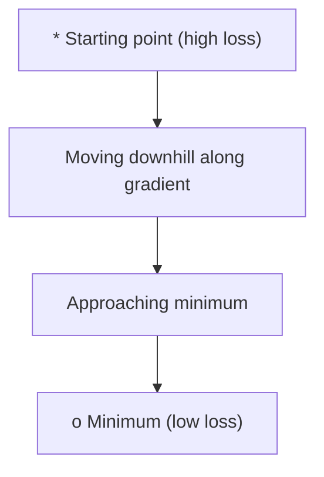
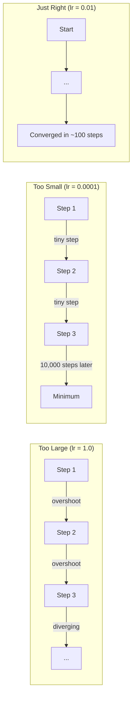
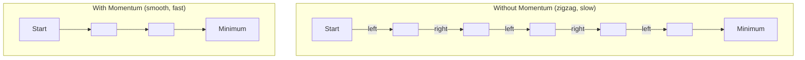
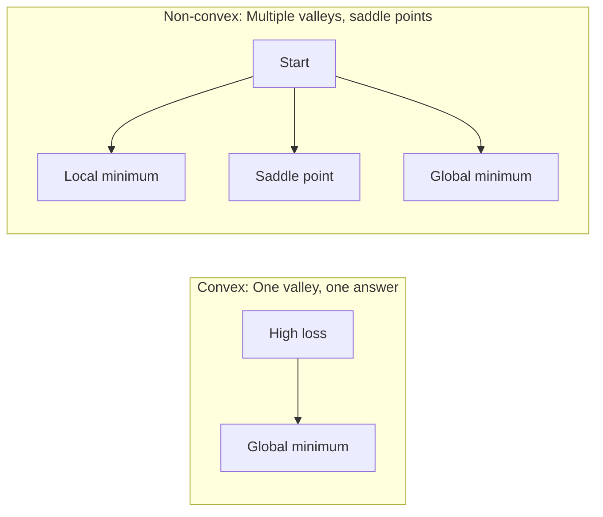
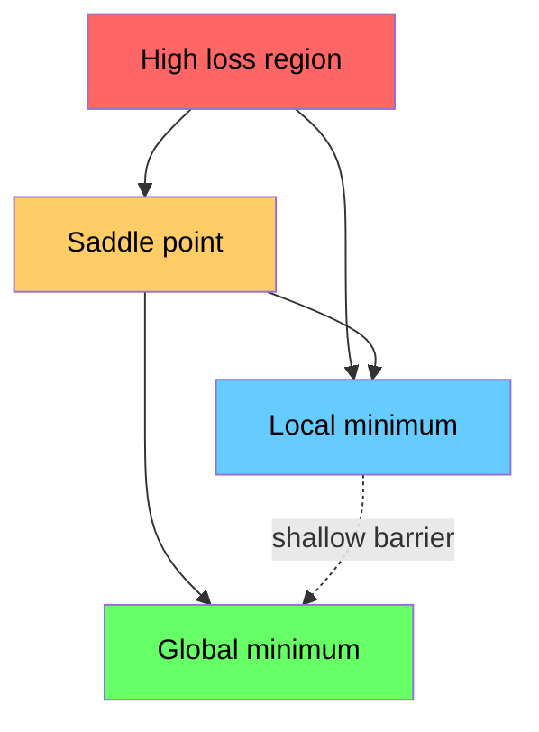

# Optimization

> Training a neural network is nothing more than finding the bottom of a valley.

**Type:** Build
**Languages:** Julia
**Language:** Python
**Prerequisites:** Phase 1, Lessons 04-05 (Derivatives, Gradients)
**Time:** ~75 minutes

## Learning Objectives

- Implement vanilla gradient descent, SGD with momentum, and Adam from scratch
- Compare optimizer convergence on the Rosenbrock function and explain why Adam adapts per-weight learning rates
- Distinguish convex from non-convex loss landscapes and explain the role of saddle points in high dimensions
- Configure learning rate schedules (step decay, cosine annealing, warmup) for training stability

## The Problem

You have a loss function. It tells you how wrong your model is. You have gradients. They tell you which direction makes the loss worse. Now you need a strategy for walking downhill.

The naive approach is simple: move opposite the gradient. Scale the step by some number called the learning rate. Repeat. This is gradient descent, and it works. But "works" has caveats. Too large a learning rate and you overshoot the valley entirely, bouncing between walls. Too small and you crawl toward the answer over thousands of unnecessary steps. Hit a saddle point and you stop moving even though you have not found a minimum.

Every optimizer in deep learning is an answer to the same question: how do you get to the bottom of the valley faster and more reliably?

## The Concept

### What optimization means

Optimization is finding the input values that minimize (or maximize) a function. In machine learning, the function is the loss. The inputs are the model's weights. Training is optimization.

```
minimize L(w) where:
  L = loss function
  w = model weights (could be millions of parameters)
```

### Gradient descent (vanilla)

The simplest optimizer. Compute the gradient of the loss with respect to every weight. Move each weight in the opposite direction of its gradient. Scale the step by the learning rate.

```
w = w - lr * gradient
```

That is the entire algorithm. One line.



### Learning rate: the most important hyperparameter

The learning rate controls step size. It determines everything about convergence.



There is no formula for the right learning rate. You find it by experiment. Common starting points: 0.001 for Adam, 0.01 for SGD with momentum.

### SGD vs batch vs mini-batch

Vanilla gradient descent computes the gradient over the entire dataset before taking one step. This is called batch gradient descent. It is stable but slow.

Stochastic gradient descent (SGD) computes the gradient on a single random sample and steps immediately. It is noisy but fast.

Mini-batch gradient descent splits the difference. Compute the gradient over a small batch (32, 64, 128, 256 samples), then step. This is what everyone actually uses.

| Variant | Batch size | Gradient quality | Speed per step | Noise |
|---------|-----------|-----------------|---------------|-------|
| Batch GD | Entire dataset | Exact | Slow | None |
| SGD | 1 sample | Very noisy | Fast | High |
| Mini-batch | 32-256 | Good estimate | Balanced | Moderate |

The noise in SGD and mini-batch is not a bug. It helps escape shallow local minima and saddle points.

### Momentum: the ball rolling downhill

Vanilla gradient descent only looks at the current gradient. If the gradient zigzags (common in narrow valleys), progress is slow. Momentum fixes this by accumulating past gradients into a velocity term.

```
v = beta * v + gradient
w = w - lr * v
```

The analogy: a ball rolling downhill. It does not stop and restart at every bump. It builds speed in consistent directions and dampens oscillations.



`beta` (typically 0.9) controls how much history to keep. Higher beta means more momentum, smoother paths, but slower response to direction changes.

### Adam: adaptive learning rates

Different weights need different learning rates. A weight that rarely gets large gradients should take bigger steps when it finally does. A weight that gets huge gradients constantly should take smaller steps.

Adam (Adaptive Moment Estimation) tracks two things per weight:

1. First moment (m): running average of gradients (like momentum)
2. Second moment (v): running average of squared gradients (gradient magnitude)

```
m = beta1 * m + (1 - beta1) * gradient
v = beta2 * v + (1 - beta2) * gradient^2

m_hat = m / (1 - beta1^t)    bias correction
v_hat = v / (1 - beta2^t)    bias correction

w = w - lr * m_hat / (sqrt(v_hat) + epsilon)
```

The division by `sqrt(v_hat)` is the key insight. Weights with large gradients get divided by a large number (small effective step). Weights with small gradients get divided by a small number (large effective step). Each weight gets its own adaptive learning rate.

Default hyperparameters: `lr=0.001, beta1=0.9, beta2=0.999, epsilon=1e-8`. These defaults work well for most problems.

### Learning rate schedules

A fixed learning rate is a compromise. Early in training, you want large steps to make fast progress. Late in training, you want small steps to fine-tune near the minimum.

Common schedules:

| Schedule | Formula | Use case |
|----------|---------|----------|
| Step decay | lr = lr * factor every N epochs | Simple, manual control |
| Exponential decay | lr = lr_0 * decay^t | Smooth reduction |
| Cosine annealing | lr = lr_min + 0.5 * (lr_max - lr_min) * (1 + cos(pi * t / T)) | Transformers, modern training |
| Warmup + decay | Linear ramp up, then decay | Large models, prevents early instability |

### Convex vs non-convex

A convex function has one minimum. Gradient descent always finds it. A quadratic like `f(x) = x^2` is convex.

Neural network loss functions are non-convex. They have many local minima, saddle points, and flat regions.



In practice, local minima in high-dimensional neural networks are rarely a problem. Most local minima have loss values close to the global minimum. Saddle points (flat in some directions, curved in others) are the real obstacle. Momentum and noise from mini-batches help escape them.

### Loss landscape visualization

The loss is a function of all weights. For a model with 1 million weights, the loss landscape lives in 1,000,001-dimensional space. We visualize it by picking two random directions in weight space and plotting the loss along those directions, producing a 2D surface.



Sharp minima generalize poorly. Flat minima generalize well. This is one reason SGD with momentum often outperforms Adam on final test accuracy: its noise prevents settling into sharp minima.


## Further Reading

- [Sebastian Ruder: An overview of gradient descent optimization algorithms](https://ruder.io/optimizing-gradient-descent/) - comprehensive survey of all major optimizers
- [Why Momentum Really Works (Distill)](https://distill.pub/2017/momentum/) - interactive visualization of momentum dynamics
- [Adam: A Method for Stochastic Optimization (Kingma & Ba, 2014)](https://arxiv.org/abs/1412.6980) - the original Adam paper, readable and short
- [Visualizing the Loss Landscape of Neural Nets (Li et al., 2018)](https://arxiv.org/abs/1712.09913) - the paper that showed sharp vs flat minima
