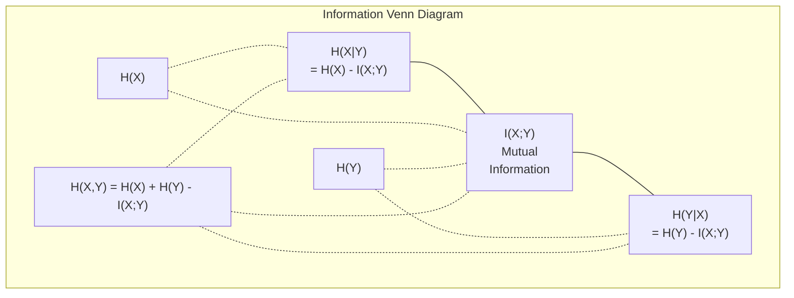

# Information Theory

> Information theory measures surprise. Loss functions are built on it.

**Type:** Learn
**Languages:** None
**Language:** Python
**Prerequisites:** Phase 1, Lesson 06 (Probability)
**Time:** ~60 minutes

## Learning Objectives

- Compute entropy, cross-entropy, and KL divergence from scratch and explain their relationship
- Derive why minimizing cross-entropy loss is equivalent to maximizing log-likelihood
- Calculate mutual information between features and a target to rank feature importance
- Explain perplexity as the effective vocabulary size a language model chooses from

## The Problem

You call `CrossEntropyLoss()` in every classification model you train. You see "perplexity" in every language model paper. You read about KL divergence in VAEs, distillation, and RLHF. These are not disconnected concepts. They are all the same idea wearing different hats.

Information theory gives you the language to reason about uncertainty, compression, and prediction. Claude Shannon invented it in 1948 to solve communication problems. Turns out, training a neural network is a communication problem: the model is trying to transmit the correct label through a noisy channel of learned weights.

This lesson builds every formula from scratch so you see where they come from and why they work.

## The Concept

### Information Content (Surprise)

When something unlikely happens, it carries more information. A coin landing heads? Not surprising. A lottery win? Very surprising.

The information content of an event with probability p is:

```
I(x) = -log(p(x))
```

Using log base 2 gives you bits. Using natural log gives you nats. Same idea, different units.

```
Event              Probability    Surprise (bits)
Fair coin heads    0.5            1.0
Rolling a 6        0.167          2.58
1-in-1000 event    0.001          9.97
Certain event      1.0            0.0
```

Certain events carry zero information. You already knew they would happen.

### Entropy (Average Surprise)

Entropy is the expected surprise across all possible outcomes of a distribution.

```
H(P) = -sum( p(x) * log(p(x)) )  for all x
```

A fair coin has maximum entropy for a binary variable: 1 bit. A biased coin (99% heads) has low entropy: 0.08 bits. You already know what will happen, so each flip tells you almost nothing.

```
Fair coin:    H = -(0.5 * log2(0.5) + 0.5 * log2(0.5)) = 1.0 bit
Biased coin:  H = -(0.99 * log2(0.99) + 0.01 * log2(0.01)) = 0.08 bits
```

Entropy measures the irreducible uncertainty in a distribution. You cannot compress below it.

### Cross-Entropy (The Loss Function You Use Every Day)

Cross-entropy measures the average surprise when you use distribution Q to encode events that actually come from distribution P.

```
H(P, Q) = -sum( p(x) * log(q(x)) )  for all x
```

P is the true distribution (the labels). Q is your model's predictions. If Q matches P perfectly, cross-entropy equals entropy. Any mismatch makes it larger.

In classification, P is a one-hot vector (the true class has probability 1, everything else 0). This simplifies cross-entropy to:

```
H(P, Q) = -log(q(true_class))
```

That is the entire cross-entropy loss formula for classification. Maximize the predicted probability of the correct class.

### KL Divergence (Distance Between Distributions)

KL divergence measures how much extra surprise you get from using Q instead of P.

```
D_KL(P || Q) = sum( p(x) * log(p(x) / q(x)) )  for all x
             = H(P, Q) - H(P)
```

Cross-entropy is entropy plus KL divergence. Since entropy of the true distribution is constant during training, minimizing cross-entropy is the same as minimizing KL divergence. You are pushing your model's distribution toward the true distribution.

KL divergence is not symmetric: D_KL(P || Q) != D_KL(Q || P). It is not a true distance metric.

### Mutual Information

Mutual information measures how much knowing one variable tells you about another.

```
I(X; Y) = H(X) - H(X|Y)
        = H(X) + H(Y) - H(X, Y)
```

If X and Y are independent, mutual information is zero. Knowing one tells you nothing about the other. If they are perfectly correlated, mutual information equals the entropy of either variable.

In feature selection, high mutual information between a feature and the target means the feature is useful. Low mutual information means it is noise.

### Conditional Entropy

H(Y|X) measures how much uncertainty remains about Y after you observe X.

```
H(Y|X) = H(X,Y) - H(X)
```

Two extremes:
- If X completely determines Y, then H(Y|X) = 0. Knowing X eliminates all uncertainty about Y. Example: X = temperature in Celsius, Y = temperature in Fahrenheit.
- If X tells you nothing about Y, then H(Y|X) = H(Y). Knowing X does not reduce your uncertainty at all. Example: X = coin flip, Y = tomorrow's weather.

Conditional entropy is always non-negative and never exceeds H(Y):

```
0 <= H(Y|X) <= H(Y)
```

In machine learning, conditional entropy appears in decision trees. At each split, the algorithm picks the feature X that minimizes H(Y|X) -- the feature that removes the most uncertainty about the label Y.

### Joint Entropy

H(X,Y) is the entropy of the joint distribution of X and Y together.

```
H(X,Y) = -sum sum p(x,y) * log(p(x,y))   for all x, y
```

Key property:

```
H(X,Y) <= H(X) + H(Y)
```

Equality holds when X and Y are independent. If they share information, the joint entropy is less than the sum of individual entropies. The "missing" entropy is exactly the mutual information.



The relationships:
- H(X,Y) = H(X) + H(Y|X) = H(Y) + H(X|Y)
- I(X;Y) = H(X) - H(X|Y) = H(Y) - H(Y|X)
- H(X,Y) = H(X) + H(Y) - I(X;Y)

### Mutual Information (Deep Dive)

Mutual information I(X;Y) quantifies how much knowing one variable reduces uncertainty about the other.

```
I(X;Y) = H(X) - H(X|Y)
       = H(Y) - H(Y|X)
       = H(X) + H(Y) - H(X,Y)
       = sum sum p(x,y) * log(p(x,y) / (p(x) * p(y)))
```

Properties:
- I(X;Y) >= 0 always. You never lose information by observing something.
- I(X;Y) = 0 if and only if X and Y are independent.
- I(X;Y) = I(Y;X). It is symmetric, unlike KL divergence.
- I(X;X) = H(X). A variable shares all its information with itself.

**Mutual information for feature selection.** In ML, you want features that are informative about the target. Mutual information gives you a principled way to rank features:

1. For each feature X_i, compute I(X_i; Y) where Y is the target variable.
2. Rank features by MI score.
3. Keep the top k features.

This works for any relationship between feature and target -- linear, nonlinear, monotonic, or not. Correlation only catches linear relationships. MI catches everything.

| Method | Detects | Computational cost | Handles categorical? |
|--------|---------|-------------------|---------------------|
| Pearson correlation | Linear relationships | O(n) | No |
| Spearman correlation | Monotonic relationships | O(n log n) | No |
| Mutual information | Any statistical dependency | O(n log n) with binning | Yes |

### Label Smoothing and Cross-Entropy

Standard classification uses hard targets: [0, 0, 1, 0]. The true class gets probability 1, everything else gets 0. Label smoothing replaces these with soft targets:

```
soft_target = (1 - epsilon) * hard_target + epsilon / num_classes
```

With epsilon = 0.1 and 4 classes:
- Hard target:  [0, 0, 1, 0]
- Soft target:  [0.025, 0.025, 0.925, 0.025]

From an information theory perspective, label smoothing increases the entropy of the target distribution. Hard one-hot targets have entropy 0 -- there is no uncertainty. Soft targets have positive entropy.

Why this helps:
- Prevents the model from driving logits to extreme values (infinite logits would be needed to perfectly match a one-hot target under cross-entropy)
- Acts as regularization: the model cannot be 100% confident
- Improves calibration: predicted probabilities better reflect true uncertainty
- Reduces the gap between training and inference behavior

The cross-entropy loss with label smoothing becomes:

```
L = (1 - epsilon) * CE(hard_target, prediction) + epsilon * H_uniform(prediction)
```

The second term penalizes predictions that are far from uniform -- a direct regularization on confidence.

### Why Cross-Entropy Is THE Classification Loss

Three perspectives, same conclusion.

**Information theory view.** Cross-entropy measures how many bits you waste by using your model's distribution instead of the true distribution. Minimizing it makes your model the most efficient encoder of reality.

**Maximum likelihood view.** For N training samples with true classes y_i:

```
Likelihood     = product( q(y_i) )
Log-likelihood = sum( log(q(y_i)) )
Negative log-likelihood = -sum( log(q(y_i)) )
```

That last line is cross-entropy loss. Minimizing cross-entropy = maximizing the likelihood of the training data under your model.

**Gradient view.** The gradient of cross-entropy with respect to the logits is simply (predicted - true). Clean, stable, and fast to compute. This is why it pairs perfectly with softmax.

### Bits vs Nats

The only difference is the log base.

```
log base 2   -> bits      (information theory tradition)
log base e   -> nats      (machine learning convention)
log base 10  -> hartleys  (rarely used)
```

1 nat = 1/ln(2) bits = 1.4427 bits. PyTorch and TensorFlow use natural log (nats) by default.

### Perplexity

Perplexity is the exponential of cross-entropy. It tells you the effective number of equally likely choices the model is uncertain between.

```
Perplexity = 2^H(P,Q)   (if using bits)
Perplexity = e^H(P,Q)   (if using nats)
```

A language model with perplexity 50 is, on average, as confused as if it had to pick uniformly from 50 possible next tokens. Lower is better.

GPT-2 achieved perplexity ~30 on common benchmarks. Modern models are in the single digits for well-represented domains.


## Use It

Entropy in practice: the textbook formula breaks the moment a probability hits zero.

```python fillin
import numpy as np

def naive_entropy(p):
    p = np.asarray(p, dtype=float)
    return -(p * np.log(p)).sum()

# A distribution with a zero-probability outcome -- like a token the model
# never assigns any probability to.
skewed = np.array([0.9, 0.1, 0.0])
print("naive:", naive_entropy(skewed))  # nan: log(0) = -inf, 0 * -inf = nan

def entropy(p):
    p = np.asarray(p, dtype=float)
    mask = p {{blank:> 0}}
    result = np.zeros_like(p)
    result[mask] = p[mask] * np.log(p[mask])
    return {{blank:-result.sum()}}

result = entropy(skewed)
expected = 0.9 * -np.log(0.9) + 0.1 * -np.log(0.1)
if np.isfinite(result) and np.isclose(result, expected, atol=1e-6):
    print("PASS")
else:
    print("WRONG:", result)
```

The `p > 0` mask is the same convention every ML framework uses: by definition, `0 * log(0)` contributes zero bits of surprise, not `nan`. `torch.nn.CrossEntropyLoss()`, cross-entropy, and KL divergence all build on this same masked formula.


## Key Terms

| Term | What people say | What it actually means |
|------|----------------|----------------------|
| Information content | "Surprise" | The number of bits (or nats) needed to encode an event: -log(p) |
| Entropy | "Randomness" | The average surprise across all outcomes of a distribution. Measures irreducible uncertainty. |
| Cross-entropy | "The loss function" | Average surprise when using model distribution Q to encode events from true distribution P. |
| KL divergence | "Distance between distributions" | Extra bits wasted by using Q instead of P. Equals cross-entropy minus entropy. Not symmetric. |
| Mutual information | "How related are X and Y" | Reduction in uncertainty about X from knowing Y. Zero means independent. |
| Softmax | "Turn logits into probabilities" | Exponentiate and normalize. Maps any real-valued vector to a valid probability distribution. |
| Perplexity | "How confused the model is" | Exponential of cross-entropy. The effective vocabulary size the model is choosing from at each step. |
| Bits | "Shannon's unit" | Information measured with log base 2. One bit resolves one fair coin flip. |
| Nats | "ML's unit" | Information measured with natural log. Used by PyTorch and TensorFlow by default. |
| Negative log-likelihood | "NLL loss" | Identical to cross-entropy loss for one-hot labels. Minimizing it maximizes the probability of correct predictions. |

## Build It

Reconstruct **Information Theory** by following `information_content` on the text "red fox". Run `run main.text` and verify that the tokenizer/retriever reports zero or a clear empty-input result, rather than borrowing a result from the previous text.

## Ship It

Hand off `outputs/skill-information-theory.md` with the command `run main.text`, the accepted input shape (the text "red fox"), the expected observable result, and a failure note for malformed inputs.

## Further Reading

- [Shannon 1948: A Mathematical Theory of Communication](https://people.math.harvard.edu/~ctm/home/text/others/shannon/entropy/entropy.pdf) - the original paper, still readable
- [Visual Information Theory (Chris Olah)](https://colah.github.io/posts/2015-09-Visual-Information/) - best visual explanation of entropy and KL divergence
- [PyTorch CrossEntropyLoss docs](https://pytorch.org/docs/stable/generated/torch.nn.CrossEntropyLoss.html) - how the framework implements what you just built

## Exercises

1. **Explain the mechanism.** Give a concrete example and a counterexample that demonstrate this objective: Compute entropy, cross-entropy, and KL divergence from scratch and explain their relationship.
2. **Make a decision.** Compare two plausible approaches, state the assumptions, and justify a choice while applying this objective: Derive why minimizing cross-entropy loss is equivalent to maximizing log-likelihood.
3. **Stress-test the reasoning.** Introduce one failure condition, revise the proposed approach, and define evidence of success for this objective: Calculate mutual information between features and a target to rank feature importance.

## Reference Solution

A complete response first demonstrates “Compute entropy, cross-entropy, and KL divergence from scratch and explain their relationship” with a specific example and a genuine counterexample. It then compares the alternatives using explicit assumptions for “Derive why minimizing cross-entropy loss is equivalent to maximizing log-likelihood.” The final stress test must name a realistic failure condition, revise the approach, and define observable acceptance evidence for “Calculate mutual information between features and a target to rank feature importance.” Unsupported preference statements are not sufficient.
