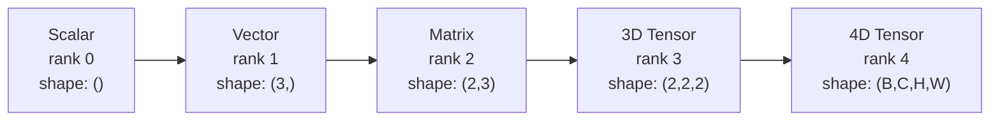
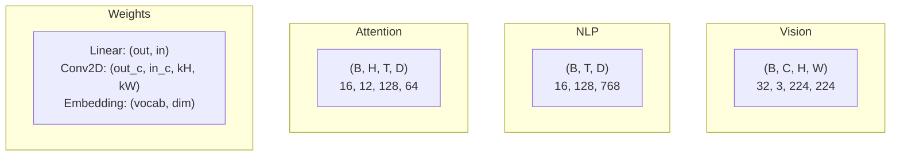
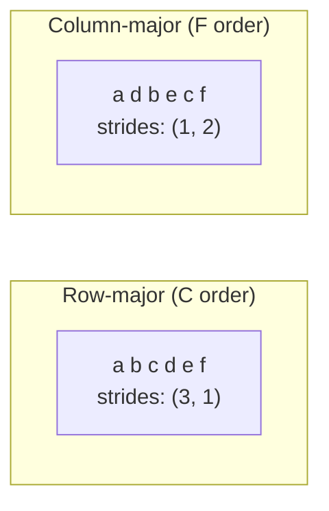
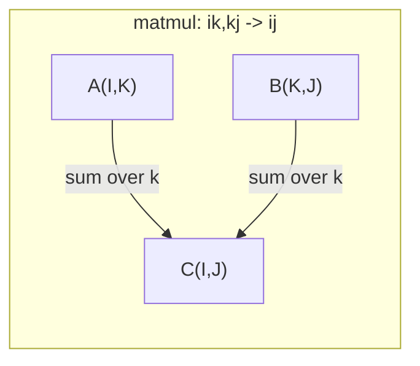

# Tensor Operations

> Tensors are the common language between data and deep learning. Every image, every sentence, every gradient flows through them.

**Type:** Build
**Language:** Python
**Prerequisites:** Phase 1, Lessons 01 (Linear Algebra Intuition), 02 (Vectors, Matrices & Operations)
**Time:** ~90 minutes

## Learning Objectives

- Implement a tensor class with shape, strides, reshape, transpose, and element-wise operations from scratch
- Apply broadcasting rules to operate on tensors of different shapes without copying data
- Write einsum expressions for dot products, matrix multiplications, outer products, and batched operations
- Trace the exact tensor shapes through every step of multi-head attention

## The Problem

You build a transformer. The forward pass looks clean. You run it and get: `RuntimeError: mat1 and mat2 shapes cannot be multiplied (32x768 and 512x768)`. You stare at the shapes. You try a transpose. Now it says `Expected 4D input (got 3D input)`. You add an unsqueeze. Something else breaks.

Shape errors are the most common bug in deep learning code. They are not hard conceptually -- each operation has a shape contract -- but they multiply fast. A transformer has dozens of reshapes, transposes, and broadcasts chained together. One wrong axis and the error cascades. Worse, some shape mistakes do not throw errors at all. They silently produce garbage by broadcasting along the wrong dimension or summing over the wrong axis.

Matrices handle pairwise relationships between two sets of things. Real data does not fit into two dimensions. A batch of 32 RGB images at 224x224 is a 4D tensor: `(32, 3, 224, 224)`. Self-attention with 12 heads is also 4D: `(batch, heads, seq_len, head_dim)`. You need a data structure that generalizes to any number of dimensions, with operations that compose cleanly across all of them. That structure is the tensor. Master its operations and shape errors become trivially debuggable.

## The Concept

### What a tensor is

A tensor is a multi-dimensional array of numbers with a uniform data type. The number of dimensions is the **rank** (or **order**). Each dimension is an **axis**. The **shape** is a tuple listing the size along each axis.



Total elements = product of all sizes. A shape `(2, 3, 4)` holds `2 * 3 * 4 = 24` elements.

### Tensor shapes in deep learning

Different data types map to specific tensor shapes by convention.



PyTorch uses NCHW (channels-first). TensorFlow defaults to NHWC (channels-last). Mismatched layouts cause silent slowdowns or errors.

### How memory layout works

A 2D array in memory is a 1D sequence of bytes. **Strides** tell you how many elements to skip to move one step along each axis.



Transpose does not move data. It swaps the strides, making the tensor **non-contiguous** -- the elements for a row are no longer adjacent in memory.

### Broadcasting rules

Broadcasting lets you operate on tensors of different shapes without copying data. Align shapes from the right. Two dimensions are compatible when they are equal or one is 1. Fewer dimensions get padded with 1s on the left.

```
Tensor A:     (8, 1, 6, 1)
Tensor B:        (7, 1, 5)
Padded B:     (1, 7, 1, 5)
Result:       (8, 7, 6, 5)
```

### Einsum: the universal tensor operation

Einstein summation labels each axis with a letter. Axes in the input but not the output get summed. Axes in both are kept.



Key patterns: `i,i->` (dot product), `i,j->ij` (outer product), `ii->` (trace), `ij->ji` (transpose), `bij,bjk->bik` (batch matmul), `bhtd,bhsd->bhts` (attention scores).


## Use It

### Scratch vs NumPy

| Operation | Scratch (Tensor class) | NumPy |
|---|---|---|
| Create | `Tensor([[1,2],[3,4]])` | `np.array([[1,2],[3,4]])` |
| Reshape | `t.reshape((3,4))` | `a.reshape(3,4)` |
| Transpose | `t.transpose(0,1)` | `a.T` or `a.transpose(0,1)` |
| Squeeze | `t.squeeze(0)` | `np.squeeze(a, 0)` |
| Sum | `t.sum(axis=0)` | `a.sum(axis=0)` |
| Einsum | N/A | `np.einsum("ij,jk->ik", a, b)` |

### Scratch vs PyTorch

```python
import torch

t = torch.tensor([[1, 2, 3], [4, 5, 6]], dtype=torch.float32)
t.shape
t.stride()
t.is_contiguous()

t.reshape(3, 2)
t.unsqueeze(0)
t.transpose(0, 1)
t.transpose(0, 1).contiguous()

torch.einsum("ik,kj->ij", A, B)
```

PyTorch adds autograd, GPU support, and optimized BLAS kernels. The shape semantics are identical. If you understand the scratch version, PyTorch shape errors become readable.

### Every neural network layer as a tensor operation

| Operation | Tensor Form | Einsum |
|---|---|---|
| Linear layer | `Y = X @ W.T + b` | `"bd,od->bo"` + bias |
| Attention QKV | `Q = X @ W_q` | `"btd,dh->bth"` |
| Attention scores | `Q @ K.T / sqrt(d)` | `"bhtd,bhsd->bhts"` |
| Attention output | `softmax(scores) @ V` | `"bhts,bhsd->bhtd"` |
| Batch norm | `(X - mu) / sigma * gamma` | element-wise + broadcast |
| Softmax | `exp(x) / sum(exp(x))` | element-wise + reduction |

## Ship It

This lesson produces two reusable prompts:

1. **`outputs/prompt-tensor-shapes.md`** -- A systematic prompt for debugging tensor shape mismatches. Includes decision tables for every common operation (matmul, broadcast, cat, Linear, Conv2d, BatchNorm, softmax) and a fix lookup table.

2. **`outputs/prompt-tensor-debugger.md`** -- A step-by-step debugging prompt you paste into any AI assistant when a shape error is blocking you. Feed it the error message and your tensor shapes, get back the exact fix.


## Key Terms

| Term | What people say | What it actually means |
|---|---|---|
| Tensor | "A matrix but more dimensions" | A multi-dimensional array with uniform type and defined shape, strides, and operations |
| Rank | "The number of dimensions" | The number of axes. A matrix has rank 2, not rank equal to its matrix rank |
| Shape | "The size of the tensor" | A tuple listing the size along each axis. `(2, 3)` means 2 rows, 3 columns |
| Stride | "How memory is laid out" | The number of elements to skip to advance one position along each axis |
| Broadcasting | "It just works when shapes differ" | A strict set of rules: align from right, dimensions must be equal or one must be 1 |
| Contiguous | "The tensor is normal" | Elements stored sequentially in memory with no gaps or reordering from the logical layout |
| Einsum | "A fancy way to write matmul" | A general notation that expresses any tensor contraction, outer product, trace, or transpose in one line |
| View | "Same as reshape" | A tensor sharing the same memory buffer but with different shape/stride metadata. Fails on non-contiguous data |
| Contraction | "Summing over an index" | The general operation where a shared index between tensors is multiplied and summed, producing a lower-rank result |
| NCHW / NHWC | "PyTorch vs TensorFlow format" | Memory layout conventions for image tensors. NCHW puts channels before spatial dims, NHWC puts them after |

## Further Reading

- [NumPy Broadcasting](https://numpy.org/doc/stable/user/basics.broadcasting.html) -- The canonical rules with visual examples
- [PyTorch Tensor Views](https://pytorch.org/docs/stable/tensor_view.html) -- When views work and when they copy
- [einops](https://github.com/arogozhnikov/einops) -- A library that makes tensor reshaping readable and safe
- [The Illustrated Transformer](https://jalammar.github.io/illustrated-transformer/) -- Visualizes the tensor shapes flowing through attention
- [Einstein Summation in NumPy](https://numpy.org/doc/stable/reference/generated/numpy.einsum.html) -- Full einsum documentation with examples
