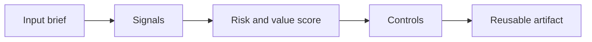

# Responsible AI Compliance Workflow

> A useful AI assistant is not production-ready until someone can explain what data it touches, what risks it creates, and who owns the decision when it is wrong.

**Type:** Build
**Languages:** Python
**Prerequisites:** Phase 11 Lesson 01 (Prompt Engineering), Phase 11 Lesson 10 (Evaluation & Testing)
**Time:** ~45 minutes
**Capability:** Foundation - Corporate Ethics & Compliance

## Learning Objectives

- Identify the operational signals that make this capability relevant in day-to-day LHIND work
- Build a lightweight Python artifact that turns an ambiguous AI idea into a structured plan
- Map risk, value, uncertainty, and controls into a practical course exercise
- Use the generated worksheet as a reusable starting point for team enablement
- Explain when the topic belongs in awareness training, guided pilot work, or a launch gate

## The Problem

A team builds a helpful document assistant for internal policies. It summarizes PDFs, answers questions, and drafts emails. The demo is good, so the team wants to publish it broadly. Then someone asks where sensitive HR data goes, whether the assistant can make employment recommendations, and who reviews high-risk outputs. Nobody has a crisp answer. The project stalls, not because the model failed, but because the workflow around the model was never designed.

This lesson treats the course as a working session, not as a slide deck. Participants should leave with something they can use in the next project conversation: a checklist, matrix, prompt pack, memo, or scoring worksheet.

## The Concept

Responsible AI compliance is an operating workflow, not a poster. The team needs a repeatable way to classify use cases, identify data sensitivity, assign controls, and decide whether a human review gate is mandatory. The key move is to separate capability from permission. A model may be able to infer, rank, or recommend, but the system may only be allowed to assist, summarize, or draft under review.

The recurring pattern is simple: identify the workflow, surface the signals, choose the right level of control, and produce an artifact that makes the next decision easier.

### Signals to Look For

- sensitive data
- external impact
- automated decision
- explanation required

### Controls to Teach

- PII minimization
- human review
- audit log
- approved tools only

### Target Roles

- All LHIND employees
- Leadership
- Corporate Functions

## Use It

Use the checklist before a pilot starts, not after the demo succeeds. It gives business owners, compliance, data protection, and engineering a shared language for whether a use case can ship as self-service, assisted workflow, or review-only capability.

The expected output is not a final answer from AI. It is a better human conversation. The artifact makes the assumptions visible enough that a team can challenge them, tune the controls, and agree on the next step.

### Workshop Flow

1. Start with a real workflow from the participant's team.
2. Capture the signals in plain language.
3. Score impact and uncertainty together.
4. Review the recommended controls.
5. Decide whether the next step is awareness, practice, pilot, or launch gate.

## Reusable Artifact

Responsible AI intake checklist and launch gate template.

The output template in `outputs/checklist-responsible-ai-intake.md` can be copied into a project kickoff, enablement workshop, or team retro. Keep the artifact short enough that teams actually use it.

## Key Takeaways

- The course is about operational judgment, not generic AI enthusiasm.
- A reusable artifact beats a one-time presentation because it changes the next project conversation.
- The right control level depends on workflow risk, uncertainty, business impact, and role accountability.
- AI can accelerate analysis, but the team still owns the decision, review, and rollout.

## Build It

Reconstruct **Responsible AI Compliance Workflow** by following `Scenario` on x=0.5 with the demo defaults. Run `python3 main.py` and verify that the update or loss change agrees with the gradient sign; a zero gradient produces no accidental jump.

## Ship It

Hand off `outputs/checklist-responsible-ai-intake.md` with the command `python3 main.py`, the accepted input shape (x=0.5 with the demo defaults), the expected observable result, and a failure note for malformed inputs.

## Exercises

Keep two runs side by side for **Responsible AI Compliance Workflow**. The important evidence is the named field, shape, or status—not a polished paragraph about the run.

1. **Read the first result.** From `code/`, run `python3 main.py` using x=0.5 with the demo defaults. Follow `Scenario`, `Recommendation`, `normalize`. Expect the update or loss change agrees with the gradient sign; a zero gradient produces no accidental jump; capture the first printed shape, metric, status, or summary field and state which part supports **Identify the operational signals that make this capability relevant in day-to-day LHIND work**.
2. **Run a two-value comparison.** Repeat the command after changing only the learning rate: use the same run with learning rate 0.1 instead of 0.01. Predict the direction of the change, then compare the two output values. Explain why **Build a lightweight Python artifact that turns an ambiguous AI idea into a structured plan** says the other inputs should stay fixed.
3. **Try an adversarial fixture.** Feed the implementation a zero gradient or an already-minimized point. Before running it, write down whether the relevant function should return an empty value, a zero-sized result, or a validation error. Check the observed status against **Map risk, value, uncertainty, and controls into a practical course exercise** and record the exception text if the code rejects the case.
4. **Write the operator note.** Open `outputs/checklist-responsible-ai-intake.md` and add a worked example using x=0.5 with the demo defaults. Include the input contract, one expected output field, and a named acceptance check for **Use the generated worksheet as a reusable starting point for team enablement**; note what the demo cannot establish.

## Reference Solution

A checkable result for **Responsible AI Compliance Workflow** should contain:

- the `python3 main.py` output for x=0.5 with the demo defaults, with `Scenario`, `Recommendation`, `normalize` traced to the value or shape that supports **Identify the operational signals that make this capability relevant in day-to-day LHIND work**;
- a before/after comparison for the learning rate, where the same run with learning rate 0.1 instead of 0.01 changes the observation in the direction predicted by **Build a lightweight Python artifact that turns an ambiguous AI idea into a structured plan**;
- a recorded result for a zero gradient or an already-minimized point that matches the implementation’s validation or empty-result contract and explains the evidence for **Map risk, value, uncertainty, and controls into a practical course exercise**; and
- an updated `outputs/checklist-responsible-ai-intake.md` example with a concrete input, expected output field, and acceptance check tied to **Use the generated worksheet as a reusable starting point for team enablement**.

Run the lesson tests after the demo. If the boundary behaves differently from the prediction, keep the actual exception or output and explain the implementation path that produced it.
