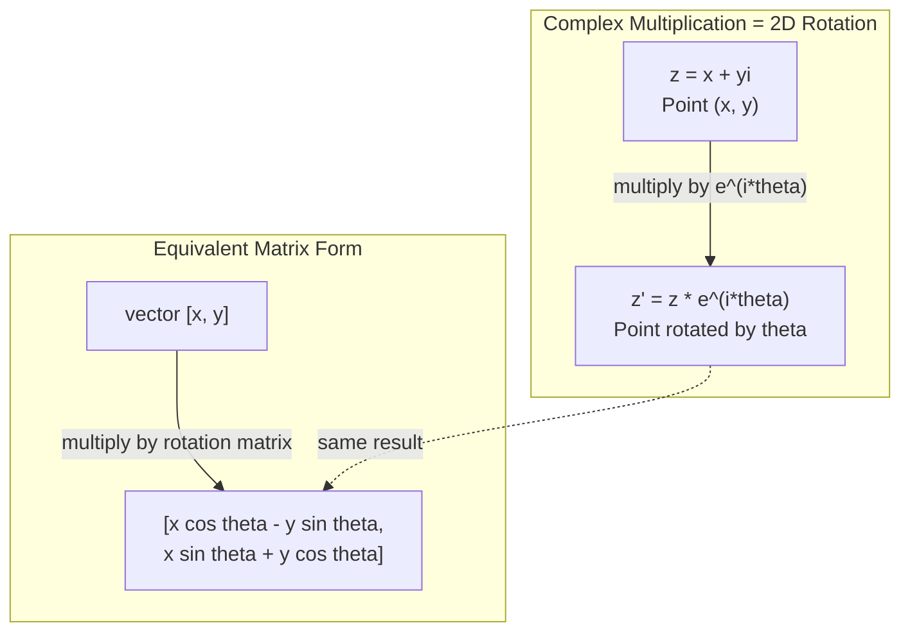
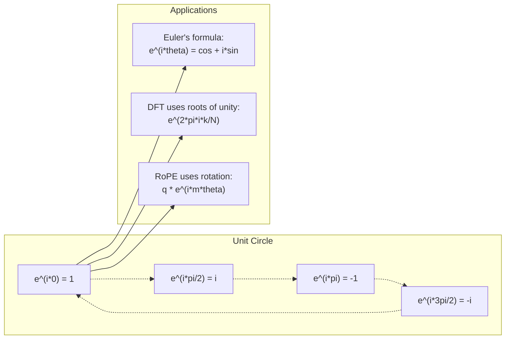

# Complex Numbers for AI

> The square root of -1 is not imaginary. It is the key to rotations, frequencies, and half of signal processing.

**Type:** Learn
**Language:** Python
**Prerequisites:** Phase 1, Lessons 01-04 (linear algebra, calculus)
**Time:** ~60 minutes

## Learning Objectives

- Perform complex arithmetic (add, multiply, divide, conjugate) in both rectangular and polar form
- Apply Euler's formula to convert between complex exponentials and trigonometric functions
- Implement the Discrete Fourier Transform using complex roots of unity
- Explain how complex rotations underlie RoPE and sinusoidal positional encodings in transformers

## The Problem

You open a paper on Fourier transforms and there is `i` everywhere. You look at transformer positional encodings and see `sin` and `cos` at different frequencies -- the real and imaginary parts of complex exponentials. You read about quantum computing and find everything expressed in complex vector spaces.

Complex numbers seem abstract. A number system built on the square root of -1 feels like a mathematical trick. But it is not a trick. It is the natural language of rotations and oscillations. Every time something spins, vibrates, or oscillates, complex numbers are the right tool.

Without understanding complex numbers, you cannot understand the Discrete Fourier Transform. You cannot understand FFT. You cannot understand how RoPE (Rotary Position Embedding) works in modern language models. You cannot understand why sinusoidal positional encodings in the original Transformer paper use the frequencies they do.

This lesson builds complex arithmetic from scratch, connects it to geometry, and shows you exactly where complex numbers appear in machine learning.

## The Concept

### What is a complex number?

A complex number has two parts: a real part and an imaginary part.

```
z = a + bi

where:
  a is the real part
  b is the imaginary part
  i is the imaginary unit, defined by i^2 = -1
```

That is it. You extend the number line into a plane. The real numbers sit on one axis. The imaginary numbers sit on the other. Every complex number is a point in this plane.

### Complex arithmetic

**Addition.** Add the real parts together, add the imaginary parts together.

```
(a + bi) + (c + di) = (a + c) + (b + d)i

Example: (3 + 2i) + (1 + 4i) = 4 + 6i
```

**Multiplication.** Use the distributive law and remember that i^2 = -1.

```
(a + bi)(c + di) = ac + adi + bci + bdi^2
                 = ac + adi + bci - bd
                 = (ac - bd) + (ad + bc)i

Example: (3 + 2i)(1 + 4i) = 3 + 12i + 2i + 8i^2
                            = 3 + 14i - 8
                            = -5 + 14i
```

**Conjugate.** Flip the sign of the imaginary part.

```
conjugate of (a + bi) = a - bi
```

The product of a complex number and its conjugate is always real:

```
(a + bi)(a - bi) = a^2 + b^2
```

**Division.** Multiply numerator and denominator by the conjugate of the denominator.

```
(a + bi) / (c + di) = (a + bi)(c - di) / (c^2 + d^2)
```

This eliminates the imaginary part from the denominator, giving you a clean complex number.

### The complex plane

The complex plane maps every complex number to a 2D point. The horizontal axis is the real axis, the vertical axis is the imaginary axis.

```
z = 3 + 2i  corresponds to the point (3, 2)
z = -1 + 0i corresponds to the point (-1, 0) on the real axis
z = 0 + 4i  corresponds to the point (0, 4) on the imaginary axis
```

A complex number is simultaneously a point and a vector from the origin. This dual interpretation is what makes complex numbers useful for geometry.

### Polar form

Any point in the plane can be described by its distance from the origin and its angle from the positive real axis.

```
z = r * (cos(theta) + i*sin(theta))

where:
  r = |z| = sqrt(a^2 + b^2)     (magnitude, or modulus)
  theta = atan2(b, a)             (phase, or argument)
```

Rectangular form (a + bi) is good for addition. Polar form (r, theta) is good for multiplication.

**Multiplication in polar form.** Multiply the magnitudes, add the angles.

```
z1 = r1 * e^(i*theta1)
z2 = r2 * e^(i*theta2)

z1 * z2 = (r1 * r2) * e^(i*(theta1 + theta2))
```

This is why complex numbers are perfect for rotations. Multiplying by a complex number with magnitude 1 is a pure rotation.

### Euler's formula

The bridge between complex exponentials and trigonometry:

```
e^(i*theta) = cos(theta) + i*sin(theta)
```

This is the most important formula in this lesson. When theta = pi:

```
e^(i*pi) = cos(pi) + i*sin(pi) = -1 + 0i = -1

Therefore: e^(i*pi) + 1 = 0
```

Five fundamental constants (e, i, pi, 1, 0) linked in one equation.

### Why Euler's formula matters for ML

Euler's formula says that `e^(i*theta)` traces the unit circle as theta varies. At theta = 0, you are at (1, 0). At theta = pi/2, you are at (0, 1). At theta = pi, you are at (-1, 0). At theta = 3*pi/2, you are at (0, -1). A full rotation is theta = 2*pi.

This means complex exponentials ARE rotations. And rotations are everywhere in signal processing and ML.

### Connection to 2D rotations

Multiplying the complex number (x + yi) by e^(i*theta) rotates the point (x, y) by angle theta around the origin.

```
Rotation via complex multiplication:
  (x + yi) * (cos(theta) + i*sin(theta))
  = (x*cos(theta) - y*sin(theta)) + (x*sin(theta) + y*cos(theta))i

Rotation via matrix multiplication:
  [cos(theta)  -sin(theta)] [x]   [x*cos(theta) - y*sin(theta)]
  [sin(theta)   cos(theta)] [y] = [x*sin(theta) + y*cos(theta)]
```

They produce identical results. Complex multiplication IS 2D rotation. The rotation matrix is just complex multiplication written in matrix notation.



### Phasors and rotating signals

A complex exponential e^(i*omega*t) is a point rotating around the unit circle at angular frequency omega. As t increases, the point traces the circle.

The real part of this rotating point is cos(omega*t). The imaginary part is sin(omega*t). A sinusoidal signal is the shadow of a rotating complex number.

```
e^(i*omega*t) = cos(omega*t) + i*sin(omega*t)

Real part:      cos(omega*t)    -- a cosine wave
Imaginary part: sin(omega*t)    -- a sine wave
```

This is the phasor representation. Instead of tracking a wiggly sine wave, you track a smoothly rotating arrow. Phase shifts become angle offsets. Amplitude changes become magnitude changes. Addition of signals becomes vector addition.

### Roots of unity

The N-th roots of unity are N points equally spaced on the unit circle:

```
w_k = e^(2*pi*i*k/N)    for k = 0, 1, 2, ..., N-1
```

For N = 4, the roots are: 1, i, -1, -i (the four compass points).
For N = 8, you get the four compass points plus the four diagonals.

Roots of unity are the foundation of the Discrete Fourier Transform. The DFT decomposes a signal into components at these N equally-spaced frequencies.

### Connection to the DFT

The Discrete Fourier Transform of a signal x[0], x[1], ..., x[N-1] is:

```
X[k] = sum_{n=0}^{N-1} x[n] * e^(-2*pi*i*k*n/N)
```

Each X[k] measures how much the signal correlates with the k-th root of unity -- a complex sinusoid at frequency k. The DFT breaks a signal into N rotating phasors and tells you the amplitude and phase of each one.

### Why i is not imaginary

The word "imaginary" is a historical accident. Descartes used it dismissively. But i is no more imaginary than negative numbers were when people first rejected them. Negative numbers answer "what do you subtract 5 from 3 to get?" The imaginary unit answers "what do you square to get -1?"

More usefully: i is a 90-degree rotation operator. Multiply a real number by i once, you rotate 90 degrees to the imaginary axis. Multiply by i again (i^2), you rotate another 90 degrees -- now you are pointing in the negative real direction. That is why i^2 = -1. It is not mysterious. It is a half-turn built from two quarter-turns.

This is why complex numbers are everywhere in engineering. Anything that rotates -- electromagnetic waves, quantum states, signal oscillations, positional encodings -- is naturally described by complex numbers.

### Complex exponentials vs trigonometric functions

Before Euler's formula, engineers wrote signals as A*cos(omega*t + phi) -- amplitude A, frequency omega, phase phi. This works but makes arithmetic painful. Adding two cosines with different phases requires trigonometric identities.

With complex exponentials, the same signal is A*e^(i*(omega*t + phi)). Adding two signals is just adding two complex numbers. Multiplying (modulating) is just multiplying magnitudes and adding angles. Phase shifts become angle additions. Frequency shifts become multiplications by phasors.

The entire field of signal processing switched to complex exponential notation because the math is cleaner. The "real signal" is always just the real part of the complex representation. The imaginary part is carried along as bookkeeping, making all the algebra work out naturally.

### Connection to transformers

**Sinusoidal positional encodings** (original Transformer paper):

```
PE(pos, 2i) = sin(pos / 10000^(2i/d))
PE(pos, 2i+1) = cos(pos / 10000^(2i/d))
```

The sin and cos pairs are the real and imaginary parts of complex exponentials at different frequencies. Each frequency provides a different "resolution" for encoding position. Low frequencies change slowly (coarse position). High frequencies change quickly (fine position). Together they give each position a unique frequency fingerprint.

**RoPE (Rotary Position Embedding)** takes this further. It explicitly multiplies query and key vectors by complex rotation matrices. The relative position between two tokens becomes a rotation angle. Attention is computed using these rotated vectors, making the model sensitive to relative position through complex multiplication.

| Operation | Algebraic Form | Geometric Meaning |
|-----------|---------------|-------------------|
| Addition | (a+c) + (b+d)i | Vector addition in the plane |
| Multiplication | (ac-bd) + (ad+bc)i | Rotate and scale |
| Conjugate | a - bi | Reflect over real axis |
| Magnitude | sqrt(a^2 + b^2) | Distance from origin |
| Phase | atan2(b, a) | Angle from positive real axis |
| Division | multiply by conjugate | Reverse rotation and rescale |
| Power | r^n * e^(i*n*theta) | Rotate n times, scale by r^n |




## Further Reading

- [Visual Introduction to Euler's Formula](https://betterexplained.com/articles/intuitive-understanding-of-eulers-formula/) - builds geometric intuition without heavy notation
- [Su et al.: RoFormer (2021)](https://arxiv.org/abs/2104.09864) - the paper introducing Rotary Position Embedding using complex rotations
- [Vaswani et al.: Attention Is All You Need (2017)](https://arxiv.org/abs/1706.03762) - the original Transformer paper with sinusoidal positional encodings
- [3Blue1Brown: Euler's formula with introductory group theory](https://www.youtube.com/watch?v=mvmuCPvRoWQ) - visual explanation of why e^(i*pi) = -1
- [Needham: Visual Complex Analysis](https://global.oup.com/academic/product/visual-complex-analysis-9780198534464) - the best visual treatment of complex numbers, full of geometric insight
- [Strang: Introduction to Linear Algebra, Ch. 10](https://math.mit.edu/~gs/linearalgebra/) - complex numbers in the context of linear algebra and eigenvalues
