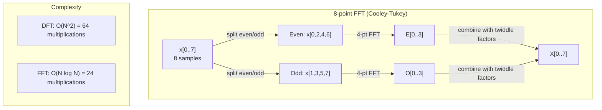
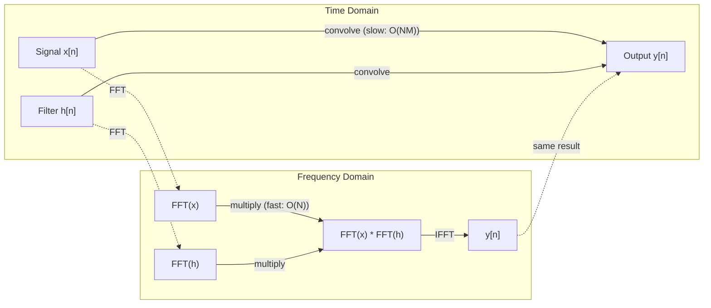

# The Fourier Transform

> Every signal is a sum of sine waves. The Fourier transform tells you which ones.

**Type:** Build
**Languages:** Python
**Language:** Python
**Prerequisites:** Phase 1, Lessons 01-04, 19 (complex numbers)
**Time:** ~90 minutes

## Learning Objectives

- Implement the DFT from scratch and verify it against the O(N log N) Cooley-Tukey FFT
- Interpret frequency coefficients: extract amplitude, phase, and power spectrum from a signal
- Apply the convolution theorem to perform convolution via FFT multiplication
- Connect Fourier frequency decomposition to transformer positional encodings and CNN convolution layers

## The Problem

An audio recording is a sequence of pressure measurements over time. A stock price is a sequence of values over days. An image is a grid of pixel intensities over space. All of these are data in the time domain (or space domain). You see values changing over some index.

But many patterns are invisible in the time domain. Is this audio signal a pure tone or a chord? Does this stock price have a weekly cycle? Does this image have a repeating texture? These questions are about frequency content, and the time domain hides it.

The Fourier transform converts data from the time domain to the frequency domain. It takes a signal and decomposes it into sine waves of different frequencies. Each sine wave has an amplitude (how strong it is) and a phase (where it starts). The Fourier transform tells you both.

This matters for ML because frequency-domain thinking appears everywhere. Convolutional neural networks perform convolution, which is multiplication in the frequency domain. Transformer positional encodings use frequency decomposition to represent position. Audio models (speech recognition, music generation) operate on spectrograms -- frequency representations of sound. Time series models look for periodic patterns. Understanding the Fourier transform gives you the vocabulary to work with all of these.

## The Concept

### The DFT definition

Given N samples x[0], x[1], ..., x[N-1], the Discrete Fourier Transform produces N frequency coefficients X[0], X[1], ..., X[N-1]:

```
X[k] = sum_{n=0}^{N-1} x[n] * e^(-2*pi*i*k*n/N)

for k = 0, 1, ..., N-1
```

Each X[k] is a complex number. Its magnitude |X[k]| tells you the amplitude of frequency k. Its phase angle(X[k]) tells you the phase offset of that frequency.

The key insight: `e^(-2*pi*i*k*n/N)` is a rotating phasor at frequency k. The DFT computes the correlation between the signal and each of N equally-spaced frequencies. If the signal contains energy at frequency k, the correlation is large. If not, it is near zero.

### What each coefficient means

**X[0]: the DC component.** This is the sum of all samples -- proportional to the mean. It represents the constant (zero-frequency) offset of the signal.

```
X[0] = sum_{n=0}^{N-1} x[n] * e^0 = sum of all samples
```

**X[k] for 1 <= k <= N/2: positive frequencies.** X[k] represents frequency k cycles per N samples. Higher k means higher frequency (faster oscillation).

**X[N/2]: the Nyquist frequency.** The highest frequency you can represent with N samples. Above this, you get aliasing -- high frequencies masquerading as low ones.

**X[k] for N/2 < k < N: negative frequencies.** For real-valued signals, X[N-k] = conj(X[k]). The negative frequencies are mirror images of the positive ones. This is why the useful information is in the first N/2 + 1 coefficients.

### Inverse DFT

The inverse DFT reconstructs the original signal from its frequency coefficients:

```
x[n] = (1/N) * sum_{k=0}^{N-1} X[k] * e^(2*pi*i*k*n/N)

for n = 0, 1, ..., N-1
```

The only differences from the forward DFT: the sign in the exponent is positive (not negative), and there is a 1/N normalization factor.

The inverse DFT is perfect reconstruction. No information is lost. You can go from time domain to frequency domain and back without any error. The DFT is a change of basis -- it re-expresses the same information in a different coordinate system.

### The FFT: making it fast

The DFT as defined above is O(N^2): for each of N output coefficients, you sum over N input samples. For N = 1 million, that is 10^12 operations.

The Fast Fourier Transform (FFT) computes the same result in O(N log N). For N = 1 million, that is about 20 million operations instead of a trillion. This is what makes frequency analysis practical.

The Cooley-Tukey algorithm (the most common FFT) works by divide and conquer:

1. Split the signal into even-indexed and odd-indexed samples.
2. Compute the DFT of each half recursively.
3. Combine the two half-size DFTs using "twiddle factors" e^(-2*pi*i*k/N).

```
X[k] = E[k] + e^(-2*pi*i*k/N) * O[k]          for k = 0, ..., N/2 - 1
X[k + N/2] = E[k] - e^(-2*pi*i*k/N) * O[k]    for k = 0, ..., N/2 - 1

where E = DFT of even-indexed samples
      O = DFT of odd-indexed samples
```

The symmetry means each level of recursion does O(N) work, and there are log2(N) levels. Total: O(N log N).



The FFT requires the signal length to be a power of 2. In practice, signals are zero-padded to the next power of 2.

### Spectral analysis

The **power spectrum** is |X[k]|^2 -- the squared magnitude of each frequency coefficient. It shows how much energy is at each frequency.

The **phase spectrum** is angle(X[k]) -- the phase offset of each frequency. For most analysis tasks, you care about the power spectrum and ignore the phase.

```
Power at frequency k:  P[k] = |X[k]|^2 = X[k].real^2 + X[k].imag^2
Phase at frequency k:  phi[k] = atan2(X[k].imag, X[k].real)
```

### Frequency resolution

The frequency resolution of the DFT depends on the number of samples N and the sampling rate fs.

```
Frequency of bin k:      f_k = k * fs / N
Frequency resolution:    delta_f = fs / N
Maximum frequency:       f_max = fs / 2  (Nyquist)
```

To resolve two frequencies that are close together, you need more samples. To capture high frequencies, you need a higher sampling rate.

### The convolution theorem

This is one of the most important results in signal processing and directly relevant to CNNs.

**Convolution in the time domain equals pointwise multiplication in the frequency domain.**

```
x * h = IFFT(FFT(x) . FFT(h))

where * is convolution and . is element-wise multiplication
```

Why this matters:

- Direct convolution of two signals of length N and M takes O(N*M) operations.
- FFT-based convolution takes O(N log N): transform both, multiply, transform back.
- For large kernels, FFT convolution is dramatically faster.
- This is exactly what happens in convolutional layers with large receptive fields.

Note: the DFT computes circular convolution (the signal wraps around). For linear convolution (no wraparound), zero-pad both signals to length N + M - 1 before computing.



### Windowing

The DFT assumes the signal is periodic -- it treats the N samples as one period of an infinitely repeating signal. If the signal does not start and end at the same value, this creates a discontinuity at the boundary, which shows up as spurious high-frequency content. This is called spectral leakage.

Windowing reduces leakage by tapering the signal to zero at both ends before computing the DFT.

Common windows:

| Window | Shape | Main lobe width | Side lobe level | Use case |
|--------|-------|----------------|-----------------|----------|
| Rectangular | Flat (no window) | Narrowest | Highest (-13 dB) | When signal is exactly periodic in N samples |
| Hann | Raised cosine | Moderate | Low (-31 dB) | General purpose spectral analysis |
| Hamming | Modified cosine | Moderate | Lower (-42 dB) | Audio processing, speech analysis |
| Blackman | Triple cosine | Wide | Very low (-58 dB) | When side lobe suppression is critical |

```
Hann window:    w[n] = 0.5 * (1 - cos(2*pi*n / (N-1)))
Hamming window: w[n] = 0.54 - 0.46 * cos(2*pi*n / (N-1))
```

Apply the window by multiplying it element-wise with the signal before the DFT: `X = DFT(x * w)`.

### DFT properties

| Property | Time Domain | Frequency Domain |
|----------|-------------|-----------------|
| Linearity | a*x + b*y | a*X + b*Y |
| Time shift | x[n - k] | X[f] * e^(-2*pi*i*f*k/N) |
| Frequency shift | x[n] * e^(2*pi*i*f0*n/N) | X[f - f0] |
| Convolution | x * h | X * H (pointwise) |
| Multiplication | x * h (pointwise) | X * H (circular convolution, scaled by 1/N) |
| Parseval's theorem | sum \|x[n]\|^2 | (1/N) * sum \|X[k]\|^2 |
| Conjugate symmetry (real input) | x[n] real | X[k] = conj(X[N-k]) |

Parseval's theorem says the total energy is the same in both domains. Energy is conserved through the transform.

### Connection to positional encodings

The original Transformer uses sinusoidal positional encodings:

```
PE(pos, 2i)   = sin(pos / 10000^(2i/d_model))
PE(pos, 2i+1) = cos(pos / 10000^(2i/d_model))
```

Each dimension pair (2i, 2i+1) oscillates at a different frequency. The frequencies are geometrically spaced from high (dimension 0,1) to low (last dimensions). This gives each position a unique pattern across all frequency bands -- similar to how Fourier coefficients uniquely identify a signal.

The key properties this provides:

- **Uniqueness:** No two positions have the same encoding.
- **Bounded values:** sin and cos are always in [-1, 1].
- **Relative position:** The encoding of position p+k can be expressed as a linear function of the encoding at position p. The model can learn to attend to relative positions.

### Connection to CNNs

A convolution layer applies a learned filter (kernel) to the input by sliding it across the signal or image. Mathematically, this is the convolution operation.

By the convolution theorem, this is equivalent to:
1. FFT the input
2. FFT the kernel
3. Multiply in frequency domain
4. IFFT the result

Standard CNN implementations use direct convolution (faster for small 3x3 kernels). But for large kernels or global convolution, FFT-based approaches are significantly faster. Some architectures (like FNet) replace attention entirely with FFT, achieving competitive accuracy with O(N log N) instead of O(N^2) complexity.

### Spectrograms and the Short-Time Fourier Transform

A single FFT gives you the frequency content of the entire signal, but tells you nothing about when those frequencies occur. A chirp (a signal whose frequency increases over time) and a chord (all frequencies present simultaneously) can have the same magnitude spectrum.

The Short-Time Fourier Transform (STFT) solves this by computing FFTs on overlapping windows of the signal. The result is a spectrogram: a 2D representation with time on one axis and frequency on the other. The intensity at each point shows the energy at that frequency at that time.

```
STFT procedure:
1. Choose a window size (e.g., 1024 samples)
2. Choose a hop size (e.g., 256 samples -- 75% overlap)
3. For each window position:
   a. Extract the windowed segment
   b. Apply a Hann/Hamming window
   c. Compute FFT
   d. Store the magnitude spectrum as one column of the spectrogram
```

Spectrograms are the standard input representation for audio ML models. Speech recognition models (Whisper, DeepSpeech) operate on mel-spectrograms -- spectrograms with frequencies mapped to the mel scale, which better matches human pitch perception.

### Aliasing

If a signal contains frequencies above fs/2 (the Nyquist frequency), sampling at rate fs will create aliased copies. A 90 Hz signal sampled at 100 Hz looks identical to a 10 Hz signal. There is no way to distinguish them from the samples alone.

```
Example:
  True signal: 90 Hz sine wave
  Sampling rate: 100 Hz
  Apparent frequency: 100 - 90 = 10 Hz

  The samples from the 90 Hz signal at 100 Hz sampling rate
  are identical to the samples from a 10 Hz signal.
  No amount of math can recover the original 90 Hz.
```

This is why analog-to-digital converters include anti-aliasing filters that remove frequencies above Nyquist before sampling. In ML, aliasing appears when downsampling feature maps without proper low-pass filtering -- some architectures address this with anti-aliased pooling layers.

### Zero-padding does not increase resolution

A common misconception: zero-padding a signal before FFT improves frequency resolution. It does not. Zero-padding interpolates between existing frequency bins, giving you a smoother-looking spectrum. But it cannot reveal frequency detail that was not present in the original samples.

True frequency resolution depends only on the observation time T = N / fs. To resolve two frequencies separated by delta_f, you need at least T = 1 / delta_f seconds of data. No amount of zero-padding changes this fundamental limit.


## Build It

Reconstruct **The Fourier Transform** by following `Complex` on tokens=["red","fox"]. Run `python3 main.py` and verify that the attention/embedding shape follows the token count and each valid attention row remains normalized.

## Use It

Call `Complex` from a small caller with tokens=["red","fox"]. Compare its result with the demo output, and record the input contract and the one field a downstream user should rely on.

## Ship It

Hand off `outputs/prompt-spectral-analyzer.md` with the command `python3 main.py`, the accepted input shape (tokens=["red","fox"]), the expected observable result, and a failure note for malformed inputs.

## Further Reading

- [Cooley & Tukey: An Algorithm for the Machine Calculation of Complex Fourier Series (1965)](https://www.ams.org/journals/mcom/1965-19-090/S0025-5718-1965-0178586-1/) - the original FFT paper that changed computing
- [3Blue1Brown: But what is the Fourier Transform?](https://www.youtube.com/watch?v=spUNpyF58BY) - the best visual introduction to Fourier transforms
- [Lee-Thorp et al.: FNet: Mixing Tokens with Fourier Transforms (2021)](https://arxiv.org/abs/2105.03824) - replaces self-attention with FFT in transformers
- [Smith: The Scientist and Engineer's Guide to Digital Signal Processing](http://www.dspguide.com/) - free online textbook covering FFT, windowing, and spectral analysis in depth
- [Vaswani et al.: Attention Is All You Need (2017)](https://arxiv.org/abs/1706.03762) - sinusoidal positional encodings derived from Fourier frequency decomposition
- [Radford et al.: Whisper (2022)](https://arxiv.org/abs/2212.04356) - speech recognition using mel-spectrograms as input representation

## Exercises

Work from the smallest fixture that the The Fourier Transform demo already understands, then make one deliberate change and record what moved.

1. **Run the smallest fixture.** From `code/`, run `python3 main.py` using tokens=["red","fox"]. Follow `Complex`, `magnitude`, `phase`. Expect the attention/embedding shape follows the token count and each valid attention row remains normalized; capture the first printed shape, metric, status, or summary field and state which part supports **Implement the DFT from scratch and verify it against the O(N log N) Cooley-Tukey FFT**.
2. **Perturb one field.** Repeat the command after changing only the token sequence: use tokens=["red","fox","runs"]. Predict the direction of the change, then compare the two output values. Explain why **Interpret frequency coefficients: extract amplitude, phase, and power spectrum from a signal** says the other inputs should stay fixed.
3. **Check the failure boundary.** Feed the implementation tokens=[]. Before running it, write down whether the relevant function should return an empty value, a zero-sized result, or a validation error. Check the observed status against **Apply the convolution theorem to perform convolution via FFT multiplication** and record the exception text if the code rejects the case.
4. **Make the result repeatable.** Open `outputs/prompt-spectral-analyzer.md` and add a worked example using tokens=["red","fox"]. Include the input contract, one expected output field, and a named acceptance check for **Connect Fourier frequency decomposition to transformer positional encodings and CNN convolution layers**; note what the demo cannot establish.

## Reference Solution

A checkable result for **The Fourier Transform** should contain:

- the `python3 main.py` output for tokens=["red","fox"], with `Complex`, `magnitude`, `phase` traced to the value or shape that supports **Implement the DFT from scratch and verify it against the O(N log N) Cooley-Tukey FFT**;
- a before/after comparison for the token sequence, where tokens=["red","fox","runs"] changes the observation in the direction predicted by **Interpret frequency coefficients: extract amplitude, phase, and power spectrum from a signal**;
- a recorded result for tokens=[] that matches the implementation’s validation or empty-result contract and explains the evidence for **Apply the convolution theorem to perform convolution via FFT multiplication**; and
- an updated `outputs/prompt-spectral-analyzer.md` example with a concrete input, expected output field, and acceptance check tied to **Connect Fourier frequency decomposition to transformer positional encodings and CNN convolution layers**.

Run the lesson tests after the demo. If the boundary behaves differently from the prediction, keep the actual exception or output and explain the implementation path that produced it.
