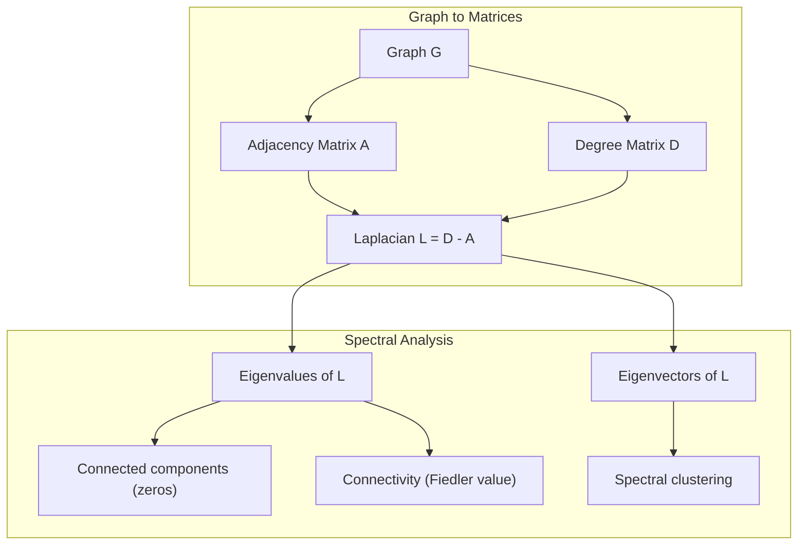
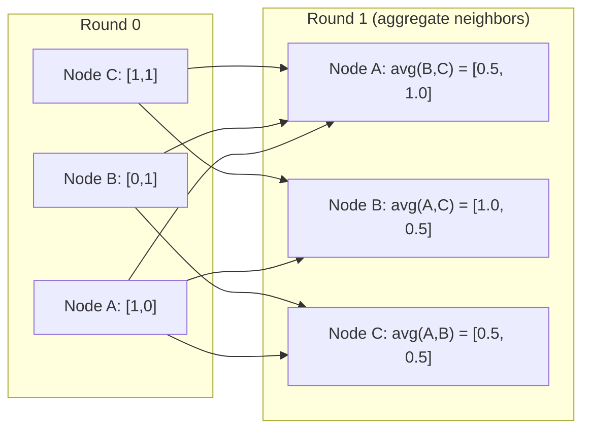

# Graph Theory for Machine Learning

> Graphs are the data structure of relationships. If your data has connections, you need graph theory.

**Type:** Build
**Languages:** Python
**Language:** Python
**Prerequisites:** Phase 1, Lessons 01-03 (linear algebra, matrices)
**Time:** ~90 minutes

## Learning Objectives

- Build a graph class with adjacency matrix/list representations and implement BFS and DFS traversals
- Compute the graph Laplacian and use its eigenvalues to detect connected components and cluster nodes
- Implement one round of GNN-style message passing as a normalized adjacency matrix multiplication
- Apply spectral clustering to partition a graph using the Fiedler vector

## The Problem

Social networks, molecules, knowledge bases, citation networks, road maps -- all are graphs. Traditional ML treats data as flat tables. Each row is independent. Each feature is a column. But when the structure of connections matters, tables fail.

Consider a social network. You want to predict what product a user will buy. Their purchase history matters. But their friends' purchase history matters more. The connections carry signal.

Or consider a molecule. You want to predict if it binds to a protein. The atoms matter, but what really matters is how atoms are bonded to each other. The structure is the data.

Graph Neural Networks (GNNs) are the fastest-growing area in deep learning. They power drug discovery, social recommendation, fraud detection, and knowledge graph reasoning. Every GNN builds on the same foundation: basic graph theory.

You need four things:
1. A way to represent graphs as matrices (so you can multiply them)
2. Traversal algorithms to explore graph structure
3. The Laplacian -- the single most important matrix in spectral graph theory
4. Message passing -- the operation that makes GNNs work

## The Concept

### Graphs: Nodes and Edges

A graph G = (V, E) consists of vertices (nodes) V and edges E. Each edge connects two nodes.

**Directed vs undirected.** In an undirected graph, edge (u, v) means u connects to v AND v connects to u. In a directed graph (digraph), edge (u, v) means u points to v, but not necessarily the reverse.

**Weighted vs unweighted.** In an unweighted graph, edges either exist or they don't. In a weighted graph, each edge has a numerical weight -- a distance, a cost, a strength.

| Graph type | Example |
|-----------|---------|
| Undirected, unweighted | Facebook friendship network |
| Directed, unweighted | Twitter follow network |
| Undirected, weighted | Road map (distances) |
| Directed, weighted | Web page links (PageRank scores) |

### The Adjacency Matrix

The adjacency matrix A is the core representation. For a graph with n nodes:

```
A[i][j] = 1    if there is an edge from node i to node j
A[i][j] = 0    otherwise
```

For undirected graphs, A is symmetric: A[i][j] = A[j][i]. For weighted graphs, A[i][j] = weight of edge (i, j).

**Example -- a triangle:**

```
Nodes: 0, 1, 2
Edges: (0,1), (1,2), (0,2)

A = [[0, 1, 1],
     [1, 0, 1],
     [1, 1, 0]]
```

The adjacency matrix is the input to every GNN. Matrix operations on A correspond to operations on the graph.

### Degree

The degree of a node is the number of edges connected to it. For directed graphs, you have in-degree (edges coming in) and out-degree (edges going out).

The degree matrix D is diagonal:

```
D[i][i] = degree of node i
D[i][j] = 0    for i != j
```

For the triangle example: D = diag(2, 2, 2) because every node connects to two others.

Degree tells you about node importance. High degree = hub node. The degree distribution of a network reveals its structure. Social networks follow power laws (few hubs, many leaf nodes). Random graphs have Poisson-distributed degrees.

### BFS and DFS

The two fundamental graph traversal algorithms. You need both.

**Breadth-First Search (BFS):** Explore all neighbors first, then neighbors' neighbors. Uses a queue (FIFO).

```
BFS from node 0:
  Visit 0
  Queue: [1, 2]        (neighbors of 0)
  Visit 1
  Queue: [2, 3]        (add neighbors of 1)
  Visit 2
  Queue: [3]           (neighbors of 2 already visited)
  Visit 3
  Queue: []            (done)
```

BFS finds shortest paths in unweighted graphs. The distance from the start to any node equals the BFS level at which that node is first discovered. This is why BFS is used for hop-count distances in social networks.

**Depth-First Search (DFS):** Go as deep as possible before backtracking. Uses a stack (LIFO) or recursion.

```
DFS from node 0:
  Visit 0
  Stack: [1, 2]        (neighbors of 0)
  Visit 2               (pop from stack)
  Stack: [1, 3]         (add neighbors of 2)
  Visit 3               (pop from stack)
  Stack: [1]
  Visit 1               (pop from stack)
  Stack: []             (done)
```

DFS is useful for:
- Finding connected components (run DFS from unvisited nodes)
- Cycle detection (back edges in DFS tree)
- Topological sorting (reverse DFS finish order)

| Algorithm | Data structure | Finds | Use case |
|-----------|---------------|-------|----------|
| BFS | Queue | Shortest paths | Social network distance, knowledge graph traversal |
| DFS | Stack | Components, cycles | Connectivity, topological sort |

### The Graph Laplacian

L = D - A. The most important matrix in spectral graph theory.

For the triangle:

```
D = [[2, 0, 0],    A = [[0, 1, 1],    L = [[2, -1, -1],
     [0, 2, 0],         [1, 0, 1],         [-1, 2, -1],
     [0, 0, 2]]         [1, 1, 0]]         [-1, -1,  2]]
```

The Laplacian has remarkable properties:

1. **L is positive semi-definite.** All eigenvalues are >= 0.

2. **The number of zero eigenvalues equals the number of connected components.** A connected graph has exactly one zero eigenvalue. A graph with 3 disconnected components has three zero eigenvalues.

3. **The smallest non-zero eigenvalue (Fiedler value) measures connectivity.** A large Fiedler value means the graph is well-connected. A small Fiedler value means the graph has a weak point -- a bottleneck.

4. **The eigenvector of the Fiedler value (Fiedler vector) reveals the best split.** Nodes with positive values go in one group, nodes with negative values go in the other. This is spectral clustering.



### Spectral Properties

The eigenvalues of the adjacency matrix and Laplacian reveal structural properties without any traversal.

**Spectral clustering** works like this:
1. Compute the Laplacian L
2. Find the k smallest eigenvectors of L (skip the first, which is all-ones for connected graphs)
3. Use those eigenvectors as new coordinates for each node
4. Run k-means on those coordinates

Why does this work? The eigenvectors of L encode the "smoothest" functions on the graph. Nodes that are well-connected get similar eigenvector values. Nodes separated by a bottleneck get different values. The eigenvectors naturally separate clusters.

**Random walk connection.** The normalized Laplacian relates to random walks on the graph. The stationary distribution of a random walk is proportional to node degree. The mixing time (how fast the walk converges) depends on the spectral gap.

### Message Passing

The core operation of Graph Neural Networks. Each node collects messages from its neighbors, aggregates them, and updates its own state.

```
h_v^(k+1) = UPDATE(h_v^(k), AGGREGATE({h_u^(k) : u in neighbors(v)}))
```

In the simplest form, AGGREGATE = mean, and UPDATE = linear transform + activation:

```
h_v^(k+1) = sigma(W * mean({h_u^(k) : u in neighbors(v)}))
```

This is matrix multiplication in disguise. If H is the matrix of all node features and A is the adjacency matrix:

```
H^(k+1) = sigma(A_norm * H^(k) * W)
```

where A_norm is the normalized adjacency matrix (each row sums to 1).

One round of message passing lets each node "see" its immediate neighbors. Two rounds let it see neighbors of neighbors. K rounds give each node information from its K-hop neighborhood.



### Concepts and ML Applications

| Concept | ML Application |
|---------|---------------|
| Adjacency matrix | GNN input representation |
| Graph Laplacian | Spectral clustering, community detection |
| BFS/DFS | Knowledge graph traversal, path finding |
| Degree distribution | Node importance, feature engineering |
| Message passing | GNN layers (GCN, GAT, GraphSAGE) |
| Eigenvalues of L | Community detection, graph partitioning |
| Spectral clustering | Unsupervised node grouping |
| PageRank | Node importance, web search |


## Build It

Reconstruct **Graph Theory for Machine Learning** by following `Graph` on a graph with edges (0,1) and (1,2). Run `python3 main.py` and verify that degrees, adjacency, or connectivity expose the isolated/no-edge case explicitly.

## Use It

Call `Graph` from a small caller with a graph with edges (0,1) and (1,2). Compare its result with the demo output, and record the input contract and the one field a downstream user should rely on.

## Ship It

Hand off `outputs/skill-graph-analysis.md` with the command `python3 main.py`, the accepted input shape (a graph with edges (0,1) and (1,2)), the expected observable result, and a failure note for malformed inputs.

## Further Reading

- **Kipf & Welling (2017)** -- "Semi-Supervised Classification with Graph Convolutional Networks." The paper that launched modern GNNs. Shows that spectral graph convolutions simplify to message passing.
- **Spielman (2012)** -- "Spectral Graph Theory" lecture notes. The definitive introduction to Laplacians, spectral gaps, and graph partitioning.
- **Hamilton (2020)** -- "Graph Representation Learning." Book covering GNNs from fundamentals to applications.
- **Bronstein et al. (2021)** -- "Geometric Deep Learning: Grids, Groups, Graphs, Geodesics, and Gauges." The unifying framework paper.
- **Veličković et al. (2018)** -- "Graph Attention Networks." Extends message passing with attention mechanisms.

## Exercises

Use `Graph` as the trace: start from a graph with edges (0,1) and (1,2), keep the raw output, and tie each observation to a named objective.

1. **Reproduce the reference path.** From `code/`, run `python3 main.py` using a graph with edges (0,1) and (1,2). Follow `Graph`, `add_edge`, `neighbors`. Expect degrees, adjacency, or connectivity expose the isolated/no-edge case explicitly; capture the first printed shape, metric, status, or summary field and state which part supports **Build a graph class with adjacency matrix/list representations and implement BFS and DFS traversals**.
2. **Vary one named input.** Repeat the command after changing only the edge list: use the same graph with an isolated node 3. Predict the direction of the change, then compare the two output values. Explain why **Compute the graph Laplacian and use its eigenvalues to detect connected components and cluster nodes** says the other inputs should stay fixed.
3. **Probe the empty case.** Feed the implementation a graph with no edges. Before running it, write down whether the relevant function should return an empty value, a zero-sized result, or a validation error. Check the observed status against **Implement one round of GNN-style message passing as a normalized adjacency matrix multiplication** and record the exception text if the code rejects the case.
4. **Package a usable handoff.** Open `outputs/skill-graph-analysis.md` and add a worked example using a graph with edges (0,1) and (1,2). Include the input contract, one expected output field, and a named acceptance check for **Apply spectral clustering to partition a graph using the Fiedler vector**; note what the demo cannot establish.

## Reference Solution

A checkable result for **Graph Theory for Machine Learning** should contain:

- the `python3 main.py` output for a graph with edges (0,1) and (1,2), with `Graph`, `add_edge`, `neighbors` traced to the value or shape that supports **Build a graph class with adjacency matrix/list representations and implement BFS and DFS traversals**;
- a before/after comparison for the edge list, where the same graph with an isolated node 3 changes the observation in the direction predicted by **Compute the graph Laplacian and use its eigenvalues to detect connected components and cluster nodes**;
- a recorded result for a graph with no edges that matches the implementation’s validation or empty-result contract and explains the evidence for **Implement one round of GNN-style message passing as a normalized adjacency matrix multiplication**; and
- an updated `outputs/skill-graph-analysis.md` example with a concrete input, expected output field, and acceptance check tied to **Apply spectral clustering to partition a graph using the Fiedler vector**.

Run the lesson tests after the demo. If the boundary behaves differently from the prediction, keep the actual exception or output and explain the implementation path that produced it.
