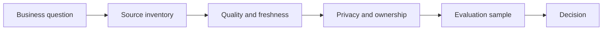

# Data Literacy for AI Projects

> AI projects fail early when nobody can say which data is allowed, fresh, representative, and good enough for the decision.

**Type:** Build
**Languages:** Python
**Prerequisites:** Phase 11 Lesson 05 (Context Engineering), Phase 11 Lesson 10 (Evaluation & Testing)
**Time:** ~45 minutes
**Capability:** Foundation - Data Literacy

## Learning Objectives

- Identify the data signals that decide whether an AI workflow is feasible
- Build a small Python data-readiness triage artifact
- Map data quality, privacy, freshness, ownership, and evaluation into one worksheet
- Use data-readiness controls before a pilot starts
- Explain when a use case needs awareness, cleanup, a guided pilot, or a launch gate

## The Problem

A team wants an assistant for customer or employee questions. The prompt looks simple, but the data is spread across SharePoint folders, old exports, local spreadsheets, and undocumented process notes. Some content is stale, some is sensitive, and nobody owns the final answer quality.

The lesson teaches participants to ask the data questions before discussing model choice. Good AI use cases start with the evidence base, not with a demo.

## The Concept

Data literacy for AI is the ability to reason about sources, quality, representativeness, permissions, and evaluation. The point is not to turn every learner into a data engineer. The point is to make every learner able to spot when the data story is too weak for reliable AI.

### Signals to Look For

- unclear source owner
- stale data
- quality issue
- sensitive field

### Controls to Teach

- source inventory
- quality threshold
- privacy classification
- evaluation sample

### Target Roles

- Business & Strategy Consulting
- Products & Value Streams
- Corporate Functions
- Leadership

## Use It

Use the artifact in discovery, requirements work, and pilot reviews. It creates a shared vocabulary for data quality without requiring a full data-platform deep dive.

### Workshop Flow

1. Start with one real workflow and list the sources it would use.
2. Mark source owners, freshness, sensitivity, and known quality issues.
3. Score the scenario with the Python artifact.
4. Decide whether the next step is cleanup, a pilot, or a governance gate.
5. Save the worksheet with the project brief.

## Reusable Artifact

Data-readiness triage worksheet.

The template in `outputs/worksheet-data-readiness-triage.md` can be copied into a discovery note, product brief, or AI initiative intake.

## Key Takeaways

- Data literacy is an operating skill for every AI project role.
- Model choice cannot compensate for stale, uncontrolled, or unowned sources.
- Evaluation samples should be planned before a pilot starts.
- Data controls should be lightweight enough that teams actually use them.

## Build It

Reconstruct **Data Literacy for AI Projects** by following `Scenario` on the demo’s smallest built-in fixture. Run `python3 main.py` and verify that the result reports the empty case explicitly or raises the documented validation error.

## Ship It

Hand off `outputs/worksheet-data-readiness-triage.md` with the command `python3 main.py`, the accepted input shape (the demo’s smallest built-in fixture), the expected observable result, and a failure note for malformed inputs.

## Exercises

This lab follows `Scenario` and `Recommendation` on a controlled fixture; write down the value before changing the input.

1. **Trace the canonical fixture.** From `code/`, run `python3 main.py` using the demo’s smallest built-in fixture. Follow `Scenario`, `Recommendation`, `normalize`. Expect the result reports the empty case explicitly or raises the documented validation error; capture the first printed shape, metric, status, or summary field and state which part supports **Identify the data signals that decide whether an AI workflow is feasible**.
2. **Change the controlled parameter.** Repeat the command after changing only the primary fixture value: use the same fixture with its primary value changed from 1 to 2. Predict the direction of the change, then compare the two output values. Explain why **Build a small Python data-readiness triage artifact** says the other inputs should stay fixed.
3. **Exercise the guard.** Feed the implementation an empty fixture {}. Before running it, write down whether the relevant function should return an empty value, a zero-sized result, or a validation error. Check the observed status against **Map data quality, privacy, freshness, ownership, and evaluation into one worksheet** and record the exception text if the code rejects the case.
4. **Prepare the artifact for reuse.** Open `outputs/worksheet-data-readiness-triage.md` and add a worked example using the demo’s smallest built-in fixture. Include the input contract, one expected output field, and a named acceptance check for **Use data-readiness controls before a pilot starts**; note what the demo cannot establish.

## Reference Solution

A checkable result for **Data Literacy for AI Projects** should contain:

- the `python3 main.py` output for the demo’s smallest built-in fixture, with `Scenario`, `Recommendation`, `normalize` traced to the value or shape that supports **Identify the data signals that decide whether an AI workflow is feasible**;
- a before/after comparison for the primary fixture value, where the same fixture with its primary value changed from 1 to 2 changes the observation in the direction predicted by **Build a small Python data-readiness triage artifact**;
- a recorded result for an empty fixture {} that matches the implementation’s validation or empty-result contract and explains the evidence for **Map data quality, privacy, freshness, ownership, and evaluation into one worksheet**; and
- an updated `outputs/worksheet-data-readiness-triage.md` example with a concrete input, expected output field, and acceptance check tied to **Use data-readiness controls before a pilot starts**.

Run the lesson tests after the demo. If the boundary behaves differently from the prediction, keep the actual exception or output and explain the implementation path that produced it.
