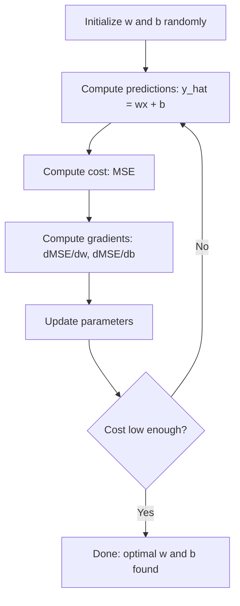

# Linear Regression

> Linear regression draws the best straight line through your data. It is the "hello world" of machine learning.

**Type:** Build
**Languages:** Python
**Prerequisites:** Phase 1 (Linear Algebra, Calculus, Optimization), Phase 2 Lesson 1
**Time:** ~90 minutes

## Learning Objectives

- Derive the gradient descent update rules for mean squared error and implement linear regression from scratch
- Compare gradient descent and the normal equation in terms of computational complexity and when to use each
- Build a multiple linear regression model with feature standardization and interpret the learned weights
- Explain how Ridge regression (L2 regularization) prevents overfitting by penalizing large weights

## The Problem

You have data: house sizes and their sale prices. You want to predict the price of a new house given its size. You could eyeball it on a scatter plot, but you need a formula. You need a line that best fits the data so you can plug in any size and get a price prediction.

Linear regression gives you that line. More importantly, it introduces the entire ML training loop: define a model, define a cost function, optimize the parameters. Every ML algorithm follows this same pattern. Master it here with the simplest case, and you will recognize it everywhere.

This is not just for simple problems. Linear regression is used in production systems for demand forecasting, A/B test analysis, financial modeling, and as a baseline for every regression task.

## The Concept

### The Model

Linear regression assumes a linear relationship between input (x) and output (y):

```
y = wx + b
```

- `w` (weight/slope): how much y changes when x increases by 1
- `b` (bias/intercept): the value of y when x = 0

For multiple inputs (features), this extends to:

```
y = w1*x1 + w2*x2 + ... + wn*xn + b
```

Or in vector form: `y = w^T * x + b`

The goal: find the values of w and b that make the predicted y as close as possible to the actual y across all training examples.

### The Cost Function (Mean Squared Error)

How do you measure "as close as possible"? You need a single number that captures how wrong your predictions are. The most common choice is Mean Squared Error (MSE):

```
MSE = (1/n) * sum((y_predicted - y_actual)^2)
```

Why squared? Two reasons. First, it penalizes large errors more than small errors (an error of 10 is 100x worse than an error of 1, not 10x). Second, the squared function is smooth and differentiable everywhere, which makes optimization straightforward.

The cost function creates a surface. For a single weight w and bias b, the MSE surface looks like a bowl (a convex paraboloid). The bottom of the bowl is where MSE is minimized. Training means finding that bottom.

### Gradient Descent

Gradient descent finds the bottom of the bowl by taking steps downhill.



The gradients tell you two things: which direction to move each parameter, and how much to move.

For MSE with y_hat = wx + b:

```
dMSE/dw = (2/n) * sum((y_hat - y) * x)
dMSE/db = (2/n) * sum(y_hat - y)
```

The update rule:

```
w = w - learning_rate * dMSE/dw
b = b - learning_rate * dMSE/db
```

The learning rate controls step size. Too large: you overshoot the minimum and diverge. Too small: training takes forever. Typical starting values: 0.01, 0.001, or 0.0001.

### The Normal Equation (Closed-Form Solution)

For linear regression specifically, there is a direct formula that gives the optimal weights without any iteration:

```
w = (X^T * X)^(-1) * X^T * y
```

This inverts a matrix to solve for w in one step. It works perfectly for small datasets. For large datasets (millions of rows or thousands of features), gradient descent is preferred because matrix inversion is O(n^3) in the number of features.

### Multiple Linear Regression

With multiple features, the model becomes:

```
y = w1*x1 + w2*x2 + ... + wn*xn + b
```

Everything works the same: MSE is the cost function, gradient descent updates all weights simultaneously. The only difference is that you are fitting a hyperplane instead of a line.

Feature scaling matters here. If one feature ranges from 0 to 1 and another ranges from 0 to 1,000,000, gradient descent will struggle because the cost surface becomes elongated. Standardize features (subtract mean, divide by standard deviation) before training.

### Polynomial Regression

What if the relationship is not linear? You can still use linear regression by creating polynomial features:

```
y = w1*x + w2*x^2 + w3*x^3 + b
```

This is still "linear" regression because the model is linear in the weights (w1, w2, w3). You are just using nonlinear features of x.

Higher-degree polynomials can fit more complex curves but risk overfitting. A degree-10 polynomial will pass through every point in a 10-point dataset but predict poorly on new data.

### R-Squared Score

MSE tells you how wrong you are, but the number depends on the scale of y. R-squared (R^2) gives a scale-independent measure:

```
R^2 = 1 - (sum of squared residuals) / (sum of squared deviations from mean)
    = 1 - SS_res / SS_tot
```

- R^2 = 1.0: perfect predictions
- R^2 = 0.0: the model is no better than predicting the mean every time
- R^2 < 0.0: the model is worse than predicting the mean

### Regularization Preview (Ridge Regression)

When you have many features, the model can overfit by assigning large weights. Ridge regression (L2 regularization) adds a penalty:

```
Cost = MSE + lambda * sum(w_i^2)
```

The penalty term discourages large weights. The hyperparameter lambda controls the tradeoff: higher lambda means smaller weights and more regularization. This is covered in depth in a later lesson. For now, know that it exists and why it helps.


## Use It

Now the same thing with scikit-learn, which is what you will actually use in production.

```python
from sklearn.linear_model import LinearRegression as SklearnLR
from sklearn.linear_model import Ridge
from sklearn.preprocessing import PolynomialFeatures, StandardScaler
from sklearn.model_selection import train_test_split
from sklearn.metrics import mean_squared_error, r2_score
import numpy as np

np.random.seed(42)
X_sk = np.random.uniform(0, 10, (100, 1))
y_sk = 3.0 * X_sk.squeeze() + 7.0 + np.random.normal(0, 2.0, 100)

X_train, X_test, y_train, y_test = train_test_split(X_sk, y_sk, test_size=0.2, random_state=42)

lr = SklearnLR()
lr.fit(X_train, y_train)
y_pred = lr.predict(X_test)

print("=== Scikit-learn Linear Regression ===")
print(f"Coefficient (w): {lr.coef_[0]:.4f}")
print(f"Intercept (b): {lr.intercept_:.4f}")
print(f"R-squared (test): {r2_score(y_test, y_pred):.4f}")
print(f"MSE (test): {mean_squared_error(y_test, y_pred):.4f}")

poly = PolynomialFeatures(degree=2, include_bias=False)
X_poly_sk = poly.fit_transform(X_train)
X_poly_test = poly.transform(X_test)

lr_poly = SklearnLR()
lr_poly.fit(X_poly_sk, y_train)
print(f"\nPolynomial degree 2 R-squared: {r2_score(y_test, lr_poly.predict(X_poly_test)):.4f}")

scaler = StandardScaler()
X_train_scaled = scaler.fit_transform(X_train)
X_test_scaled = scaler.transform(X_test)

ridge = Ridge(alpha=1.0)
ridge.fit(X_train_scaled, y_train)
print(f"Ridge R-squared: {r2_score(y_test, ridge.predict(X_test_scaled)):.4f}")
print(f"Ridge coefficient: {ridge.coef_[0]:.4f}")
```

Your from-scratch implementation and scikit-learn produce the same results. The difference: scikit-learn handles edge cases, numerical stability, and performance optimizations. Use the library for production. Use the from-scratch version to understand what is happening.

## Ship It

This lesson produces:
- `outputs/skill-regression.md` - a skill for choosing the right regression approach based on the problem


## Key Terms

| Term | What people say | What it actually means |
|------|----------------|----------------------|
| Linear regression | "Draw a line through data" | Find weight w and bias b that minimize the sum of squared differences between wx+b and actual y values |
| Cost function | "How bad the model is" | A function that maps model parameters to a single number measuring prediction error, which optimization minimizes |
| Mean squared error | "Average of squared errors" | (1/n) * sum of (predicted - actual)^2, penalizing large errors disproportionately |
| Gradient descent | "Walk downhill" | Iteratively adjust parameters in the direction that reduces the cost function, using partial derivatives |
| Learning rate | "Step size" | A scalar that controls how much parameters change per gradient descent step |
| Normal equation | "Solve it directly" | The closed-form solution w = (X^T X)^-1 X^T y that gives optimal weights without iteration |
| R-squared | "How good the fit is" | The fraction of variance in y explained by the model, ranging from negative infinity to 1.0 |
| Feature scaling | "Make features comparable" | Transforming features to similar ranges (e.g., zero mean, unit variance) so gradient descent converges faster |
| Regularization | "Penalize complexity" | Adding a term to the cost function that shrinks weights, preventing overfitting |
| Ridge regression | "L2 regularization" | Linear regression with a penalty of lambda * sum(w_i^2) added to MSE |
| Polynomial regression | "Fitting curves with linear math" | Linear regression on polynomial features (x, x^2, x^3, ...), still linear in the weights |
| Overfitting | "Memorizing training data" | Using a model so complex that it fits noise in training data and fails on new data |

## Further Reading

- [An Introduction to Statistical Learning (ISLR)](https://www.statlearning.com/) -- free PDF, chapters 3 and 6 cover linear regression and regularization with practical R examples
- [The Elements of Statistical Learning (ESL)](https://hastie.su.domains/ElemStatLearn/) -- free PDF, the more mathematical companion to ISLR with deeper treatment of ridge and lasso
- [Stanford CS229 Lecture Notes on Linear Regression](https://cs229.stanford.edu/main_notes.pdf) -- Andrew Ng's notes deriving the normal equation and gradient descent from first principles
- [scikit-learn LinearRegression documentation](https://scikit-learn.org/stable/modules/linear_model.html) -- practical reference for LinearRegression, Ridge, Lasso, and ElasticNet with code examples
