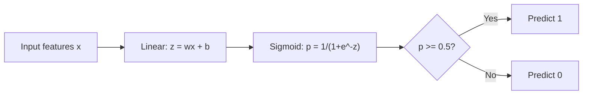
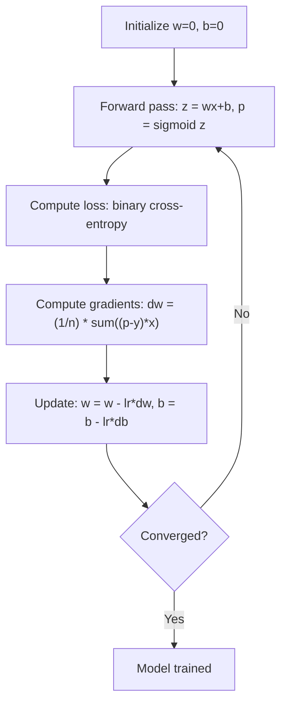

# Logistic Regression

> Logistic regression bends a straight line into an S-curve to answer yes-or-no questions with probabilities.

**Type:** Build
**Languages:** Julia
**Prerequisites:** Phase 2 Lesson 1-2 (What Is ML, Linear Regression)
**Time:** ~90 minutes

## Learning Objectives

- Implement logistic regression from scratch using the sigmoid function and binary cross-entropy loss
- Compute and interpret precision, recall, F1 score, and the confusion matrix for binary classification
- Explain why MSE fails for classification and why binary cross-entropy produces a convex cost surface
- Build a softmax regression model for multi-class classification and evaluate threshold tuning tradeoffs

## The Problem

You want to predict whether a tumor is malignant or benign given its size. You try linear regression. It outputs numbers like 0.3 or 1.7 or -0.5. What do those mean? Is 1.7 "very malignant"? Is -0.5 "very benign"? Linear regression outputs unbounded numbers. Classification needs bounded probabilities between 0 and 1, and a clear decision: yes or no.

Logistic regression solves this. It takes the same linear combination (wx + b) and passes it through the sigmoid function, which squashes any number into the range (0, 1). The output is a probability. You set a threshold (usually 0.5) and make a decision.

This is one of the most widely used algorithms in practice. Despite its name, logistic regression is a classification algorithm, not a regression algorithm. The name comes from the logistic (sigmoid) function it uses.

## The Concept

### Why Linear Regression Fails for Classification

Imagine predicting pass/fail (1/0) based on study hours. Linear regression fits a line through the data:

```
hours:  1   2   3   4   5   6   7   8   9   10
actual: 0   0   0   0   1   1   1   1   1   1
```

A linear fit might produce predictions like -0.2 at hour 1 and 1.3 at hour 10. These values are not probabilities. They go below 0 and above 1. Worse, a single outlier (someone who studied 50 hours) would drag the entire line, changing predictions for everyone.

Classification needs a function that:
- Outputs values between 0 and 1 (probabilities)
- Creates a sharp transition (a decision boundary)
- Is not distorted by outliers far from the boundary

### The Sigmoid Function

The sigmoid function does exactly this:

```
sigmoid(z) = 1 / (1 + e^(-z))
```

Properties:
- When z is large and positive, sigmoid(z) approaches 1
- When z is large and negative, sigmoid(z) approaches 0
- When z = 0, sigmoid(z) = 0.5
- The output is always between 0 and 1
- The function is smooth and differentiable everywhere

The derivative has a convenient form: sigmoid'(z) = sigmoid(z) * (1 - sigmoid(z)). This makes gradient computation efficient.

### Logistic Regression = Linear Model + Sigmoid

The model computes z = wx + b (same as linear regression), then applies sigmoid:



The output p is interpreted as P(y=1 | x), the probability that the input belongs to class 1. The decision boundary is where wx + b = 0, which makes sigmoid output exactly 0.5.

### Binary Cross-Entropy Loss

You cannot use MSE for logistic regression. MSE with a sigmoid creates a non-convex cost surface with many local minima. Instead, use binary cross-entropy (log loss):

```
Loss = -(1/n) * sum(y * log(p) + (1-y) * log(1-p))
```

Why this works:
- When y=1 and p is close to 1: log(1) = 0, so loss is near 0 (correct, low cost)
- When y=1 and p is close to 0: log(0) approaches negative infinity, so loss is huge (wrong, high cost)
- When y=0 and p is close to 0: log(1) = 0, so loss is near 0 (correct, low cost)
- When y=0 and p is close to 1: log(0) approaches negative infinity, so loss is huge (wrong, high cost)

This loss function is convex for logistic regression, guaranteeing a single global minimum.

### Gradient Descent for Logistic Regression

The gradients for binary cross-entropy with sigmoid have a clean form:

```
dL/dw = (1/n) * sum((p - y) * x)
dL/db = (1/n) * sum(p - y)
```

These look identical to the linear regression gradients. The difference is that p = sigmoid(wx + b) instead of p = wx + b. The sigmoid introduces the nonlinearity, but the gradient update rule stays the same.



### The Decision Boundary

For a 2D input (two features), the decision boundary is the line where:

```
w1*x1 + w2*x2 + b = 0
```

Points on one side get classified as 1, points on the other side as 0. Logistic regression always produces a linear decision boundary. If you need a curved boundary, you either add polynomial features or use a nonlinear model.

### Multi-Class Classification with Softmax

Binary logistic regression handles two classes. For k classes, use the softmax function:

```
softmax(z_i) = e^(z_i) / sum(e^(z_j) for all j)
```

Each class has its own weight vector. The model computes a score z_i for each class, then softmax converts scores to probabilities that sum to 1. The predicted class is the one with the highest probability.

The loss function becomes categorical cross-entropy:

```
Loss = -(1/n) * sum(sum(y_k * log(p_k)))
```

where y_k is 1 for the true class and 0 for all others (one-hot encoding).

### Evaluation Metrics

Accuracy alone is not enough. For a dataset with 95% negative and 5% positive, a model that always predicts negative gets 95% accuracy but is useless.

**Confusion Matrix**:

| | Predicted Positive | Predicted Negative |
|---|---|---|
| Actually Positive | True Positive (TP) | False Negative (FN) |
| Actually Negative | False Positive (FP) | True Negative (TN) |

**Precision**: Of all predicted positives, how many are actually positive?
```
Precision = TP / (TP + FP)
```

**Recall** (Sensitivity): Of all actual positives, how many did we catch?
```
Recall = TP / (TP + FN)
```

**F1 Score**: Harmonic mean of precision and recall. Balances both metrics.
```
F1 = 2 * (Precision * Recall) / (Precision + Recall)
```

When to prioritize:
- **Precision**: when false positives are costly (spam filter, you do not want to block legitimate email)
- **Recall**: when false negatives are costly (cancer screening, you do not want to miss a tumor)
- **F1**: when you need a single balanced metric


## Ship It

This lesson produces:
- `code/logistic_regression.py` - logistic regression from scratch with metrics


## Key Terms

| Term | What people say | What it actually means |
|------|----------------|----------------------|
| Logistic regression | "Regression for classification" | A linear model followed by a sigmoid function that outputs class probabilities |
| Sigmoid function | "The S-curve" | The function 1/(1+e^(-z)) that maps any real number to the range (0, 1) |
| Binary cross-entropy | "Log loss" | The loss function -[y*log(p) + (1-y)*log(1-p)] that penalizes confident wrong predictions severely |
| Decision boundary | "The dividing line" | The surface where the model's output probability equals 0.5, separating predicted classes |
| Softmax | "Multi-class sigmoid" | A function that converts a vector of scores into probabilities that sum to 1 |
| Precision | "How many selected are relevant" | TP / (TP + FP), the fraction of positive predictions that are actually positive |
| Recall | "How many relevant are selected" | TP / (TP + FN), the fraction of actual positives that the model correctly identifies |
| F1 score | "Balanced accuracy" | The harmonic mean of precision and recall: 2*P*R / (P+R) |
| Confusion matrix | "The error breakdown" | A table showing TP, TN, FP, FN counts for each class pair |
| Threshold | "The cutoff" | The probability value above which the model predicts class 1 (default 0.5, tunable) |
| One-hot encoding | "Binary columns for categories" | Representing class k as a vector of zeros with a 1 at position k |
| Categorical cross-entropy | "Multi-class log loss" | The extension of binary cross-entropy to k classes using one-hot encoded labels |

## Build It

Reconstruct **Logistic Regression** by following `sigmoid` on x=0.5 with the demo defaults. Run `julia main.jl` and verify that the update or loss change agrees with the gradient sign; a zero gradient produces no accidental jump.

## Use It

Call `sigmoid` from a small caller with x=0.5 with the demo defaults. Compare its result with the demo output, and record the input contract and the one field a downstream user should rely on.

## Exercises

Work from the smallest fixture that the Logistic Regression demo already understands, then make one deliberate change and record what moved.

1. **Run the smallest fixture.** From `code/`, run `julia main.jl` using x=0.5 with the demo defaults. Follow `sigmoid`, `LogisticRegression`, `predict_proba`. Expect the update or loss change agrees with the gradient sign; a zero gradient produces no accidental jump; capture the first printed shape, metric, status, or summary field and state which part supports **Implement logistic regression from scratch using the sigmoid function and binary cross-entropy loss**.
2. **Perturb one field.** Repeat the command after changing only the learning rate: use the same run with learning rate 0.1 instead of 0.01. Predict the direction of the change, then compare the two output values. Explain why **Compute and interpret precision, recall, F1 score, and the confusion matrix for binary classification** says the other inputs should stay fixed.
3. **Check the failure boundary.** Feed the implementation a zero gradient or an already-minimized point. Before running it, write down whether the relevant function should return an empty value, a zero-sized result, or a validation error. Check the observed status against **Explain why MSE fails for classification and why binary cross-entropy produces a convex cost surface** and record the exception text if the code rejects the case.
4. **Make the result repeatable.** Open `outputs/skill-classification-baseline.md` and add a worked example using x=0.5 with the demo defaults. Include the input contract, one expected output field, and a named acceptance check for **Build a softmax regression model for multi-class classification and evaluate threshold tuning tradeoffs**; note what the demo cannot establish.

## Reference Solution

A checkable result for **Logistic Regression** should contain:

- the `julia main.jl` output for x=0.5 with the demo defaults, with `sigmoid`, `LogisticRegression`, `predict_proba` traced to the value or shape that supports **Implement logistic regression from scratch using the sigmoid function and binary cross-entropy loss**;
- a before/after comparison for the learning rate, where the same run with learning rate 0.1 instead of 0.01 changes the observation in the direction predicted by **Compute and interpret precision, recall, F1 score, and the confusion matrix for binary classification**;
- a recorded result for a zero gradient or an already-minimized point that matches the implementation’s validation or empty-result contract and explains the evidence for **Explain why MSE fails for classification and why binary cross-entropy produces a convex cost surface**; and
- an updated `outputs/skill-classification-baseline.md` example with a concrete input, expected output field, and acceptance check tied to **Build a softmax regression model for multi-class classification and evaluate threshold tuning tradeoffs**.

Run the lesson tests after the demo. If the boundary behaves differently from the prediction, keep the actual exception or output and explain the implementation path that produced it.
