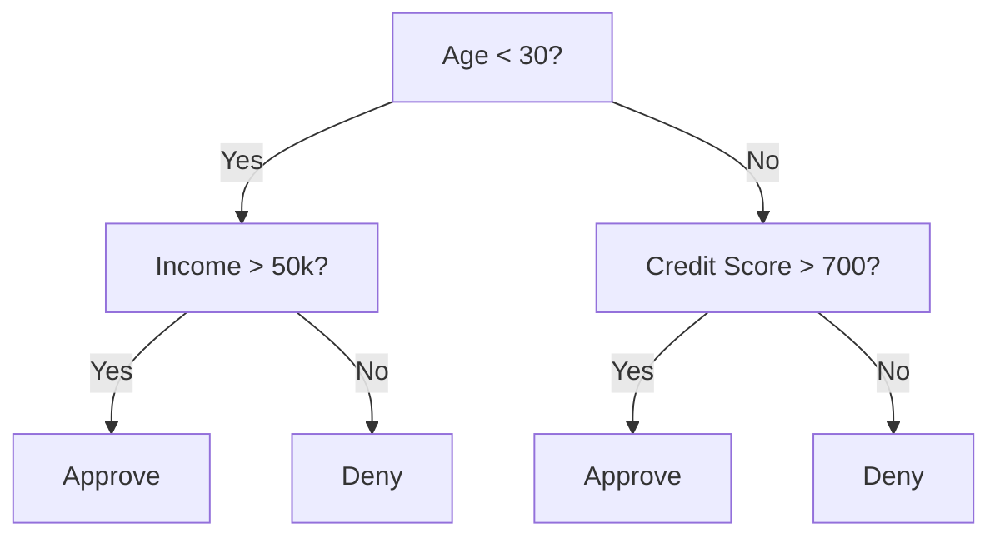
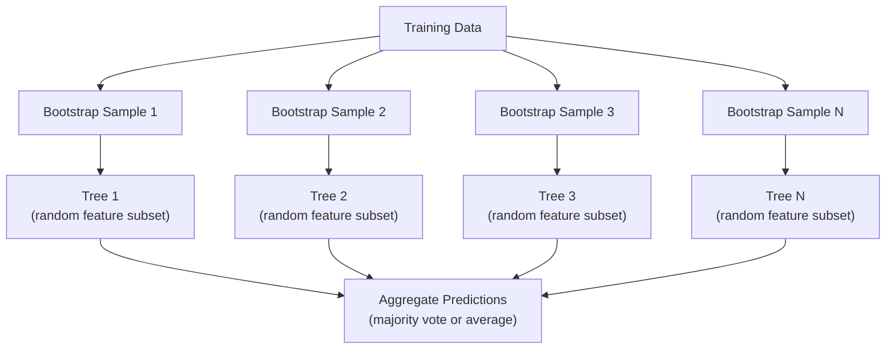

# Decision Trees and Random Forests

> A decision tree is just a flowchart. But a forest of them is one of the most powerful tools in ML.

**Type:** Build
**Languages:** Python
**Language:** Python
**Prerequisites:** Phase 1 (Lessons 09 Information Theory, 06 Probability)
**Time:** ~90 minutes

## Learning Objectives

- Implement Gini impurity, entropy, and information gain calculations to find optimal decision tree splits
- Build a decision tree classifier from scratch with pre-pruning controls (max depth, min samples)
- Construct a random forest using bootstrap sampling and feature randomization, and explain why it reduces variance
- Compare MDI feature importance with permutation importance and identify when MDI is biased

## The Problem

You have tabular data. Rows are samples, columns are features, and there is a target column you want to predict. You could throw a neural network at it. But for tabular data, tree-based models (decision trees, random forests, gradient boosted trees) consistently outperform deep learning. Kaggle competitions on structured data are dominated by XGBoost and LightGBM, not transformers.

Why? Trees handle mixed feature types (numeric and categorical) without preprocessing. They handle nonlinear relationships without feature engineering. They are interpretable: you can look at the tree and see exactly why a prediction was made. And random forests, which average many trees, are highly resistant to overfitting on moderate-sized datasets.

This lesson builds decision trees from scratch using recursive splitting, then builds a random forest on top. You will implement the math behind split criteria (Gini impurity, entropy, information gain) and understand why an ensemble of weak learners becomes a strong one.

## The Concept

### What a decision tree does

A decision tree partitions the feature space into rectangular regions by asking a sequence of yes/no questions.



Each internal node tests a feature against a threshold. Each leaf node makes a prediction. To classify a new data point, you start at the root and follow the branches until you reach a leaf.

The tree is built top-down by choosing, at each node, the feature and threshold that best separate the data. "Best" is defined by a split criterion.

### Split criteria: measuring impurity

At each node, we have a set of samples. We want to split them so that the resulting child nodes are as "pure" as possible, meaning each child contains mostly one class.

**Gini impurity** measures the probability that a randomly chosen sample would be misclassified if it were labeled according to the class distribution at that node.

```
Gini(S) = 1 - sum(p_k^2)

where p_k is the proportion of class k in set S.
```

For a pure node (all one class), Gini = 0. For a binary split with 50/50 classes, Gini = 0.5. Lower is better.

```
Example: 6 cats, 4 dogs

Gini = 1 - (0.6^2 + 0.4^2) = 1 - (0.36 + 0.16) = 0.48
```

**Entropy** measures the information content (disorder) in a node. Covered in Phase 1 Lesson 09.

```
Entropy(S) = -sum(p_k * log2(p_k))
```

For a pure node, entropy = 0. For a 50/50 binary split, entropy = 1.0. Lower is better.

```
Example: 6 cats, 4 dogs

Entropy = -(0.6 * log2(0.6) + 0.4 * log2(0.4))
        = -(0.6 * -0.737 + 0.4 * -1.322)
        = 0.442 + 0.529
        = 0.971 bits
```

**Information gain** is the reduction in impurity (entropy or Gini) after a split.

```
IG(S, feature, threshold) = Impurity(S) - weighted_avg(Impurity(S_left), Impurity(S_right))

where the weights are the proportions of samples in each child.
```

The greedy algorithm at each node: try every feature and every possible threshold. Pick the (feature, threshold) pair that maximizes information gain.

### How splitting works

For a dataset with n features and m samples at the current node:

1. For each feature j (j = 1 to n):
   - Sort the samples by feature j
   - Try every midpoint between consecutive distinct values as a threshold
   - Compute the information gain for each threshold
2. Select the feature and threshold with the highest information gain
3. Split the data into left (feature <= threshold) and right (feature > threshold)
4. Recurse on each child

This greedy approach does not guarantee the globally optimal tree. Finding the optimal tree is NP-hard. But greedy splitting works well in practice.

### Stopping conditions

Without stopping conditions, the tree grows until every leaf is pure (one sample per leaf). This perfectly memorizes the training data and generalizes terribly.

**Pre-pruning** stops the tree before it fully grows:
- Maximum depth: stop splitting when the tree reaches a set depth
- Minimum samples per leaf: stop if a node has fewer than k samples
- Minimum information gain: stop if the best split improves impurity by less than a threshold
- Maximum leaf nodes: limit the total number of leaves

**Post-pruning** grows the full tree, then trims it back:
- Cost-complexity pruning (used by scikit-learn): adds a penalty proportional to the number of leaves. Increase the penalty to get smaller trees
- Reduced error pruning: remove a subtree if the validation error does not increase

Pre-pruning is simpler and faster. Post-pruning often produces better trees because it does not prematurely stop splits that might lead to useful further splits.

### Decision trees for regression

For regression, the leaf prediction is the mean of the target values in that leaf. The split criterion changes too:

**Variance reduction** replaces information gain:

```
VR(S, feature, threshold) = Var(S) - weighted_avg(Var(S_left), Var(S_right))
```

Pick the split that reduces variance the most. The tree partitions the input space into regions, and predicts a constant (the mean) in each region.

### Random forests: the power of ensembles

A single decision tree is high variance. Small changes in the data can produce completely different trees. Random forests fix this by averaging many trees.



Two sources of randomness make the trees diverse:

**Bagging (bootstrap aggregating):** Each tree is trained on a bootstrap sample, a random sample with replacement from the training data. About 63% of the original samples appear in each bootstrap (the rest are out-of-bag samples that can be used for validation).

**Feature randomization:** At each split, only a random subset of features is considered. For classification, the default is sqrt(n_features). For regression, n_features/3. This prevents all trees from splitting on the same dominant feature.

The key insight: averaging many decorrelated trees reduces variance without increasing bias. Each individual tree may be mediocre. The ensemble is strong.

### Feature importance

Random forests naturally provide feature importance scores. The most common method:

**Mean Decrease in Impurity (MDI):** For each feature, sum the total reduction in impurity across all trees and all nodes where that feature is used. Features that produce bigger impurity reductions at earlier splits are more important.

```
importance(feature_j) = sum over all nodes where feature_j is used:
    (n_samples_at_node / n_total_samples) * impurity_decrease
```

This is fast (computed during training) but biased toward high-cardinality features and features with many possible split points.

**Permutation importance** is the alternative: shuffle one feature's values and measure how much the model's accuracy drops. More reliable but slower.

### When trees beat neural networks

Trees and forests dominate neural networks on tabular data. Several reasons:

| Factor | Trees | Neural networks |
|--------|-------|----------------|
| Mixed types (numeric + categorical) | Native support | Need encoding |
| Small datasets (< 10k rows) | Work well | Overfit |
| Feature interactions | Found by splitting | Need architecture design |
| Interpretability | Full transparency | Black box |
| Training time | Minutes | Hours |
| Hyperparameter sensitivity | Low | High |

Neural networks win when the data has spatial or sequential structure (images, text, audio). For flat tables of features, trees are the default.


## Build It

Reconstruct **Decision Trees and Random Forests** by following `gini_impurity` on x=0.5 with the demo defaults. Run `python3 main.py` and verify that the update or loss change agrees with the gradient sign; a zero gradient produces no accidental jump.

## Use It

Call `gini_impurity` from a small caller with x=0.5 with the demo defaults. Compare its result with the demo output, and record the input contract and the one field a downstream user should rely on.

## Ship It

Hand off `outputs/prompt-tree-interpreter.md` with the command `python3 main.py`, the accepted input shape (x=0.5 with the demo defaults), the expected observable result, and a failure note for malformed inputs.

## Further Reading

- [Breiman: Random Forests (2001)](https://link.springer.com/article/10.1023/A:1010933404324) - the original random forest paper
- [Grinsztajn et al.: Why do tree-based models still outperform deep learning on tabular data? (2022)](https://arxiv.org/abs/2207.08815) - rigorous comparison of trees vs neural networks on tabular tasks
- [scikit-learn Decision Trees documentation](https://scikit-learn.org/stable/modules/tree.html) - practical guide with visualization tools
- [XGBoost: A Scalable Tree Boosting System (Chen & Guestrin, 2016)](https://arxiv.org/abs/1603.02754) - the gradient boosting paper that dominates Kaggle

## Exercises

Keep two runs side by side for **Decision Trees and Random Forests**. The important evidence is the named field, shape, or status—not a polished paragraph about the run.

1. **Read the first result.** From `code/`, run `python3 main.py` using x=0.5 with the demo defaults. Follow `gini_impurity`, `entropy`, `information_gain`. Expect the update or loss change agrees with the gradient sign; a zero gradient produces no accidental jump; capture the first printed shape, metric, status, or summary field and state which part supports **Implement Gini impurity, entropy, and information gain calculations to find optimal decision tree splits**.
2. **Run a two-value comparison.** Repeat the command after changing only the learning rate: use the same run with learning rate 0.1 instead of 0.01. Predict the direction of the change, then compare the two output values. Explain why **Build a decision tree classifier from scratch with pre-pruning controls (max depth, min samples)** says the other inputs should stay fixed.
3. **Try an adversarial fixture.** Feed the implementation a zero gradient or an already-minimized point. Before running it, write down whether the relevant function should return an empty value, a zero-sized result, or a validation error. Check the observed status against **Construct a random forest using bootstrap sampling and feature randomization, and explain why it reduces variance** and record the exception text if the code rejects the case.
4. **Write the operator note.** Open `outputs/prompt-tree-interpreter.md` and add a worked example using x=0.5 with the demo defaults. Include the input contract, one expected output field, and a named acceptance check for **Compare MDI feature importance with permutation importance and identify when MDI is biased**; note what the demo cannot establish.

## Reference Solution

A checkable result for **Decision Trees and Random Forests** should contain:

- the `python3 main.py` output for x=0.5 with the demo defaults, with `gini_impurity`, `entropy`, `information_gain` traced to the value or shape that supports **Implement Gini impurity, entropy, and information gain calculations to find optimal decision tree splits**;
- a before/after comparison for the learning rate, where the same run with learning rate 0.1 instead of 0.01 changes the observation in the direction predicted by **Build a decision tree classifier from scratch with pre-pruning controls (max depth, min samples)**;
- a recorded result for a zero gradient or an already-minimized point that matches the implementation’s validation or empty-result contract and explains the evidence for **Construct a random forest using bootstrap sampling and feature randomization, and explain why it reduces variance**; and
- an updated `outputs/prompt-tree-interpreter.md` example with a concrete input, expected output field, and acceptance check tied to **Compare MDI feature importance with permutation importance and identify when MDI is biased**.

Run the lesson tests after the demo. If the boundary behaves differently from the prediction, keep the actual exception or output and explain the implementation path that produced it.
