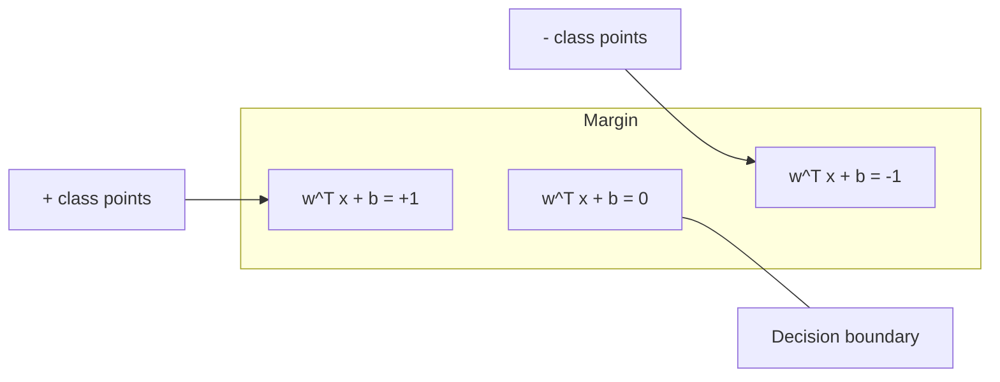
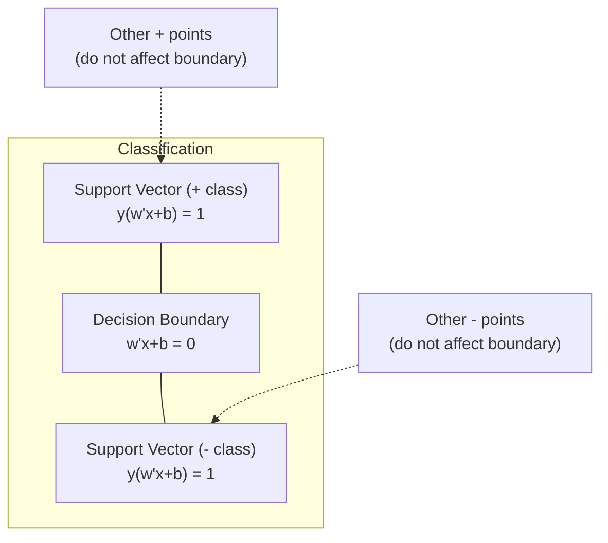
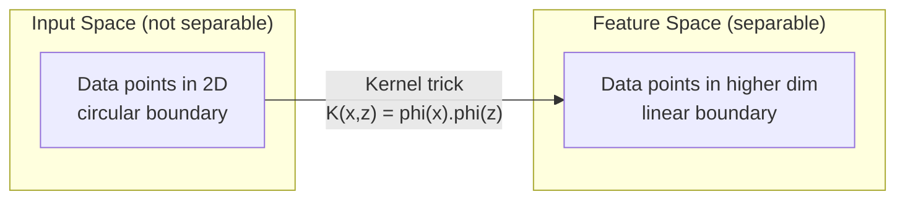

# Support Vector Machines

> Find the widest street between two classes. That is the entire idea.

**Type:** Build
**Languages:** Julia
**Language:** Python
**Prerequisites:** Phase 1 (Lessons 08 Optimization, 14 Norms and Distances, 18 Convex Optimization)
**Time:** ~90 minutes

## Learning Objectives

- Implement a linear SVM from scratch using hinge loss and gradient descent on the primal formulation
- Explain the maximum margin principle and identify support vectors from a trained model
- Compare linear, polynomial, and RBF kernels and explain how the kernel trick avoids explicit high-dimensional mapping
- Evaluate the tradeoff controlled by the C parameter between margin width and classification errors

## The Problem

You have two classes of data points and need to draw a line (or hyperplane) separating them. Infinitely many lines could work. Which one should you pick?

The one with the biggest margin. The margin is the distance between the decision boundary and the nearest data points on each side. A wider margin means the classifier is more confident and generalizes better to unseen data.

This intuition leads to Support Vector Machines, one of the most mathematically elegant algorithms in ML. SVMs were the dominant classification method before deep learning and remain the best choice for small datasets, high-dimensional data, and problems where you need a principled, well-understood model with theoretical guarantees.

SVMs connect directly to Phase 1: the optimization is convex (Lesson 18), the margin is measured with norms (Lesson 14), and the kernel trick exploits dot products to handle nonlinear boundaries without ever computing in the high-dimensional space.

## The Concept

### The maximum margin classifier

Given linearly separable data with labels y_i in {-1, +1} and feature vectors x_i, we want a hyperplane w^T x + b = 0 that separates the classes.

The distance from a point x_i to the hyperplane is:

```
distance = |w^T x_i + b| / ||w||
```

For a correctly classified point: y_i * (w^T x_i + b) > 0. The margin is twice the distance from the hyperplane to the nearest point on either side.



The optimization problem:

```
maximize    2 / ||w||     (the margin width)
subject to  y_i * (w^T x_i + b) >= 1  for all i
```

Equivalently (minimizing ||w||^2 is easier to optimize):

```
minimize    (1/2) ||w||^2
subject to  y_i * (w^T x_i + b) >= 1  for all i
```

This is a convex quadratic program. It has a unique global solution. The data points that sit exactly on the margin boundaries (where y_i * (w^T x_i + b) = 1) are the support vectors. They are the only points that determine the decision boundary. Move or remove any non-support-vector point, and the boundary does not change.

### Support vectors: the critical few



Most training points are irrelevant. Only the support vectors matter. This is why SVMs are memory-efficient at prediction time: you only need to store the support vectors, not the entire training set.

The number of support vectors also gives a bound on generalization error. Fewer support vectors relative to the dataset size means better generalization.

### Soft margin: handling noise with the C parameter

Real data is rarely perfectly separable. Some points may be on the wrong side of the boundary, or inside the margin. The soft margin formulation allows violations by introducing slack variables.

```
minimize    (1/2) ||w||^2 + C * sum(xi_i)
subject to  y_i * (w^T x_i + b) >= 1 - xi_i
            xi_i >= 0  for all i
```

The slack variable xi_i measures how much point i violates the margin. C controls the trade-off:

| C value | Behavior |
|---------|----------|
| Large C | Penalizes violations heavily. Narrow margin, fewer misclassifications. Overfits |
| Small C | Allows more violations. Wide margin, more misclassifications. Underfits |

C is the regularization strength, inverted. Large C = less regularization. Small C = more regularization.

### Hinge loss: the SVM loss function

The soft margin SVM can be rewritten as an unconstrained optimization:

```
minimize    (1/2) ||w||^2 + C * sum(max(0, 1 - y_i * (w^T x_i + b)))
```

The term max(0, 1 - y_i * f(x_i)) is the hinge loss. It is zero when the point is correctly classified and beyond the margin. It is linear when the point is inside the margin or misclassified.

```
Hinge loss for a single point:

loss
  |
  | \
  |  \
  |   \
  |    \
  |     \_______________
  |
  +-----|-----|-------->  y * f(x)
       0     1

Zero loss when y*f(x) >= 1 (correctly classified, outside margin).
Linear penalty when y*f(x) < 1.
```

Compare with logistic loss (logistic regression):

```
Hinge:     max(0, 1 - y*f(x))          Hard cutoff at margin
Logistic:  log(1 + exp(-y*f(x)))        Smooth, never exactly zero
```

Hinge loss produces sparse solutions (only support vectors have nonzero contribution). Logistic loss uses all data points. This makes SVMs more memory-efficient at prediction time.

### Training a linear SVM with gradient descent

You can train a linear SVM using gradient descent on the hinge loss plus L2 regularization, without solving the constrained QP:

```
L(w, b) = (lambda/2) * ||w||^2 + (1/n) * sum(max(0, 1 - y_i * (w^T x_i + b)))

Gradient with respect to w:
  If y_i * (w^T x_i + b) >= 1:  dL/dw = lambda * w
  If y_i * (w^T x_i + b) < 1:   dL/dw = lambda * w - y_i * x_i

Gradient with respect to b:
  If y_i * (w^T x_i + b) >= 1:  dL/db = 0
  If y_i * (w^T x_i + b) < 1:   dL/db = -y_i
```

This is called the primal formulation. It runs in O(n * d) per epoch, where n is the number of samples and d is the number of features. For large, sparse, high-dimensional data (text classification), this is fast.

### The dual formulation and the kernel trick

The Lagrangian dual of the SVM problem (from Phase 1 Lesson 18, KKT conditions) is:

```
maximize    sum(alpha_i) - (1/2) * sum_ij(alpha_i * alpha_j * y_i * y_j * (x_i . x_j))
subject to  0 <= alpha_i <= C
            sum(alpha_i * y_i) = 0
```

The dual only involves dot products x_i . x_j between data points. This is the key insight. Replace every dot product with a kernel function K(x_i, x_j) and the SVM can learn nonlinear boundaries without ever computing the transformation explicitly.

```
Linear kernel:      K(x, z) = x . z
Polynomial kernel:  K(x, z) = (x . z + c)^d
RBF (Gaussian):     K(x, z) = exp(-gamma * ||x - z||^2)
```

The RBF kernel maps data into an infinite-dimensional space. Points that are close in input space have kernel value near 1. Points that are far apart have kernel value near 0. It can learn any smooth decision boundary.



The kernel trick computes the dot product in the high-dimensional space without ever going there. For the polynomial kernel of degree d in D dimensions, the explicit feature space has O(D^d) dimensions. But K(x, z) is computed in O(D) time.

### SVM for regression (SVR)

Support Vector Regression fits a tube of width epsilon around the data. Points inside the tube have zero loss. Points outside the tube are penalized linearly.

```
minimize    (1/2) ||w||^2 + C * sum(xi_i + xi_i*)
subject to  y_i - (w^T x_i + b) <= epsilon + xi_i
            (w^T x_i + b) - y_i <= epsilon + xi_i*
            xi_i, xi_i* >= 0
```

The epsilon parameter controls the tube width. Wider tube = fewer support vectors = smoother fit. Narrower tube = more support vectors = tighter fit.

### Why SVMs lost to deep learning (and when they still win)

SVMs dominated ML from the late 1990s through the early 2010s. Deep learning surpassed them for several reasons:

| Factor | SVMs | Deep learning |
|--------|------|---------------|
| Feature engineering | Requires it | Learns features |
| Scalability | O(n^2) to O(n^3) for kernel | O(n) per epoch with SGD |
| Image/text/audio | Needs handcrafted features | Learns from raw data |
| Large datasets (>100k) | Slow | Scales well |
| GPU acceleration | Limited benefit | Massive speedup |

SVMs still win in these situations:
- Small datasets (hundreds to low thousands of samples)
- High-dimensional sparse data (text with TF-IDF features)
- When you need mathematical guarantees (margin bounds)
- When training time must be minimal (linear SVM is very fast)
- Binary classification with clear margin structure
- Anomaly detection (one-class SVM)


## Use It

The margin formula from the section above -- margin = 2 / ||w|| -- is exact
for a linear SVM. Compute it directly from a fitted model, and see what a
too-small `C` does to it before fixing it.

```python fillin
import numpy as np
from sklearn.svm import SVC

# Two clusters offset by 4 units along x -- linearly separable, so the
# margin formula above is exact.
X = np.array([
    [0.0, 0.0], [0.5, 0.5], [0.2, -0.3], [-0.3, 0.4],
    [4.0, 0.0], [4.5, 0.5], [4.2, -0.3], [3.7, 0.4],
])
y = np.array([-1, -1, -1, -1, 1, 1, 1, 1])

# Naive: C too small barely penalizes margin violations -- every point
# ends up inside the margin and counts as a support vector.
naive = SVC(kernel="linear", C=0.01)
naive.fit(X, y)
naive_w = naive.coef_[0]
print("naive margin:", 2 / np.linalg.norm(naive_w), "support vectors:", len(naive.support_vectors_))

# Fix: a properly tuned C converges to the true max-margin hyperplane --
# only the closest point on each side stays a support vector.
clf = SVC(kernel="linear", C={{blank:1.0}})
clf.fit(X, y)
w = clf.coef_[0]
margin = {{blank:2}} / {{blank:np.linalg.norm(w)}}
n_support = len(clf.support_vectors_)

expected_margin = 3.201562224835397
if abs(margin - expected_margin) < 1e-6 and n_support == 2:
    print("PASS")
else:
    print("WRONG:", margin, n_support)
```

With `C=0.01`, every one of the 8 points becomes a support vector and the
reported margin (12.5) is meaningless -- the model barely tried to separate
the classes. A properly tuned `C` recovers the true 2-support-vector
solution.

With scikit-learn, in practice:

```python
from sklearn.svm import SVC, LinearSVC, SVR
from sklearn.preprocessing import StandardScaler
from sklearn.pipeline import Pipeline

clf = Pipeline([
    ("scaler", StandardScaler()),
    ("svm", SVC(kernel="rbf", C=1.0, gamma="scale")),
])
clf.fit(X_train, y_train)
print(f"Accuracy: {clf.score(X_test, y_test):.4f}")
print(f"Support vectors: {clf['svm'].n_support_}")
```

Important: always scale your features before training an SVM. SVMs are sensitive to feature magnitudes because the margin depends on ||w||, and unscaled features distort the geometry.

For large datasets, use `LinearSVC` (primal formulation, O(n) per epoch) instead of `SVC` (dual formulation, O(n^2) to O(n^3)):

```python
from sklearn.svm import LinearSVC

clf = Pipeline([
    ("scaler", StandardScaler()),
    ("svm", LinearSVC(C=1.0, max_iter=10000)),
])
```


## Key Terms

| Term | What it actually means |
|------|----------------------|
| Support vectors | The training points closest to the decision boundary. The only points that determine the hyperplane |
| Margin | The distance between the decision boundary and the nearest support vectors. SVMs maximize this |
| Hinge loss | max(0, 1 - y*f(x)). Zero when correctly classified and outside the margin. Linear penalty otherwise |
| C parameter | Trade-off between margin width and classification errors. Large C = narrow margin, small C = wide margin |
| Soft margin | SVM formulation that allows margin violations via slack variables. Handles non-separable data |
| Kernel trick | Computing dot products in a high-dimensional feature space without explicitly mapping to that space |
| Linear kernel | K(x, z) = x . z. Equivalent to standard dot product. For linearly separable data |
| RBF kernel | K(x, z) = exp(-gamma * \|\|x-z\|\|^2). Maps to infinite dimensions. Learns any smooth boundary |
| Polynomial kernel | K(x, z) = (x . z + c)^d. Maps to a feature space of polynomial combinations |
| Dual formulation | Reformulation of the SVM problem that depends only on dot products between data points. Enables kernels |
| SVR | Support Vector Regression. Fits an epsilon-tube around the data. Points inside the tube have zero loss |
| Slack variables | xi_i: measures how much a point violates the margin. Zero for correctly classified points outside margin |
| Maximum margin | The principle of choosing the hyperplane that maximizes the distance to the nearest points of each class |

## Build It

Reconstruct **Support Vector Machines** by following `dotprod` on x=0.5 with the demo defaults. Run `julia main.jl` and verify that the update or loss change agrees with the gradient sign; a zero gradient produces no accidental jump.

## Ship It

Hand off `outputs/skill-svm-kernel-chooser.md` with the command `julia main.jl`, the accepted input shape (x=0.5 with the demo defaults), the expected observable result, and a failure note for malformed inputs.

## Further Reading

- [Vapnik: The Nature of Statistical Learning Theory (1995)](https://link.springer.com/book/10.1007/978-1-4757-3264-1) - the foundational text on SVMs and statistical learning
- [Cortes & Vapnik: Support-vector networks (1995)](https://link.springer.com/article/10.1007/BF00994018) - the original SVM paper
- [Platt: Sequential Minimal Optimization (1998)](https://www.microsoft.com/en-us/research/publication/sequential-minimal-optimization-a-fast-algorithm-for-training-support-vector-machines/) - the SMO algorithm that made SVM training practical
- [scikit-learn SVM documentation](https://scikit-learn.org/stable/modules/svm.html) - practical guide with implementation details
- [LIBSVM: A Library for Support Vector Machines](https://www.csie.ntu.edu.tw/~cjlin/libsvm/) - the C++ library behind most SVM implementations

## Exercises

Work from the smallest fixture that the Support Vector Machines demo already understands, then make one deliberate change and record what moved.

1. **Run the smallest fixture.** From `code/`, run `julia main.jl` using x=0.5 with the demo defaults. Follow `dotprod`, `vec_norm`, `linear_kernel`. Expect the update or loss change agrees with the gradient sign; a zero gradient produces no accidental jump; capture the first printed shape, metric, status, or summary field and state which part supports **Implement a linear SVM from scratch using hinge loss and gradient descent on the primal formulation**.
2. **Perturb one field.** Repeat the command after changing only the learning rate: use the same run with learning rate 0.1 instead of 0.01. Predict the direction of the change, then compare the two output values. Explain why **Explain the maximum margin principle and identify support vectors from a trained model** says the other inputs should stay fixed.
3. **Check the failure boundary.** Feed the implementation a zero gradient or an already-minimized point. Before running it, write down whether the relevant function should return an empty value, a zero-sized result, or a validation error. Check the observed status against **Compare linear, polynomial, and RBF kernels and explain how the kernel trick avoids explicit high-dimensional mapping** and record the exception text if the code rejects the case.
4. **Make the result repeatable.** Open `outputs/skill-svm-kernel-chooser.md` and add a worked example using x=0.5 with the demo defaults. Include the input contract, one expected output field, and a named acceptance check for **Evaluate the tradeoff controlled by the C parameter between margin width and classification errors**; note what the demo cannot establish.

## Reference Solution

A checkable result for **Support Vector Machines** should contain:

- the `julia main.jl` output for x=0.5 with the demo defaults, with `dotprod`, `vec_norm`, `linear_kernel` traced to the value or shape that supports **Implement a linear SVM from scratch using hinge loss and gradient descent on the primal formulation**;
- a before/after comparison for the learning rate, where the same run with learning rate 0.1 instead of 0.01 changes the observation in the direction predicted by **Explain the maximum margin principle and identify support vectors from a trained model**;
- a recorded result for a zero gradient or an already-minimized point that matches the implementation’s validation or empty-result contract and explains the evidence for **Compare linear, polynomial, and RBF kernels and explain how the kernel trick avoids explicit high-dimensional mapping**; and
- an updated `outputs/skill-svm-kernel-chooser.md` example with a concrete input, expected output field, and acceptance check tied to **Evaluate the tradeoff controlled by the C parameter between margin width and classification errors**.

Run the lesson tests after the demo. If the boundary behaves differently from the prediction, keep the actual exception or output and explain the implementation path that produced it.
