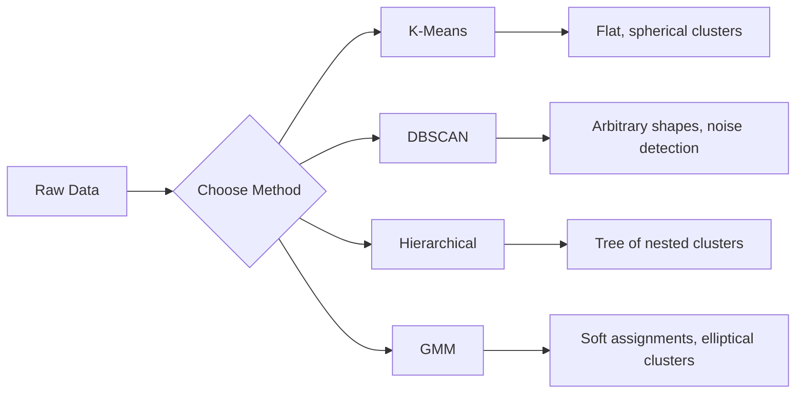

# Unsupervised Learning

> No labels, no teacher. The algorithm finds structure on its own.

**Type:** Build
**Languages:** Python
**Prerequisites:** Phase 1 (Norms & Distances, Probability & Distributions), Phase 2 Lessons 1-6
**Time:** ~90 minutes

## Learning Objectives

- Implement K-Means, DBSCAN, and Gaussian Mixture Models from scratch and compare their clustering behavior
- Evaluate cluster quality using the silhouette score and the elbow method to select the optimal K
- Explain when DBSCAN outperforms K-Means and identify which algorithm handles non-spherical clusters and outliers
- Build an anomaly detection pipeline using clustering methods to flag points that deviate from normal patterns

## The Problem

Every ML lesson so far has assumed labeled data: "here is an input, here is the correct output." In the real world, labels are expensive. A hospital has millions of patient records but no one has manually tagged each one with a disease category. An e-commerce site has millions of user sessions but no one has hand-labeled customer segments. A security team has network logs but nobody has flagged every anomaly.

Unsupervised learning finds patterns without being told what to look for. It groups similar data points, discovers hidden structures, and surfaces anomalies. If supervised learning is learning from a textbook with an answer key, unsupervised learning is staring at raw data until the patterns reveal themselves.

The catch: without labels, you cannot directly measure "right" or "wrong." You need different tools to evaluate whether the structure your algorithm found is meaningful.

## The Concept

### Clustering: Grouping Similar Things Together

Clustering assigns each data point to a group (cluster) so that points within the same group are more similar to each other than to points in other groups. The question is always: what does "similar" mean?

### K-Means: The Workhorse

K-Means partitions data into exactly K clusters. Each cluster has a centroid (its center of mass), and every point belongs to the nearest centroid.

Lloyd's algorithm:

1. Pick K random points as initial centroids
2. Assign each data point to the nearest centroid
3. Recompute each centroid as the mean of its assigned points
4. Repeat steps 2-3 until assignments stop changing

The objective function (inertia) measures the total squared distance from each point to its assigned centroid. K-Means minimizes this, but only finds a local minimum. Different initializations can give different results.

### Choosing K

Two standard methods:

**Elbow method:** Run K-Means for K = 1, 2, 3, ..., n. Plot inertia vs K. Look for the "elbow" where adding more clusters stops reducing inertia significantly.

**Silhouette score:** For each point, measure how similar it is to its own cluster (a) versus the nearest other cluster (b). The silhouette coefficient is (b - a) / max(a, b), ranging from -1 (wrong cluster) to +1 (well-clustered). Average across all points for a global score.

### DBSCAN: Density-Based Clustering

K-Means assumes clusters are spherical and requires you to pick K upfront. DBSCAN makes neither assumption. It finds clusters as dense regions separated by sparse regions.

Two parameters:
- **eps**: the radius of a neighborhood
- **min_samples**: the minimum number of points needed to form a dense region

Three types of points:
- **Core point**: has at least min_samples points within eps distance
- **Border point**: within eps of a core point but not itself a core point
- **Noise point**: neither core nor border. These are outliers.

DBSCAN connects core points that are within eps of each other into the same cluster. Border points join the cluster of a nearby core point. Noise points belong to no cluster.

Strengths: finds clusters of any shape, automatically determines the number of clusters, identifies outliers. Weakness: struggles with clusters of varying densities.

### Hierarchical Clustering

Builds a tree (dendrogram) of nested clusters.

Agglomerative (bottom-up):
1. Start with each point as its own cluster
2. Merge the two closest clusters
3. Repeat until only one cluster remains
4. Cut the dendrogram at the desired level to get K clusters

The "closeness" between clusters can be measured as:
- **Single linkage**: minimum distance between any two points in the two clusters
- **Complete linkage**: maximum distance between any two points
- **Average linkage**: average distance between all pairs
- **Ward's method**: the merge that causes the smallest increase in total within-cluster variance

### Gaussian Mixture Models (GMM)

K-Means gives hard assignments: each point belongs to exactly one cluster. GMM gives soft assignments: each point has a probability of belonging to each cluster.

GMM assumes the data is generated from a mixture of K Gaussian distributions, each with its own mean and covariance. The Expectation-Maximization (EM) algorithm alternates between:

- **E-step**: compute the probability that each point belongs to each Gaussian
- **M-step**: update the mean, covariance, and mixing weight of each Gaussian to maximize the likelihood of the data

GMM can model elliptical clusters (not just spherical like K-Means) and naturally handles overlapping clusters.

### When to Use Which

| Method | Best for | Avoid when |
|--------|----------|------------|
| K-Means | Large datasets, spherical clusters, known K | Irregular shapes, outliers present |
| DBSCAN | Unknown K, arbitrary shapes, outlier detection | Varying densities, very high dimensions |
| Hierarchical | Small datasets, need dendrogram, unknown K | Large datasets (O(n^2) memory) |
| GMM | Overlapping clusters, soft assignments needed | Very large datasets, too many dimensions |

### Anomaly Detection with Clustering

Clustering naturally supports anomaly detection:
- **K-Means**: points far from any centroid are anomalies
- **DBSCAN**: noise points are anomalies by definition
- **GMM**: points with low probability under all Gaussians are anomalies

## Build It

Reconstruct **Unsupervised Learning** by following `euclidean_distance` on an 8x8 synthetic image. Run `python3 main.py` and verify that the reported height/width or feature-map shape changes predictably, without inventing pixels.

## Use It

Call `euclidean_distance` from a small caller with an 8x8 synthetic image. Compare its result with the demo output, and record the input contract and the one field a downstream user should rely on.

## Ship It

Hand off `outputs/skill-clustering-guide.md` with the command `python3 main.py`, the accepted input shape (an 8x8 synthetic image), the expected observable result, and a failure note for malformed inputs.

## Further Reading

- [Stanford CS229 - Unsupervised Learning](https://cs229.stanford.edu/notes2022fall/main_notes.pdf) - Andrew Ng's lecture notes on clustering and EM
- [scikit-learn Clustering Guide](https://scikit-learn.org/stable/modules/clustering.html) - practical comparison of all clustering algorithms with visual examples
- [DBSCAN original paper (Ester et al., 1996)](https://www.aaai.org/Papers/KDD/1996/KDD96-037.pdf) - the paper that introduced density-based clustering

## Exercises

This lab follows `euclidean_distance` and `kmeans` on a controlled fixture; write down the value before changing the input.

1. **Trace the canonical fixture.** From `code/`, run `python3 main.py` using an 8x8 synthetic image. Follow `euclidean_distance`, `kmeans`, `compute_inertia`. Expect the reported height/width or feature-map shape changes predictably, without inventing pixels; capture the first printed shape, metric, status, or summary field and state which part supports **Implement K-Means, DBSCAN, and Gaussian Mixture Models from scratch and compare their clustering behavior**.
2. **Change the controlled parameter.** Repeat the command after changing only the center-pixel value: use the same image with one bright center pixel. Predict the direction of the change, then compare the two output values. Explain why **Evaluate cluster quality using the silhouette score and the elbow method to select the optimal K** says the other inputs should stay fixed.
3. **Exercise the guard.** Feed the implementation a 1x1 image with all values zero. Before running it, write down whether the relevant function should return an empty value, a zero-sized result, or a validation error. Check the observed status against **Explain when DBSCAN outperforms K-Means and identify which algorithm handles non-spherical clusters and outliers** and record the exception text if the code rejects the case.
4. **Prepare the artifact for reuse.** Open `outputs/skill-clustering-guide.md` and add a worked example using an 8x8 synthetic image. Include the input contract, one expected output field, and a named acceptance check for **Build an anomaly detection pipeline using clustering methods to flag points that deviate from normal patterns**; note what the demo cannot establish.

## Reference Solution

A checkable result for **Unsupervised Learning** should contain:

- the `python3 main.py` output for an 8x8 synthetic image, with `euclidean_distance`, `kmeans`, `compute_inertia` traced to the value or shape that supports **Implement K-Means, DBSCAN, and Gaussian Mixture Models from scratch and compare their clustering behavior**;
- a before/after comparison for the center-pixel value, where the same image with one bright center pixel changes the observation in the direction predicted by **Evaluate cluster quality using the silhouette score and the elbow method to select the optimal K**;
- a recorded result for a 1x1 image with all values zero that matches the implementation’s validation or empty-result contract and explains the evidence for **Explain when DBSCAN outperforms K-Means and identify which algorithm handles non-spherical clusters and outliers**; and
- an updated `outputs/skill-clustering-guide.md` example with a concrete input, expected output field, and acceptance check tied to **Build an anomaly detection pipeline using clustering methods to flag points that deviate from normal patterns**.

Run the lesson tests after the demo. If the boundary behaves differently from the prediction, keep the actual exception or output and explain the implementation path that produced it.
