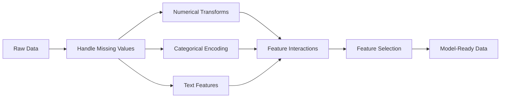

# Feature Engineering & Selection

> A good feature is worth a thousand data points.

**Type:** Build
**Languages:** Python
**Prerequisites:** Phase 1 (Statistics for ML, Linear Algebra), Phase 2 Lessons 1-7
**Time:** ~90 minutes

## Learning Objectives

- Implement numerical transforms (standardization, min-max scaling, log transform, binning) and explain when each is appropriate
- Build one-hot, label, and target encoding for categorical features and identify the data leakage risk in target encoding
- Construct a TF-IDF vectorizer from scratch and explain why it outperforms raw word counts for text classification
- Apply filter-based feature selection (variance threshold, correlation, mutual information) to reduce dimensionality

## The Problem

You have a dataset. You pick an algorithm. You train it. The results are mediocre. You try a fancier algorithm. Still mediocre. You spend a week tuning hyperparameters. Marginal improvement.

Then someone transforms the raw data into better features and a simple logistic regression beats your tuned gradient-boosted ensemble.

This happens constantly. In classical ML, the representation of the data matters more than the choice of algorithm. A house price model with "square footage" and "number of bedrooms" will beat a model with "address as a raw string" no matter how sophisticated the learner is. The algorithm can only work with what you give it.

Feature engineering is the process of transforming raw data into representations that make patterns easier for models to find. Feature selection is the process of throwing away features that add noise without adding signal. Together, they are the highest-leverage activity in classical ML.

## The Concept

### The Feature Pipeline



### Numerical Features

Raw numbers are rarely model-ready. Common transforms:

**Scaling:** Put features on the same range so distance-based algorithms (K-Means, KNN, SVM) treat all features equally. Min-max scaling maps to [0, 1]. Standardization (z-score) maps to mean=0, std=1.

**Log transform:** Compresses right-skewed distributions (income, population, word counts). Turns multiplicative relationships into additive ones.

**Binning:** Converts continuous values into categories. Useful when the relationship between feature and target is non-linear but step-wise (e.g., age groups).

**Polynomial features:** Creates x^2, x^3, x1*x2 terms. Lets linear models capture non-linear relationships at the cost of more features.

### Categorical Features

Models need numbers. Categories need encoding.

**One-hot encoding:** Creates a binary column for each category. "color = red/blue/green" becomes three columns: is_red, is_blue, is_green. Works well for low-cardinality features but explodes with many categories.

**Label encoding:** Maps each category to an integer: red=0, blue=1, green=2. Introduces false ordering (the model might think green > blue > red). Only appropriate for tree-based models that split on individual values.

**Target encoding:** Replaces each category with the mean of the target variable for that category. Powerful but dangerous: high risk of data leakage. Must be computed only on training data and applied to test data.

### Text Features

**Count vectorizer:** Counts how many times each word appears in a document. "the cat sat on the mat" becomes {the: 2, cat: 1, sat: 1, on: 1, mat: 1}.

**TF-IDF:** Term Frequency-Inverse Document Frequency. Weighs words by how unique they are across documents. Common words like "the" get low weight. Rare, distinctive words get high weight.

```
TF(word, doc) = count(word in doc) / total words in doc
IDF(word) = log(total docs / docs containing word)
TF-IDF = TF * IDF
```

### Missing Values

Real data has holes. Strategies:

- **Drop rows:** Only when missing data is rare and random
- **Mean/median imputation:** Simple, preserves distribution shape (median is more robust to outliers)
- **Mode imputation:** For categorical features
- **Indicator column:** Add a binary column "was_this_missing" before imputing. The fact that data is missing can itself be informative
- **Forward/backward fill:** For time series data

### Feature Interaction

Sometimes the relationship is in the combination. "Height" and "weight" alone are less predictive than "BMI = weight / height^2". Feature interactions multiply the feature space, so use domain knowledge to pick the right ones.

### Feature Selection

More features is not always better. Irrelevant features add noise, increase training time, and can cause overfitting.

**Filter methods (pre-model):**
- Correlation: remove features highly correlated with each other (redundant)
- Mutual information: measures how much knowing a feature reduces uncertainty about the target
- Variance threshold: remove features that barely vary

**Wrapper methods (model-based):**
- L1 regularization (Lasso): drives irrelevant feature weights to exactly zero
- Recursive feature elimination: train, remove least important feature, repeat

**Why selection matters:** A model with 10 good features will usually outperform a model with 10 good features and 90 noisy ones. The noisy features give the model opportunities to overfit on training data patterns that do not generalize.


## Build It

Reconstruct **Feature Engineering & Selection** by following `min_max_scale` on the text "red fox". Run `python3 main.py` and verify that the tokenizer/retriever reports zero or a clear empty-input result, rather than borrowing a result from the previous text.

## Use It

Call `min_max_scale` from a small caller with the text "red fox". Compare its result with the demo output, and record the input contract and the one field a downstream user should rely on.

## Ship It

Hand off `outputs/prompt-feature-engineer.md` with the command `python3 main.py`, the accepted input shape (the text "red fox"), the expected observable result, and a failure note for malformed inputs.

## Further Reading

- [Feature Engineering and Selection (Max Kuhn & Kjell Johnson)](http://www.feat.engineering/) - free online book covering the full landscape of feature engineering
- [scikit-learn Preprocessing Guide](https://scikit-learn.org/stable/modules/preprocessing.html) - practical reference for all standard transforms
- [Target Encoding Done Right (Micci-Barreca, 2001)](https://dl.acm.org/doi/10.1145/507533.507538) - the original paper on target encoding with smoothing

## Exercises

Keep two runs side by side for **Feature Engineering & Selection**. The important evidence is the named field, shape, or status—not a polished paragraph about the run.

1. **Read the first result.** From `code/`, run `python3 main.py` using the text "red fox". Follow `min_max_scale`, `standardize`, `log_transform`. Expect the tokenizer/retriever reports zero or a clear empty-input result, rather than borrowing a result from the previous text; capture the first printed shape, metric, status, or summary field and state which part supports **Implement numerical transforms (standardization, min-max scaling, log transform, binning) and explain when each is appropriate**.
2. **Run a two-value comparison.** Repeat the command after changing only the input text: use the text "red fox runs". Predict the direction of the change, then compare the two output values. Explain why **Build one-hot, label, and target encoding for categorical features and identify the data leakage risk in target encoding** says the other inputs should stay fixed.
3. **Try an adversarial fixture.** Feed the implementation an empty string. Before running it, write down whether the relevant function should return an empty value, a zero-sized result, or a validation error. Check the observed status against **Construct a TF-IDF vectorizer from scratch and explain why it outperforms raw word counts for text classification** and record the exception text if the code rejects the case.
4. **Write the operator note.** Open `outputs/prompt-feature-engineer.md` and add a worked example using the text "red fox". Include the input contract, one expected output field, and a named acceptance check for **Apply filter-based feature selection (variance threshold, correlation, mutual information) to reduce dimensionality**; note what the demo cannot establish.

## Reference Solution

A checkable result for **Feature Engineering & Selection** should contain:

- the `python3 main.py` output for the text "red fox", with `min_max_scale`, `standardize`, `log_transform` traced to the value or shape that supports **Implement numerical transforms (standardization, min-max scaling, log transform, binning) and explain when each is appropriate**;
- a before/after comparison for the input text, where the text "red fox runs" changes the observation in the direction predicted by **Build one-hot, label, and target encoding for categorical features and identify the data leakage risk in target encoding**;
- a recorded result for an empty string that matches the implementation’s validation or empty-result contract and explains the evidence for **Construct a TF-IDF vectorizer from scratch and explain why it outperforms raw word counts for text classification**; and
- an updated `outputs/prompt-feature-engineer.md` example with a concrete input, expected output field, and acceptance check tied to **Apply filter-based feature selection (variance threshold, correlation, mutual information) to reduce dimensionality**.

Run the lesson tests after the demo. If the boundary behaves differently from the prediction, keep the actual exception or output and explain the implementation path that produced it.
