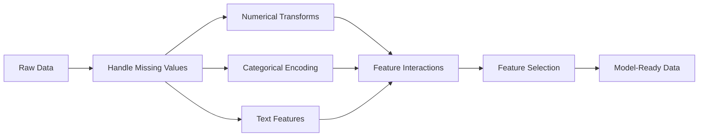

# Feature Engineering & Selection

> A good feature is worth a thousand data points.

**Type:** Build
**Languages:** Python
**Prerequisites:** Phase 1 (Statistics for ML, Linear Algebra), Phase 2 Lessons 1-7
**Time:** ~90 minutes

## Learning Objectives

- Implement numerical transforms (standardization, min-max scaling, log transform, binning) and explain when each is appropriate
- Build one-hot, label, and target encoding for categorical features and identify the data leakage risk in target encoding
- Construct a TF-IDF vectorizer from scratch and explain why it outperforms raw word counts for text classification
- Apply filter-based feature selection (variance threshold, correlation, mutual information) to reduce dimensionality

## The Problem

You have a dataset. You pick an algorithm. You train it. The results are mediocre. You try a fancier algorithm. Still mediocre. You spend a week tuning hyperparameters. Marginal improvement.

Then someone transforms the raw data into better features and a simple logistic regression beats your tuned gradient-boosted ensemble.

This happens constantly. In classical ML, the representation of the data matters more than the choice of algorithm. A house price model with "square footage" and "number of bedrooms" will beat a model with "address as a raw string" no matter how sophisticated the learner is. The algorithm can only work with what you give it.

Feature engineering is the process of transforming raw data into representations that make patterns easier for models to find. Feature selection is the process of throwing away features that add noise without adding signal. Together, they are the highest-leverage activity in classical ML.

## The Concept

### The Feature Pipeline



### Numerical Features

Raw numbers are rarely model-ready. Common transforms:

**Scaling:** Put features on the same range so distance-based algorithms (K-Means, KNN, SVM) treat all features equally. Min-max scaling maps to [0, 1]. Standardization (z-score) maps to mean=0, std=1.

**Log transform:** Compresses right-skewed distributions (income, population, word counts). Turns multiplicative relationships into additive ones.

**Binning:** Converts continuous values into categories. Useful when the relationship between feature and target is non-linear but step-wise (e.g., age groups).

**Polynomial features:** Creates x^2, x^3, x1*x2 terms. Lets linear models capture non-linear relationships at the cost of more features.

### Categorical Features

Models need numbers. Categories need encoding.

**One-hot encoding:** Creates a binary column for each category. "color = red/blue/green" becomes three columns: is_red, is_blue, is_green. Works well for low-cardinality features but explodes with many categories.

**Label encoding:** Maps each category to an integer: red=0, blue=1, green=2. Introduces false ordering (the model might think green > blue > red). Only appropriate for tree-based models that split on individual values.

**Target encoding:** Replaces each category with the mean of the target variable for that category. Powerful but dangerous: high risk of data leakage. Must be computed only on training data and applied to test data.

### Text Features

**Count vectorizer:** Counts how many times each word appears in a document. "the cat sat on the mat" becomes {the: 2, cat: 1, sat: 1, on: 1, mat: 1}.

**TF-IDF:** Term Frequency-Inverse Document Frequency. Weighs words by how unique they are across documents. Common words like "the" get low weight. Rare, distinctive words get high weight.

```
TF(word, doc) = count(word in doc) / total words in doc
IDF(word) = log(total docs / docs containing word)
TF-IDF = TF * IDF
```

### Missing Values

Real data has holes. Strategies:

- **Drop rows:** Only when missing data is rare and random
- **Mean/median imputation:** Simple, preserves distribution shape (median is more robust to outliers)
- **Mode imputation:** For categorical features
- **Indicator column:** Add a binary column "was_this_missing" before imputing. The fact that data is missing can itself be informative
- **Forward/backward fill:** For time series data

### Feature Interaction

Sometimes the relationship is in the combination. "Height" and "weight" alone are less predictive than "BMI = weight / height^2". Feature interactions multiply the feature space, so use domain knowledge to pick the right ones.

### Feature Selection

More features is not always better. Irrelevant features add noise, increase training time, and can cause overfitting.

**Filter methods (pre-model):**
- Correlation: remove features highly correlated with each other (redundant)
- Mutual information: measures how much knowing a feature reduces uncertainty about the target
- Variance threshold: remove features that barely vary

**Wrapper methods (model-based):**
- L1 regularization (Lasso): drives irrelevant feature weights to exactly zero
- Recursive feature elimination: train, remove least important feature, repeat

**Why selection matters:** A model with 10 good features will usually outperform a model with 10 good features and 90 noisy ones. The noisy features give the model opportunities to overfit on training data patterns that do not generalize.


## Use It

With scikit-learn, these transforms are composable pipelines:

```python
from sklearn.preprocessing import StandardScaler, OneHotEncoder, PolynomialFeatures
from sklearn.impute import SimpleImputer
from sklearn.feature_extraction.text import TfidfVectorizer
from sklearn.feature_selection import mutual_info_classif, VarianceThreshold
from sklearn.compose import ColumnTransformer
from sklearn.pipeline import Pipeline

numeric_pipe = Pipeline([
    ("imputer", SimpleImputer(strategy="median")),
    ("scaler", StandardScaler()),
])

categorical_pipe = Pipeline([
    ("encoder", OneHotEncoder(sparse_output=False)),
])

preprocessor = ColumnTransformer([
    ("num", numeric_pipe, ["sqft", "age"]),
    ("cat", categorical_pipe, ["neighborhood"]),
])
```

The from-scratch versions show exactly what happens inside each transform. The library versions add edge-case handling, sparse matrix support, and pipeline composition, but the math is the same.

## Ship It

This lesson produces:
- `outputs/prompt-feature-engineer.md` - a prompt for systematically engineering features from raw data


## Key Terms

| Term | What people say | What it actually means |
|------|----------------|----------------------|
| Feature engineering | "Making new columns" | Transforming raw data into representations that expose patterns to the model |
| Standardization | "Making it normal" | Subtracting the mean and dividing by standard deviation so the feature has mean=0 and std=1 |
| One-hot encoding | "Making dummy variables" | Creating one binary column per category, where exactly one column is 1 for each row |
| Target encoding | "Using the answer to encode" | Replacing each category with the average target value for that category, with smoothing to prevent overfitting |
| TF-IDF | "Fancy word counts" | Term Frequency times Inverse Document Frequency: words weighted by how distinctive they are across the corpus |
| Imputation | "Filling in blanks" | Replacing missing values with estimated values (mean, median, mode, or model-predicted) |
| Feature selection | "Throwing out bad columns" | Removing features that add noise or redundancy, keeping only those with signal about the target |
| Mutual information | "How much one thing tells you about another" | A measure of the reduction in uncertainty about variable Y gained by observing variable X |
| Data leakage | "Accidentally cheating" | Using information during training that would not be available at prediction time, giving falsely optimistic results |

## Further Reading

- [Feature Engineering and Selection (Max Kuhn & Kjell Johnson)](http://www.feat.engineering/) - free online book covering the full landscape of feature engineering
- [scikit-learn Preprocessing Guide](https://scikit-learn.org/stable/modules/preprocessing.html) - practical reference for all standard transforms
- [Target Encoding Done Right (Micci-Barreca, 2001)](https://dl.acm.org/doi/10.1145/507533.507538) - the original paper on target encoding with smoothing
