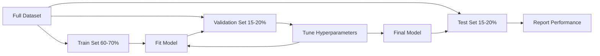

# Model Evaluation

> A model is only as good as the way you measure it.

**Type:** Build
**Languages:** Julia
**Prerequisites:** Phase 1 (Probability & Distributions, Statistics for ML), Phase 2 Lessons 1-8
**Time:** ~90 minutes

## Learning Objectives

- Implement K-fold and stratified K-fold cross-validation from scratch and explain why stratification matters for imbalanced data
- Compute precision, recall, F1, AUC-ROC, and regression metrics (MSE, RMSE, MAE, R-squared) from scratch
- Interpret learning curves to diagnose whether a model suffers from high bias or high variance
- Identify common evaluation mistakes including data leakage, wrong metric selection, and test set contamination

## The Problem

You trained a model. It gets 95% accuracy on your data. Is it good?

Maybe. Maybe not. If 95% of your data belongs to one class, a model that always predicts that class gets 95% accuracy while being completely useless. If you evaluated on the same data you trained on, the 95% number is meaningless because the model just memorized the answers. If your dataset has a time component and you randomly shuffled before splitting, your model might be using future data to predict the past.

Model evaluation is where most ML projects go wrong. The wrong metric makes a bad model look good. The wrong split lets a model cheat. The wrong comparison makes you pick the worse model. Getting evaluation right is not optional. It is the difference between a model that works in production and one that fails the moment it sees real data.

## The Concept

### Train, Validation, Test

Three splits, three purposes:

- **Training set**: the model learns from this data. It sees these examples during training.
- **Validation set**: used to tune hyperparameters and select between models. The model never trains on this data, but your decisions are influenced by it.
- **Test set**: touched exactly once, at the very end, to report final performance. If you look at test performance and then go back to change your model, it is no longer a test set. It has become a second validation set.

The test set is your hold-out guarantee that the reported performance reflects how the model will do on truly unseen data.

### K-Fold Cross-Validation

With small datasets, a single train/validation split wastes data and gives noisy estimates. K-fold cross-validation uses all the data for both training and validation:

```mermaid
flowchart TB
    subgraph Fold1["Fold 1"]
        direction LR
        V1["Val"] --- T1a["Train"] --- T1b["Train"] --- T1c["Train"] --- T1d["Train"]
    end
    subgraph Fold2["Fold 2"]
        direction LR
        T2a["Train"] --- V2["Val"] --- T2b["Train"] --- T2c["Train"] --- T2d["Train"]
    end
    subgraph Fold3["Fold 3"]
        direction LR
        T3a["Train"] --- T3b["Train"] --- V3["Val"] --- T3c["Train"] --- T3d["Train"]
    end
    subgraph Fold4["Fold 4"]
        direction LR
        T4a["Train"] --- T4b["Train"] --- T4c["Train"] --- V4["Val"] --- T4d["Train"]
    end
    subgraph Fold5["Fold 5"]
        direction LR
        T5a["Train"] --- T5b["Train"] --- T5c["Train"] --- T5d["Train"] --- V5["Val"]
    end
    Fold1 --> R["Average scores"]
    Fold2 --> R
    Fold3 --> R
    Fold4 --> R
    Fold5 --> R
```

1. Split data into K equal-sized folds
2. For each fold, train on K-1 folds and validate on the remaining fold
3. Average the K validation scores

K=5 or K=10 are standard choices. Every data point gets used for validation exactly once. The average score is a more stable estimate than any single split.

**Stratified K-fold**: preserves the class distribution in each fold. If your dataset is 70% class A and 30% class B, each fold will have roughly the same ratio. This is important for imbalanced datasets where a random split might put all minority samples in one fold.

### Classification Metrics

**Confusion matrix**: the foundation. For binary classification:

|  | Predicted Positive | Predicted Negative |
|--|---|---|
| Actually Positive | True Positive (TP) | False Negative (FN) |
| Actually Negative | False Positive (FP) | True Negative (TN) |

From this matrix, all other metrics follow:

- **Accuracy** = (TP + TN) / (TP + TN + FP + FN). Fraction of correct predictions. Misleading when classes are imbalanced.
- **Precision** = TP / (TP + FP). Of all things predicted positive, how many actually were? Use when false positives are costly (e.g., spam filter marking real email as spam).
- **Recall** (sensitivity) = TP / (TP + FN). Of all actual positives, how many did we catch? Use when false negatives are costly (e.g., cancer screening missing a tumor).
- **F1 score** = 2 * precision * recall / (precision + recall). Harmonic mean of precision and recall. Balances both when neither clearly dominates.
- **AUC-ROC**: Area Under the Receiver Operating Characteristic curve. Plots true positive rate vs false positive rate at various classification thresholds. AUC = 0.5 means random guessing, AUC = 1.0 means perfect separation. Threshold-independent: it measures how well the model ranks positives above negatives, regardless of the cutoff you pick.

### Regression Metrics

- **MSE** (Mean Squared Error) = mean((y_true - y_pred)^2). Penalizes large errors quadratically. Sensitive to outliers.
- **RMSE** (Root Mean Squared Error) = sqrt(MSE). Same units as the target variable. Easier to interpret than MSE.
- **MAE** (Mean Absolute Error) = mean(|y_true - y_pred|). Treats all errors linearly. More robust to outliers than MSE.
- **R-squared** = 1 - SS_res / SS_tot, where SS_res = sum((y_true - y_pred)^2) and SS_tot = sum((y_true - y_mean)^2). Fraction of variance explained by the model. R^2 = 1.0 is perfect. R^2 = 0.0 means the model is no better than always predicting the mean. R^2 can be negative if the model is worse than the mean.

### Learning Curves

Plot training and validation scores as a function of training set size:

- **High bias (underfitting)**: both curves converge to a low score. Adding more data will not help. You need a more complex model.
- **High variance (overfitting)**: training score is high but validation score is much lower. The gap between them is large. Adding more data should help.

### Validation Curves

Plot training and validation scores as a function of a hyperparameter:

- At low complexity: both scores are low (underfitting)
- At the right complexity: both scores are high and close together
- At high complexity: training score stays high but validation score drops (overfitting)

The optimal hyperparameter value is where the validation score peaks.

### Common Evaluation Mistakes

**Data leakage**: information from the test set leaks into training. Examples: fitting a scaler on the full dataset before splitting, including future data in time series prediction, using a feature that is derived from the target. Always split first, then preprocess.

**Class imbalance**: 99% of transactions are legitimate, 1% are fraud. A model that always predicts "legitimate" gets 99% accuracy. Use precision, recall, F1, or AUC-ROC instead.

**Wrong metric**: optimizing accuracy when you should optimize recall (medical diagnosis), or optimizing RMSE when your data has heavy outliers (use MAE instead).

**Not using stratified splits**: with imbalanced data, a random split might put very few minority samples in the validation fold, giving unstable estimates.

**Testing too often**: every time you look at test performance and adjust, you overfit to the test set. The test set is single-use.

## Build It

Reconstruct **Model Evaluation** by following `train_val_test_split` on the demo’s smallest built-in fixture. Run `julia main.jl` and verify that the result reports the empty case explicitly or raises the documented validation error.

## Use It

Call `train_val_test_split` from a small caller with the demo’s smallest built-in fixture. Compare its result with the demo output, and record the input contract and the one field a downstream user should rely on.

## Ship It

Hand off `outputs/skill-evaluation.md` with the command `julia main.jl`, the accepted input shape (the demo’s smallest built-in fixture), the expected observable result, and a failure note for malformed inputs.

## Further Reading

- [scikit-learn Model Selection Guide](https://scikit-learn.org/stable/model_selection.html) - comprehensive reference on cross-validation, metrics, and hyperparameter tuning
- [Beyond Accuracy: Precision and Recall (Google ML Crash Course)](https://developers.google.com/machine-learning/crash-course/classification/precision-and-recall) - clear explanation with interactive examples
- [A Survey of Cross-Validation Procedures (Arlot & Celisse, 2010)](https://projecteuclid.org/journals/statistics-surveys/volume-4/issue-none/A-survey-of-cross-validation-procedures-for-model-selection/10.1214/09-SS054.full) - rigorous treatment of when and why different CV strategies work

## Exercises

Work from the smallest fixture that the Model Evaluation demo already understands, then make one deliberate change and record what moved.

1. **Run the smallest fixture.** From `code/`, run `julia main.jl` using the demo’s smallest built-in fixture. Follow `train_val_test_split`, `kfold_split`, `stratified_kfold_split`. Expect the result reports the empty case explicitly or raises the documented validation error; capture the first printed shape, metric, status, or summary field and state which part supports **Implement K-fold and stratified K-fold cross-validation from scratch and explain why stratification matters for imbalanced data**.
2. **Perturb one field.** Repeat the command after changing only the primary fixture value: use the same fixture with its primary value changed from 1 to 2. Predict the direction of the change, then compare the two output values. Explain why **Compute precision, recall, F1, AUC-ROC, and regression metrics (MSE, RMSE, MAE, R-squared) from scratch** says the other inputs should stay fixed.
3. **Check the failure boundary.** Feed the implementation an empty fixture {}. Before running it, write down whether the relevant function should return an empty value, a zero-sized result, or a validation error. Check the observed status against **Interpret learning curves to diagnose whether a model suffers from high bias or high variance** and record the exception text if the code rejects the case.
4. **Make the result repeatable.** Open `outputs/skill-evaluation.md` and add a worked example using the demo’s smallest built-in fixture. Include the input contract, one expected output field, and a named acceptance check for **Identify common evaluation mistakes including data leakage, wrong metric selection, and test set contamination**; note what the demo cannot establish.

## Reference Solution

A checkable result for **Model Evaluation** should contain:

- the `julia main.jl` output for the demo’s smallest built-in fixture, with `train_val_test_split`, `kfold_split`, `stratified_kfold_split` traced to the value or shape that supports **Implement K-fold and stratified K-fold cross-validation from scratch and explain why stratification matters for imbalanced data**;
- a before/after comparison for the primary fixture value, where the same fixture with its primary value changed from 1 to 2 changes the observation in the direction predicted by **Compute precision, recall, F1, AUC-ROC, and regression metrics (MSE, RMSE, MAE, R-squared) from scratch**;
- a recorded result for an empty fixture {} that matches the implementation’s validation or empty-result contract and explains the evidence for **Interpret learning curves to diagnose whether a model suffers from high bias or high variance**; and
- an updated `outputs/skill-evaluation.md` example with a concrete input, expected output field, and acceptance check tied to **Identify common evaluation mistakes including data leakage, wrong metric selection, and test set contamination**.

Run the lesson tests after the demo. If the boundary behaves differently from the prediction, keep the actual exception or output and explain the implementation path that produced it.
## Guided Demo

Use the [10–15 minute guided demo](demo.md) to predict an invariant, run the canonical entrypoint, change one variable, and probe a failure case.
