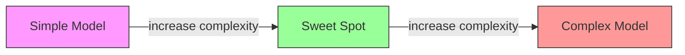
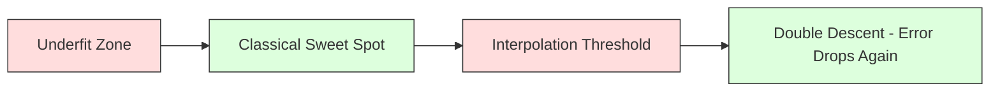
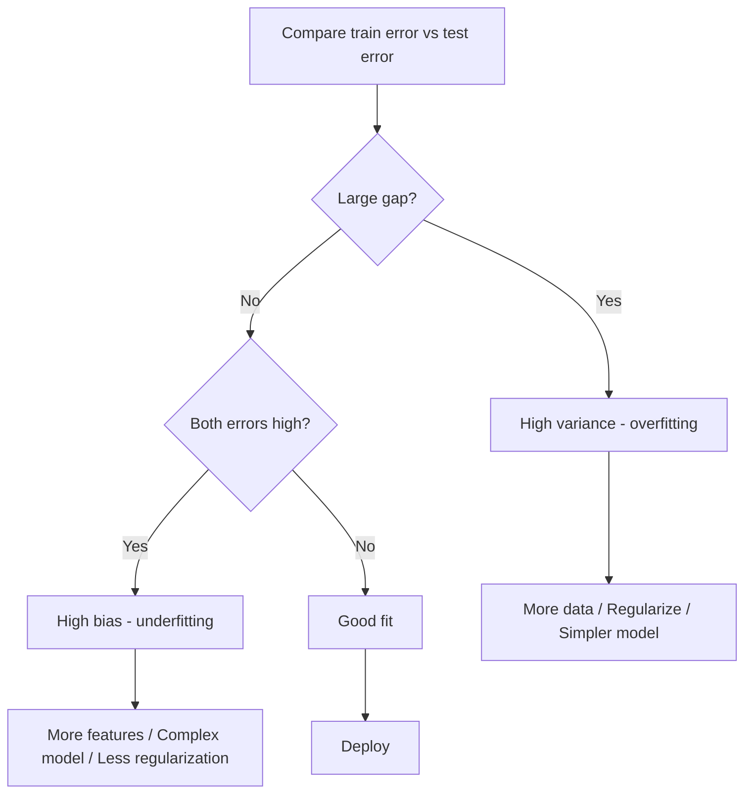
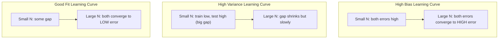
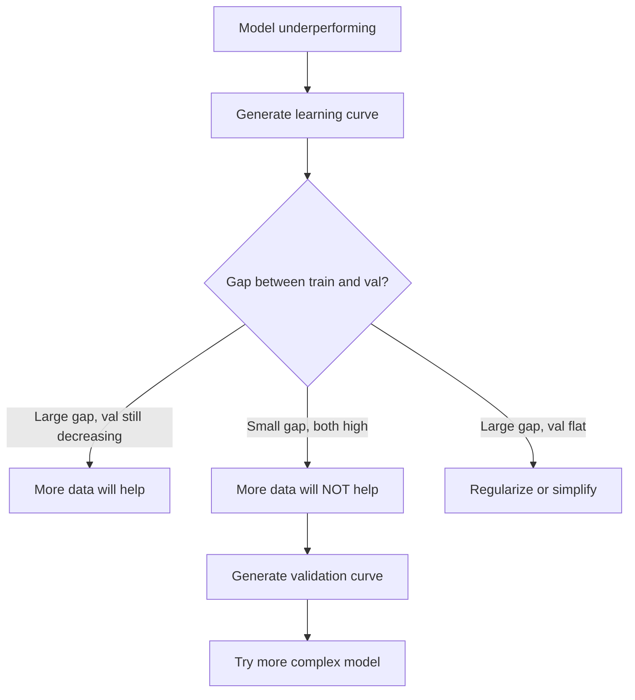

# Bias-Variance Tradeoff

> Every model error comes from one of three sources: bias, variance, or noise. You can only control the first two.

**Type:** Learn
**Language:** Python
**Prerequisites:** Phase 2, Lessons 01-09 (ML basics, regression, classification, evaluation)
**Time:** ~75 minutes

## Learning Objectives

- Derive the bias-variance decomposition of expected prediction error and explain the role of irreducible noise
- Diagnose whether a model suffers from high bias or high variance using training and test error patterns
- Explain how regularization techniques (L1, L2, dropout, early stopping) trade bias for variance
- Implement experiments that visualize the bias-variance tradeoff across models of increasing complexity

## The Problem

You trained a model. It has some error on test data. Where does that error come from?

If your model is too simple (linear regression on a curved dataset), it will consistently miss the true pattern. That is bias. If your model is too complex (degree-20 polynomial on 15 data points), it will fit the training data perfectly but give wildly different predictions on new data. That is variance.

You cannot minimize both at the same time for a fixed model capacity. Push bias down and variance goes up. Push variance down and bias goes up. Understanding this tradeoff is the single most useful diagnostic skill in machine learning. It tells you whether to make your model more complex or less complex, whether to get more data or engineer better features, whether to regularize more or less.

## The Concept

### Bias: Systematic Error

Bias measures how far off your model's average prediction is from the true value. If you trained the same model on many different training sets drawn from the same distribution and averaged the predictions, bias is the gap between that average and the truth.

High bias means the model is too rigid to capture the real pattern. A straight line fit to a parabola will always miss the curve, no matter how much data you give it. This is underfitting.

```
High bias (underfitting):
  Model always predicts roughly the same wrong thing.
  Training error: HIGH
  Test error: HIGH
  Gap between them: SMALL
```

### Variance: Sensitivity to Training Data

Variance measures how much your predictions change when you train on different subsets of data. If small changes in the training set cause large changes in the model, variance is high.

High variance means the model is fitting noise in the training data, not the underlying signal. A degree-20 polynomial will thread through every training point but oscillate wildly between them. This is overfitting.

```
High variance (overfitting):
  Model fits training data perfectly but fails on new data.
  Training error: LOW
  Test error: HIGH
  Gap between them: LARGE
```

### The Decomposition

For any point x, the expected prediction error under squared loss decomposes exactly:

```
Expected Error = Bias^2 + Variance + Irreducible Noise

where:
  Bias^2   = (E[f_hat(x)] - f(x))^2
  Variance = E[(f_hat(x) - E[f_hat(x)])^2]
  Noise    = E[(y - f(x))^2]             (sigma^2)
```

- `f(x)` is the true function
- `f_hat(x)` is your model's prediction
- `E[...]` is the expectation over different training sets
- `y` is the observed label (true function plus noise)

The noise term is irreducible. No model can do better than sigma^2 on noisy data. Your job is to find the right balance between bias^2 and variance.

### Model Complexity vs Error



The classic U-shaped curve:

| Complexity | Bias | Variance | Total Error |
|-----------|------|----------|-------------|
| Too low | HIGH | LOW | HIGH (underfitting) |
| Just right | MODERATE | MODERATE | LOWEST |
| Too high | LOW | HIGH | HIGH (overfitting) |

### Regularization as Bias-Variance Control

Regularization deliberately increases bias to reduce variance. It constrains the model so it cannot chase noise.

- **L2 (Ridge):** Shrinks all weights toward zero. Keeps all features but reduces their influence.
- **L1 (Lasso):** Pushes some weights exactly to zero. Performs feature selection.
- **Dropout:** Randomly disables neurons during training. Forces redundant representations.
- **Early stopping:** Stops training before the model fully fits the training data.

The regularization strength (lambda, dropout rate, number of epochs) directly controls where you sit on the bias-variance curve. More regularization means more bias, less variance.

### Double Descent: The Modern Perspective

Classical theory says: after the sweet spot, more complexity always hurts. But research since 2019 has shown something unexpected. If you keep increasing model capacity far past the interpolation threshold (where the model has enough parameters to perfectly fit training data), test error can decrease again.



This "double descent" phenomenon explains why massively overparameterized neural networks (with far more parameters than training examples) still generalize well. The classical bias-variance tradeoff is not wrong, but it is incomplete for the modern regime.

Key observations about double descent:
- It happens in linear models, decision trees, and neural networks
- More data can actually hurt in the interpolation region (sample-wise double descent)
- More training epochs can cause it too (epoch-wise double descent)
- Regularization smooths out the peak but does not eliminate it

Why does this happen? At the interpolation threshold, the model has just enough capacity to fit all training points. It is forced into a very specific solution that threads through every point, and small perturbations in the data cause large changes in the fit. This is where variance peaks. Past the threshold, the model has many possible solutions that fit the data perfectly. The learning algorithm (e.g., gradient descent with implicit regularization) tends to pick the simplest one among them. This implicit bias toward simple solutions is why overparameterized models generalize.

| Regime | Parameters vs Samples | Behavior |
|--------|----------------------|----------|
| Underparameterized | p << n | Classical tradeoff applies |
| Interpolation threshold | p ~ n | Variance peaks, test error spikes |
| Overparameterized | p >> n | Implicit regularization kicks in, test error drops |

For practical purposes: if you are using neural networks or large tree ensembles, do not stop at the interpolation threshold. Either stay well below it (with explicit regularization) or go well past it. The worst place to be is right at the threshold.

### Diagnosing Your Model



| Symptom | Diagnosis | Fix |
|---------|-----------|-----|
| High train error, high test error | Bias | More features, complex model, less regularization |
| Low train error, high test error | Variance | More data, regularization, simpler model, dropout |
| Low train error, low test error | Good fit | Ship it |
| Train error decreasing, test error increasing | Overfitting in progress | Early stopping |

### Practical Strategies

**When bias is the problem:**
- Add polynomial or interaction features
- Use a more flexible model (tree ensemble instead of linear)
- Reduce regularization strength
- Train longer (if not yet converged)

**When variance is the problem:**
- Get more training data
- Use bagging (random forests)
- Increase regularization (higher lambda, more dropout)
- Feature selection (remove noisy features)
- Use cross-validation to detect it early

### Ensemble Methods and Variance Reduction

Ensemble methods are the most practical tool for fighting variance.

**Bagging (Bootstrap Aggregating)** trains multiple models on different bootstrap samples of the training data, then averages their predictions. Each individual model has high variance, but the average has much lower variance. Random forests are bagging applied to decision trees.

Why it works mathematically: if you average N independent predictions, each with variance sigma^2, the variance of the average is sigma^2 / N. The models are not truly independent (they all see similar data), so the reduction is less than 1/N, but it is still substantial.

**Boosting** reduces bias by building models sequentially, where each new model focuses on the errors of the ensemble so far. Gradient boosting and AdaBoost are the main examples. Boosting can overfit if you add too many models, so you need early stopping or regularization.

| Method | Primary Effect | Bias Change | Variance Change |
|--------|---------------|-------------|-----------------|
| Bagging | Reduces variance | No change | Decreases |
| Boosting | Reduces bias | Decreases | Can increase |
| Stacking | Reduces both | Depends on meta-learner | Depends on base models |
| Dropout | Implicit bagging | Slight increase | Decreases |

**Practical rule:** if your base model has high variance (deep trees, high-degree polynomials), use bagging. If your base model has high bias (shallow stumps, simple linear models), use boosting.

### Learning Curves

Learning curves plot training and validation error as a function of training set size. They are the most practical diagnostic tool you have. Unlike a single train/test comparison, learning curves show you the trajectory of your model and tell you whether more data will help.



How to read them:

| Scenario | Training Error | Validation Error | Gap | What It Means | What to Do |
|----------|---------------|-----------------|-----|---------------|------------|
| High bias | High | High | Small | Model cannot capture the pattern | More features, complex model, less regularization |
| High variance | Low | High | Large | Model memorizes training data | More data, regularization, simpler model |
| Good fit | Moderate | Moderate | Small | Model generalizes well | Ship it |
| High variance, improving | Low | Decreasing with more data | Shrinking | Variance problem that data can fix | Collect more data |
| High bias, flat | High | High and flat | Small and flat | More data will NOT help | Change model architecture |

The critical insight: if both curves have plateaued and the gap is small but both errors are high, more data is useless. You need a better model. If the gap is large and still shrinking, more data will help.

### How to Generate Learning Curves

There are two approaches:

**Approach 1: Vary training set size, fixed model.** Hold the model and hyperparameters constant. Train on increasingly large subsets of the training data. Measure training error and validation error at each size. This is the standard learning curve.

**Approach 2: Vary model complexity, fixed data.** Hold the data constant. Sweep a complexity parameter (polynomial degree, tree depth, number of layers). Measure training error and validation error at each complexity. This is a validation curve and shows the bias-variance tradeoff directly.

Both approaches complement each other. The first tells you if more data will help. The second tells you if a different model will help. Run both before making decisions about your next step.




## Use It

sklearn provides `learning_curve` and `validation_curve` to automate these diagnostics without writing bootstrap loops.

### Validation Curve: Sweep Model Complexity

```python
from sklearn.model_selection import validation_curve
from sklearn.pipeline import make_pipeline
from sklearn.preprocessing import PolynomialFeatures
from sklearn.linear_model import Ridge

degrees = list(range(1, 16))
train_scores_all = []
val_scores_all = []

for d in degrees:
    pipe = make_pipeline(PolynomialFeatures(d), Ridge(alpha=0.01))
    train_scores, val_scores = validation_curve(
        pipe, X, y, param_name="polynomialfeatures__degree",
        param_range=[d], cv=5, scoring="neg_mean_squared_error"
    )
    train_scores_all.append(-train_scores.mean())
    val_scores_all.append(-val_scores.mean())
```

This gives you the bias-variance tradeoff curve directly. Where the validation score is worst relative to train score, variance dominates. Where both are bad, bias dominates.

### Learning Curve: Sweep Training Set Size

```python
from sklearn.model_selection import learning_curve

pipe = make_pipeline(PolynomialFeatures(5), Ridge(alpha=0.01))
train_sizes, train_scores, val_scores = learning_curve(
    pipe, X, y, train_sizes=np.linspace(0.1, 1.0, 10),
    cv=5, scoring="neg_mean_squared_error"
)
train_mse = -train_scores.mean(axis=1)
val_mse = -val_scores.mean(axis=1)
```

Plot `train_mse` and `val_mse` against `train_sizes`. The shape tells you everything about your model.

### Cross-Validation with Regularization Sweep

```python
from sklearn.model_selection import cross_val_score

alphas = [0.001, 0.01, 0.1, 1.0, 10.0, 100.0]
for alpha in alphas:
    pipe = make_pipeline(PolynomialFeatures(10), Ridge(alpha=alpha))
    scores = cross_val_score(pipe, X, y, cv=5, scoring="neg_mean_squared_error")
    print(f"alpha={alpha:>7.3f}  MSE={-scores.mean():.4f} +/- {scores.std():.4f}")
```

This sweeps regularization strength for a fixed model complexity. You will see the same bias-variance tradeoff: low alpha means high variance, high alpha means high bias.

### Putting It All Together: A Complete Diagnostic Workflow

In practice, you run these diagnostics in sequence:

1. Train your model. Compute train and test error.
2. If both are high: you have a bias problem. Skip to step 4.
3. If train is low but test is high: you have a variance problem. Generate a learning curve to see if more data will help. If not, regularize.
4. Generate a validation curve sweeping your main complexity parameter. Find the sweet spot.
5. At the sweet spot, generate a learning curve. If the gap is still large, you need more data or regularization.
6. Try Ridge/Lasso with different alpha values using `cross_val_score`. Pick the alpha where cross-validated error is lowest.

This takes 10-15 minutes of compute for most tabular datasets and saves hours of guessing.

## Ship It

This lesson produces: `outputs/prompt-model-diagnostics.md`


## Key Terms

| Term | What people say | What it actually means |
|------|----------------|----------------------|
| Bias | "The model is too simple" | Systematic error from wrong assumptions. The gap between the average model prediction and truth. |
| Variance | "The model is overfitting" | Error from sensitivity to training data. How much predictions change across different training sets. |
| Irreducible error | "Noise in the data" | Error from randomness in the true data-generating process. No model can eliminate it. |
| Underfitting | "Not learning enough" | Model has high bias. It misses the real pattern even on training data. |
| Overfitting | "Memorizing the data" | Model has high variance. It fits noise in training data that does not generalize. |
| Regularization | "Constraining the model" | Adding a penalty to reduce model complexity, trading bias for lower variance. |
| Double descent | "More parameters can help" | Test error decreases again when model capacity far exceeds the interpolation threshold. |
| Model complexity | "How flexible the model is" | The capacity of a model to fit arbitrary patterns. Controlled by architecture, features, or regularization. |

## Further Reading

- [Hastie, Tibshirani, Friedman: Elements of Statistical Learning, Ch. 7](https://hastie.su.domains/ElemStatLearn/) -- the definitive treatment of bias-variance decomposition
- [Belkin et al., Reconciling modern machine learning practice and the bias-variance trade-off (2019)](https://arxiv.org/abs/1812.11118) -- the double descent paper
- [Nakkiran et al., Deep Double Descent (2019)](https://arxiv.org/abs/1912.02292) -- epoch-wise and sample-wise double descent
- [Scott Fortmann-Roe: Understanding the Bias-Variance Tradeoff](http://scott.fortmann-roe.com/docs/BiasVariance.html) -- clear visual explanation
