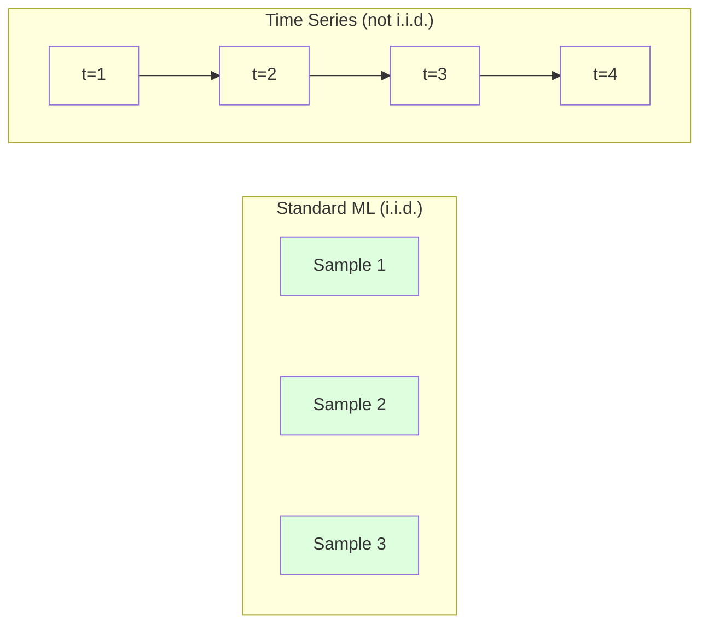
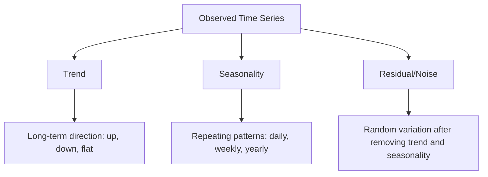
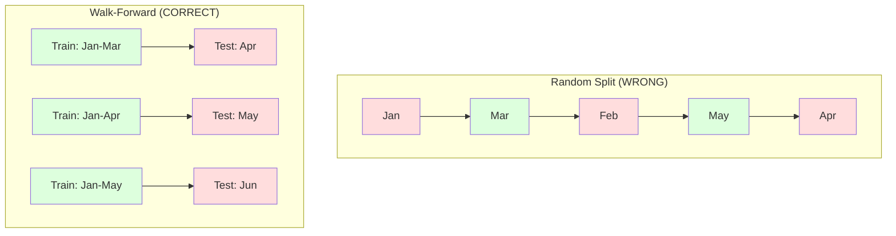

# Time Series Fundamentals

> Past performance does predict future results -- if you check for stationarity first.

**Type:** Build
**Languages:** Python
**Language:** Python
**Prerequisites:** Phase 2, Lessons 01-09
**Time:** ~90 minutes

## Learning Objectives

- Decompose a time series into trend, seasonality, and residual components and test for stationarity
- Implement lag features and rolling statistics to convert a time series into a supervised learning problem
- Build a walk-forward validation framework that prevents future data from leaking into training
- Explain why random train/test splits are invalid for time series and demonstrate the performance gap versus proper temporal splits

## The Problem

You have data ordered by time. Daily sales, hourly temperature, per-minute CPU usage, weekly stock prices. You want to predict the next value, the next week, the next quarter.

You reach for your standard ML toolkit: random train/test split, cross-validation, feature matrix in, prediction out. Every step is wrong.

Time series breaks the assumptions that standard ML relies on. Samples are not independent -- today's temperature depends on yesterday's. Random splits leak future information into the past. Features that look great in backtest fail in production because they rely on patterns that shift over time.

A model that gets 95% accuracy with random cross-validation might get 55% with proper time-based evaluation. The difference is not a technicality. It is the difference between a model that works on paper and one that works in production.

This lesson covers the fundamentals: what makes time data different, how to evaluate models honestly, and how to turn a time series into features that standard ML models can consume.

## The Concept

### What Makes Time Series Different

Standard ML assumes i.i.d. -- independent and identically distributed. Each sample is drawn from the same distribution, independently of other samples. Time series violates both:

- **Not independent.** Today's stock price depends on yesterday's. This week's sales correlate with last week's.
- **Not identically distributed.** The distribution shifts over time. Sales in December look different from sales in March.

These violations are not minor. They change how you build features, how you evaluate models, and which algorithms work.



In standard ML, samples are interchangeable. Shuffling them changes nothing. In time series, order is everything. Shuffling destroys the signal.

### Components of a Time Series

Every time series is a combination of:



- **Trend**: The long-term direction. Revenue growing 10% per year. Global temperature rising.
- **Seasonality**: Repeating patterns at fixed intervals. Retail sales spike in December. Air conditioning usage peaks in July.
- **Residual**: Whatever is left after removing trend and seasonality. If the residual looks like white noise, the decomposition captured the signal.

### Stationarity

A time series is stationary if its statistical properties (mean, variance, autocorrelation) do not change over time. Most forecasting methods assume stationarity.

**Why it matters:** A non-stationary series has a mean that drifts. A model trained on data from January has learned a different mean than what February will show. It will be systematically wrong.

**How to check:** Compute rolling mean and rolling standard deviation over windows. If they drift, the series is non-stationary.

**How to fix:** Differencing. Instead of modeling the raw values, model the change between consecutive values:

```
diff[t] = value[t] - value[t-1]
```

If one round of differencing does not make the series stationary, apply it again (second-order differencing). Most real-world series need at most two rounds.

**Example:**

Original series: [100, 102, 106, 112, 120]
First difference:  [2, 4, 6, 8] (still trending upward)
Second difference:  [2, 2, 2] (constant -- stationary)

The original series had a quadratic trend. First differencing turned it into a linear trend. Second differencing made it flat. In practice, you rarely need more than two rounds.

**Formal test:** The Augmented Dickey-Fuller (ADF) test is the standard statistical test for stationarity. The null hypothesis is "the series is non-stationary." A p-value below 0.05 means you can reject the null and conclude stationarity. We do not implement ADF from scratch (it requires asymptotic distribution tables), but the rolling statistics approach in our code gives a practical visual check.

### Autocorrelation

Autocorrelation measures how much a value at time t correlates with the value at time t-k (k steps in the past). The autocorrelation function (ACF) plots this correlation for each lag k.

**ACF tells you:**
- How far back the series remembers. If ACF drops to zero after lag 5, values more than 5 steps ago are irrelevant.
- Whether seasonality exists. If ACF spikes at lag 12 (monthly data), there is yearly seasonality.
- How many lag features to create. Use lags up to where ACF becomes negligible.

**PACF (Partial Autocorrelation Function)** removes indirect correlations. If today correlates with 3 days ago only because both correlate with yesterday, PACF at lag 3 will be zero while ACF at lag 3 will not.

### Lag Features: Turning Time Series into Supervised Learning

Standard ML models need a feature matrix X and a target y. Time series gives you a single column of values. The bridge is lag features.

Take the series [10, 12, 14, 13, 15] and create lag-1 and lag-2 features:

| lag_2 | lag_1 | target |
|-------|-------|--------|
| 10    | 12    | 14     |
| 12    | 14    | 13     |
| 14    | 13    | 15     |

Now you have a standard regression problem. Any ML model (linear regression, random forest, gradient boosting) can predict the target from the lags.

Additional features you can engineer:
- **Rolling statistics:** mean, std, min, max over the last k values
- **Calendar features:** day of week, month, is_holiday, is_weekend
- **Differenced values:** change from previous step
- **Expanding statistics:** cumulative mean, cumulative sum
- **Ratio features:** current value / rolling mean (how far from recent average)
- **Interaction features:** lag_1 * day_of_week (weekday effects on momentum)

**How many lags?** Use the autocorrelation function. If ACF is significant up to lag 10, use at least 10 lags. If there is weekly seasonality, include lag 7 (and possibly 14). More lags give the model more history but also more features to fit, increasing the risk of overfitting.

**The target alignment trap.** When creating lag features, the target must be the value at time t, and all features must use values at time t-1 or earlier. If you accidentally include the value at time t as a feature, you have a perfect predictor -- and a completely useless model. This is the most common bug in time series feature engineering.

### Walk-Forward Validation

This is the most important concept in this lesson. Standard k-fold cross-validation randomly assigns samples to train and test. For time series, this leaks future information.



Walk-forward validation:
1. Train on data up to time t
2. Predict at time t+1 (or t+1 to t+k for multi-step)
3. Slide the window forward
4. Repeat

Each test fold only contains data that comes after all training data. No future leakage. This gives you an honest estimate of how the model will perform when deployed.

**Expanding window** uses all historical data for training (window grows). **Sliding window** uses a fixed-size training window (window slides). Use expanding when you believe older data is still relevant. Use sliding when the world changes and old data hurts.

### ARIMA Intuition

ARIMA is the classical time series model. It has three components:

- **AR (Autoregressive):** Predict from past values. AR(p) uses the last p values.
- **I (Integrated):** Differencing to achieve stationarity. I(d) applies d rounds of differencing.
- **MA (Moving Average):** Predict from past forecast errors. MA(q) uses the last q errors.

ARIMA(p, d, q) combines all three. You choose p, d, q based on ACF/PACF analysis or automated search (auto-ARIMA).

We will not implement ARIMA from scratch -- it requires numerical optimization that is beyond the scope of this lesson. The key insight is understanding what each component does so you can interpret ARIMA results and know when to use it.

### When to Use What

| Approach | Best For | Handles Seasonality | Handles External Features |
|----------|---------|-------------------|------------------------|
| Lag features + ML | Tabular with many external features | With calendar features | Yes |
| ARIMA | Single univariate series, short-term | SARIMA variant | No (ARIMAX for limited) |
| Exponential smoothing | Simple trend + seasonality | Yes (Holt-Winters) | No |
| Prophet | Business forecasting, holidays | Yes (Fourier terms) | Limited |
| Neural networks (LSTM, Transformer) | Long sequences, many series | Learned | Yes |

For most practical problems, lag features + gradient boosting is the strongest starting point. It handles external features naturally, does not require stationarity, and is easy to debug.

### Forecasting Horizons and Strategies

Single-step forecasting predicts one time step ahead. Multi-step forecasting predicts multiple steps. There are three strategies:

**Recursive (iterated):** Predict one step ahead, use the prediction as input for the next step. Simple but errors accumulate -- each prediction uses the previous prediction, so mistakes compound.

**Direct:** Train a separate model for each horizon. Model-1 predicts t+1, Model-5 predicts t+5. No error accumulation, but each model has fewer training samples and they do not share information.

**Multi-output:** Train one model that outputs all horizons simultaneously. Shares information across horizons but requires a model that supports multiple outputs (or a custom loss function).

For most practical problems, start with recursive for short horizons (1-5 steps) and direct for longer horizons.

### Common Mistakes in Time Series

| Mistake | Why it happens | How to fix |
|---------|---------------|-----------|
| Random train/test split | Habit from standard ML | Use walk-forward or temporal split |
| Using future features | Feature at time t included by mistake | Audit every feature for temporal alignment |
| Overfitting to seasonality | Model memorizes calendar patterns | Hold out a full seasonal cycle in the test set |
| Ignoring scale changes | Revenue doubles but patterns stay | Model percentage change instead of absolute |
| Too many lag features | "More history is better" | Use ACF to determine relevant lags |
| Not differencing | "The model will figure it out" | Tree models handle trends; linear models need stationarity |


## Further Reading

- [Hyndman and Athanasopoulos, Forecasting: Principles and Practice (3rd ed.)](https://otexts.com/fpp3/) -- the best free textbook on time series forecasting
- [scikit-learn Time Series Split](https://scikit-learn.org/stable/modules/generated/sklearn.model_selection.TimeSeriesSplit.html) -- sklearn's walk-forward splitter
- [statsmodels ARIMA docs](https://www.statsmodels.org/stable/generated/statsmodels.tsa.arima.model.ARIMA.html) -- ARIMA implementation with diagnostics
- [Makridakis et al., The M5 Competition (2022)](https://www.sciencedirect.com/science/article/pii/S0169207021001874) -- large-scale forecasting competition showing ML methods vs statistical methods

## Exercises

1. **Establish a baseline.** Run the lesson demo, then capture the inputs, outputs, and one invariant that demonstrates this objective: Decompose a time series into trend, seasonality, and residual components and test for stationarity.
2. **Change one variable.** Modify a single input or parameter and use the resulting evidence to investigate this objective: Implement lag features and rolling statistics to convert a time series into a supervised learning problem.
3. **Probe an edge case.** Predict the result before running it, compare prediction with observation, and explain the discrepancy while applying this objective: Build a walk-forward validation framework that prevents future data from leaking into training.

## Reference Solution

Use the canonical [main.py](../code/main.py) as the executable baseline. A complete solution records a successful run, identifies the invariant tied to “Decompose a time series into trend, seasonality, and residual components and test for stationarity,” and changes only one variable for the comparison. The edge-case result must distinguish the prediction from the observation, explain the cause using “Build a walk-forward validation framework that prevents future data from leaking into training,” and cite a repeatable check rather than relying on visual inspection alone.
